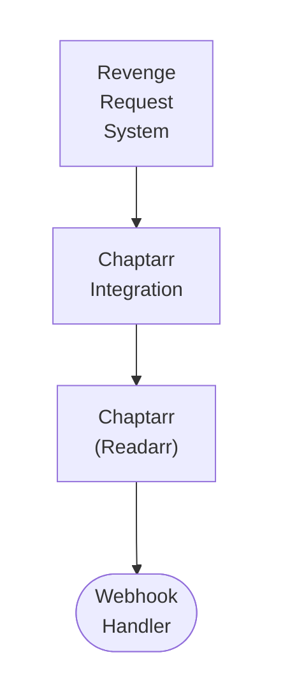

## Table of Contents

- [Chaptarr](#chaptarr)
  - [Status](#status)
  - [Architecture](#architecture)
    - [Integration Structure](#integration-structure)
    - [Data Flow](#data-flow)
    - [Provides](#provides)
  - [Implementation](#implementation)
    - [Key Interfaces](#key-interfaces)
    - [Dependencies](#dependencies)
  - [Configuration](#configuration)
    - [Environment Variables](#environment-variables)
- [Chaptarr instance](#chaptarr-instance)
- [Sync settings](#sync-settings)
    - [Config Keys](#config-keys)
  - [Related Documentation](#related-documentation)
    - [Design Documents](#design-documents)
    - [External Sources](#external-sources)

# Chaptarr


**Created**: 2026-01-31
**Status**: ✅ Complete
**Category**: integration


> Integration with Chaptarr

> Book & audiobook management automation (uses Readarr API)
**API Base URL**: `http://localhost:8787/api/v1`
**Authentication**: api_key

---


## Status

| Dimension | Status | Notes |
|-----------|--------|-------|
| Design | ✅ | - |
| Sources | ✅ | - |
| Instructions | 🟡 | - |
| Code | 🔴 | - |
| Linting | 🔴 | - |
| Unit Testing | 🔴 | - |
| Integration Testing | 🔴 | - |

**Overall**: ✅ Complete


---


## Architecture



### Integration Structure

```
internal/integration/chaptarr/
├── client.go              # API client
├── types.go               # Response types
├── mapper.go              # Map external → internal types
├── cache.go               # Response caching
└── client_test.go         # Tests
```

### Data Flow

<!-- Data flow diagram -->

### Provides
<!-- Data provided by integration -->
## Implementation

### Key Interfaces

```go
// Chaptarr integration service
type ChaptarrService interface {
  // Author management
  AddAuthor(ctx context.Context, goodreadsID string, qualityProfileID int, rootFolder string) (*ChaptarrAuthor, error)
  DeleteAuthor(ctx context.Context, chaptarrID int, deleteFiles bool) error
  SearchAuthor(ctx context.Context, authorID int) error  // Trigger download

  // Book management
  GetBooks(ctx context.Context, authorID int) ([]ChaptarrBook, error)
  GetCalendar(ctx context.Context, start, end time.Time) ([]CalendarBook, error)

  // Sync
  SyncLibrary(ctx context.Context, instanceID uuid.UUID) error
}

// Chaptarr author structure
type ChaptarrAuthor struct {
  ID              int      `json:"id"`
  AuthorName      string   `json:"authorName"`
  ForeignAuthorID string   `json:"foreignAuthorId"`  // GoodReads ID
  QualityProfile  int      `json:"qualityProfileId"`
  MetadataProfile int      `json:"metadataProfileId"`
  Monitored       bool     `json:"monitored"`
  RootFolderPath  string   `json:"rootFolderPath"`
  Path            string   `json:"path"`
}

// Chaptarr book structure
type ChaptarrBook struct {
  ID              int      `json:"id"`
  Title           string   `json:"title"`
  AuthorID        int      `json:"authorId"`
  ForeignBookID   string   `json:"foreignBookId"`
  ISBN            string   `json:"isbn"`
  ReleaseDate     string   `json:"releaseDate"`
  PageCount       int      `json:"pageCount"`
  Monitored       bool     `json:"monitored"`
  HasFile         bool     `json:"hasFile"`
}
```


### Dependencies
**Go Packages**:
- `net/http` - HTTP client
- `github.com/google/uuid` - UUID support
- `github.com/jackc/pgx/v5` - PostgreSQL driver
- `github.com/riverqueue/river` - Background sync jobs
- `go.uber.org/fx` - Dependency injection

**External Services**:
- Chaptarr/Readarr v1+ (self-hosted)

## Configuration

### Environment Variables

```bash
# Chaptarr instance
CHAPTARR_URL=http://localhost:8787
CHAPTARR_API_KEY=your_api_key_here

# Sync settings
CHAPTARR_AUTO_SYNC=true
CHAPTARR_SYNC_INTERVAL=300  # 5 minutes
```


### Config Keys
```yaml
integrations:
  chaptarr:
    instances:
      - name: Main Chaptarr
        base_url: http://localhost:8787
        api_key: ${CHAPTARR_API_KEY}
        enabled: true
        auto_sync: true
        sync_interval: 300
```

## Related Documentation
### Design Documents
- [01_ARCHITECTURE](../../architecture/01_ARCHITECTURE.md)
- [02_DESIGN_PRINCIPLES](../../architecture/02_DESIGN_PRINCIPLES.md)
- [03_METADATA_SYSTEM](../../architecture/03_METADATA_SYSTEM.md)

### External Sources
- [Uber fx](../../../sources/tooling/fx.md) - Auto-resolved from fx
- [pgx PostgreSQL Driver](../../../sources/database/pgx.md) - Auto-resolved from pgx
- [PostgreSQL Arrays](../../../sources/database/postgresql-arrays.md) - Auto-resolved from postgresql-arrays
- [PostgreSQL JSON Functions](../../../sources/database/postgresql-json.md) - Auto-resolved from postgresql-json
- [River Job Queue](../../../sources/tooling/river.md) - Auto-resolved from river
- [Servarr Wiki](../../../sources/apis/servarr-wiki.md) - Auto-resolved from servarr-wiki
- [Typesense API](../../../sources/infrastructure/typesense.md) - Auto-resolved from typesense
- [Typesense Go Client](../../../sources/infrastructure/typesense-go.md) - Auto-resolved from typesense-go

