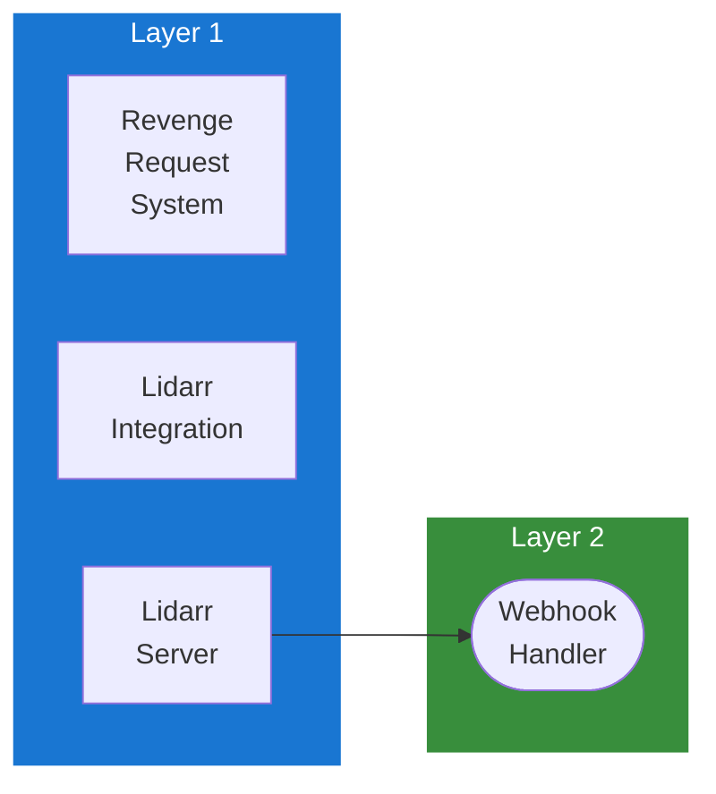

## Table of Contents

- [Lidarr](#lidarr)
  - [Status](#status)
  - [Architecture](#architecture)
    - [Integration Structure](#integration-structure)
    - [Data Flow](#data-flow)
    - [Provides](#provides)
  - [Related Documentation](#related-documentation)
    - [Design Documents](#design-documents)
    - [External Sources](#external-sources)

# Lidarr

<!-- DESIGN: integrations/servarr, README, test_output_claude, test_output_wiki -->


**Created**: 2026-01-31
**Status**: ✅ Complete
**Category**: integration


> Integration with Lidarr

> Music management automation
**API Base URL**: `http://localhost:8686/api/v1`
**Authentication**: api_key

---


## Status

| Dimension | Status | Notes |
|-----------|--------|-------|
| Design | ✅ | - |
| Sources | ✅ | - |
| Instructions | 🟡 | - |
| Code | 🔴 | - |
| Linting | 🔴 | - |
| Unit Testing | 🔴 | - |
| Integration Testing | 🔴 | - |

**Overall**: ✅ Complete


---


## Architecture



### Integration Structure

```
internal/integration/lidarr/
├── client.go              # API client
├── types.go               # Response types
├── mapper.go              # Map external → internal types
├── cache.go               # Response caching
└── client_test.go         # Tests
```

### Data Flow

<!-- Data flow diagram -->

### Provides
<!-- Data provided by integration -->
## Related Documentation
### Design Documents
- [01_ARCHITECTURE](../../architecture/01_ARCHITECTURE.md)
- [02_DESIGN_PRINCIPLES](../../architecture/02_DESIGN_PRINCIPLES.md)
- [03_METADATA_SYSTEM](../../architecture/03_METADATA_SYSTEM.md)

### External Sources
- [Uber fx](../../sources/tooling/fx.md) - Auto-resolved from fx
- [Last.fm API](../../sources/apis/lastfm.md) - Auto-resolved from lastfm-api
- [Lidarr API Docs](../../sources/apis/lidarr-docs.md) - Auto-resolved from lidarr-docs
- [pgx PostgreSQL Driver](../../sources/database/pgx.md) - Auto-resolved from pgx
- [PostgreSQL Arrays](../../sources/database/postgresql-arrays.md) - Auto-resolved from postgresql-arrays
- [PostgreSQL JSON Functions](../../sources/database/postgresql-json.md) - Auto-resolved from postgresql-json
- [River Job Queue](../../sources/tooling/river.md) - Auto-resolved from river
- [Servarr Wiki](../../sources/apis/servarr-wiki.md) - Auto-resolved from servarr-wiki
- [Typesense API](../../sources/infrastructure/typesense.md) - Auto-resolved from typesense
- [Typesense Go Client](../../sources/infrastructure/typesense-go.md) - Auto-resolved from typesense-go

