## Table of Contents

- [Blackbeard](#blackbeard)
  - [Status](#status)
  - [Architecture](#architecture)
    - [Integration Structure](#integration-structure)
    - [Data Flow](#data-flow)
    - [Provides](#provides)
  - [Implementation](#implementation)
    - [File Structure](#file-structure)
    - [Key Interfaces](#key-interfaces)
    - [Dependencies](#dependencies)
  - [Configuration](#configuration)
    - [Environment Variables](#environment-variables)
- [Blackbeard external integration (OPTIONAL)](#blackbeard-external-integration-optional)
- [Transcoding preference](#transcoding-preference)
    - [Config Keys](#config-keys)
  - [Testing Strategy](#testing-strategy)
    - [Unit Tests](#unit-tests)
    - [Integration Tests](#integration-tests)
    - [Test Coverage](#test-coverage)
  - [Related Documentation](#related-documentation)
    - [Design Documents](#design-documents)
    - [External Sources](#external-sources)

# Blackbeard


**Created**: 2026-01-31
**Status**: ✅ Complete
**Category**: integration


> Integration with Blackbeard

> EXTERNAL transcoding service integration - offload CPU/GPU-intensive transcoding to dedicated Blackbeard instances

---


## Status

| Dimension | Status | Notes |
|-----------|--------|-------|
| Design | ✅ | External integration design complete |
| Sources | ✅ | - |
| Instructions | ✅ | - |
| Code | 🔴 | - |
| Linting | 🔴 | - |
| Unit Testing | 🔴 | - |
| Integration Testing | 🔴 | - |

**Overall**: ✅ Complete


---


## Architecture

```mermaid
flowchart TD
    node1["Revenge Server<br/>┌────────────────┐    ┌────────────────┐    ┌────────────────┐<br/>Playback"]
    node2["Transcoding Router<br/>(choose internal vs external)"]
    node3["EXTERNAL: Blackbeard Service<br/>(Third-party, NOT developed by us)<br/>┌──────────────────────────────────────────────────────────────┐"]
    node1 --> node2
    node2 --> node3
```



### Integration Structure

```
internal/integration/blackbeard/
├── client.go              # API client
├── types.go               # Response types
├── mapper.go              # Map external → internal types
├── cache.go               # Response caching
└── client_test.go         # Tests
```

### Data Flow

<!-- Data flow diagram -->

### Provides
<!-- Data provided by integration -->


## Implementation

### File Structure

<!-- File structure -->

### Key Interfaces

```go
// External transcoding provider interface
type ExternalTranscoder interface {
  // Submit job to external service
  SubmitJob(ctx context.Context, job *TranscodeJob) (externalID string, error)

  // Get job status from external service
  GetJobStatus(ctx context.Context, externalID string) (*JobStatus, error)

  // Cancel job on external service
  CancelJob(ctx context.Context, externalID string) error

  // Check if service is available
  IsAvailable(ctx context.Context) bool

  // Provider name
  Name() string
}

// Blackbeard client (implements ExternalTranscoder)
type BlackbeardClient struct {
  baseURL     string
  apiKey      string
  httpClient  *http.Client
}

func (c *BlackbeardClient) Name() string { return "blackbeard" }

func (c *BlackbeardClient) IsAvailable(ctx context.Context) bool {
  // Check Blackbeard health endpoint
  resp, err := c.httpClient.Get(c.baseURL + "/api/v1/health")
  if err != nil {
    return false
  }
  defer resp.Body.Close()
  return resp.StatusCode == http.StatusOK
}

func (c *BlackbeardClient) SubmitJob(ctx context.Context, job *TranscodeJob) (string, error) {
  // Submit to Blackbeard API
  // Returns external job ID
}

// Transcoding router (chooses internal vs external)
type TranscodingRouter struct {
  internal    *InternalTranscoder  // go-astiav FFmpeg
  external    ExternalTranscoder   // Blackbeard (optional)
  preferExternal bool
}

func (r *TranscodingRouter) Transcode(ctx context.Context, job *TranscodeJob) error {
  // Try external if configured and available
  if r.preferExternal && r.external != nil && r.external.IsAvailable(ctx) {
    externalID, err := r.external.SubmitJob(ctx, job)
    if err == nil {
      // Track external job
      return r.trackExternalJob(ctx, job, externalID)
    }
    slog.Warn("external transcode failed, falling back to internal", "error", err)
  }

  // Fall back to internal transcoding
  return r.internal.Transcode(ctx, job)
}
```


### Dependencies
**Go Packages**:
- `net/http` - HTTP client for Blackbeard API
- `encoding/json` - JSON encoding/decoding
- `github.com/jackc/pgx/v5` - PostgreSQL for job tracking
- `github.com/riverqueue/river` - Background job processing
- `go.uber.org/fx` - Dependency injection

**For Internal Transcoding** (see TRANSCODING service):
- `github.com/asticode/go-astiav` - FFmpeg Go bindings
- `github.com/bluenviron/gohlslib/v2` - HLS streaming

**External**:
- Blackbeard service (user-deployed, not developed by us)


## Configuration
### Environment Variables

```bash
# Blackbeard external integration (OPTIONAL)
BLACKBEARD_ENABLED=false             # Enable external offloading
BLACKBEARD_URL=http://blackbeard:8080
BLACKBEARD_API_KEY=your_api_key

# Transcoding preference
TRANSCODING_PREFER_EXTERNAL=false    # Prefer Blackbeard over internal
TRANSCODING_EXTERNAL_TIMEOUT=60s     # Timeout for external API calls
```


### Config Keys
```yaml
transcoding:
  # Internal transcoding (always available)
  internal:
    enabled: true
    hardware_accel: auto           # auto, nvenc, qsv, vaapi, none
    max_concurrent: 2
    cache_dir: /var/cache/revenge/transcoded
    cache_max_size_gb: 100

  # External transcoding via Blackbeard (OPTIONAL)
  external:
    blackbeard:
      enabled: false               # Disabled by default
      url: ${BLACKBEARD_URL}
      api_key: ${BLACKBEARD_API_KEY}
      timeout: 60s
      prefer_external: false       # Prefer external over internal
      fallback_to_internal: true   # Fall back if Blackbeard unavailable

  # HLS settings (used by both internal and external)
  hls:
    segment_duration: 6s
    target_duration: 6
```


## Testing Strategy

### Unit Tests

<!-- Unit test strategy -->

### Integration Tests

<!-- Integration test strategy -->

### Test Coverage

Target: **80% minimum**


## Related Documentation
### Design Documents
- [TRANSCODING service (INTERNAL transcoding)](../../services/TRANSCODING.md)
- [04_PLAYER_ARCHITECTURE](../../architecture/04_PLAYER_ARCHITECTURE.md)
- [TRICKPLAY feature](../../features/playback/TRICKPLAY.md)
- [HTTP_CLIENT (for Blackbeard API)](../../services/HTTP_CLIENT.md)

### External Sources
- [FFmpeg Documentation](../../../sources/media/ffmpeg.md) - Auto-resolved from ffmpeg
- [go-astiav (FFmpeg bindings)](../../../sources/media/go-astiav.md) - Internal transcoding (go-astiav)
- [gohlslib (HLS)](../../../sources/media/gohlslib.md) - Auto-resolved from gohlslib
- [River Job Queue](../../../sources/tooling/river.md) - Job queue for transcoding tasks

