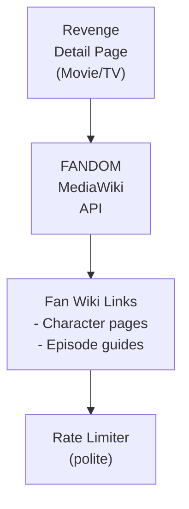

## Table of Contents

- [FANDOM](#fandom)
  - [Status](#status)
  - [Architecture](#architecture)
    - [Integration Structure](#integration-structure)
    - [Data Flow](#data-flow)
    - [Provides](#provides)
  - [Implementation](#implementation)
    - [Key Interfaces](#key-interfaces)
    - [Dependencies](#dependencies)
  - [Configuration](#configuration)
    - [Environment Variables](#environment-variables)
    - [Config Keys](#config-keys)
  - [Related Documentation](#related-documentation)
    - [Design Documents](#design-documents)
    - [External Sources](#external-sources)

# FANDOM


**Created**: 2026-01-31
**Status**: ✅ Complete
**Category**: integration


> Integration with FANDOM (Wikia)

> ENRICHMENT link provider to fan-curated wikis for franchises
**API Base URL**: `https://{wiki}.fandom.com/api.php`
**Authentication**: none

---


## Status

| Dimension | Status | Notes |
|-----------|--------|-------|
| Design | ✅ | - |
| Sources | ✅ | - |
| Instructions | ✅ | - |
| Code | 🔴 | - |
| Linting | 🔴 | - |
| Unit Testing | 🔴 | - |
| Integration Testing | 🔴 | - |

**Overall**: ✅ Complete


---


## Architecture



### Integration Structure

```
internal/integration/fandom/
├── client.go              # API client
├── types.go               # Response types
├── mapper.go              # Map external → internal types
├── cache.go               # Response caching
└── client_test.go         # Tests
```

### Data Flow

<!-- Data flow diagram -->

### Provides
<!-- Data provided by integration -->
## Implementation

### Key Interfaces

```go
// FANDOM link provider
type FANDOMProvider struct {
  client      *http.Client
  rateLimiter *rate.Limiter
  wikiRegistry *WikiRegistry
  cache       Cache
}

// Wiki link provider interface
type WikiLinkProvider interface {
  FindWikiForContent(ctx context.Context, content *Content) (*Wiki, error)
  SearchPage(ctx context.Context, wiki string, query string) ([]PageResult, error)
  GetPageInfo(ctx context.Context, wiki string, title string) (*PageInfo, error)
  GenerateLink(ctx context.Context, content *Content) (*WikiLink, error)
}

// Wiki registry
type WikiRegistry struct {
  wikis map[string]*Wiki
}

type Wiki struct {
  Subdomain string   `json:"subdomain"`
  Name      string   `json:"name"`
  Keywords  []string `json:"keywords"`
}

// Wiki page info
type PageInfo struct {
  Title    string `json:"title"`
  PageID   int    `json:"pageid"`
  URL      string `json:"fullurl"`
  Extract  string `json:"extract,omitempty"`
  Exists   bool   `json:"exists"`
}

// Link to display in UI
type WikiLink struct {
  WikiName string `json:"wiki_name"`
  PageTitle string `json:"page_title"`
  URL       string `json:"url"`
  LinkType  string `json:"type"`  // 'main', 'character', 'episode'
}
```


### Dependencies
**Go Packages**:
- `net/http` - HTTP client
- `golang.org/x/time/rate` - Polite rate limiting
- `github.com/jackc/pgx/v5` - PostgreSQL
- `github.com/riverqueue/river` - Background jobs
- `go.uber.org/fx` - DI

**External**:
- FANDOM MediaWiki API (free, no key)

## Configuration

### Environment Variables

```bash
FANDOM_ENABLED=true
FANDOM_RATE_LIMIT=1
FANDOM_CACHE_TTL=168h
```


### Config Keys
```yaml
metadata:
  providers:
    fandom:
      enabled: true
      rate_limit: 1
      rate_window: 1s
      cache_ttl: 168h
      role: enrichment

      # Pre-configured wikis
      wikis:
        - subdomain: starwars
          name: Wookieepedia
          keywords: [Star Wars, Mandalorian, Ahsoka, Andor]
        - subdomain: marvel
          name: Marvel Database
          keywords: [Marvel, Avengers, X-Men, Spider-Man]
        - subdomain: gameofthrones
          name: Wiki of Westeros
          keywords: [Game of Thrones, House of the Dragon]
        - subdomain: memory-alpha
          name: Memory Alpha
          keywords: [Star Trek, Discovery, Strange New Worlds]
        - subdomain: lotr
          name: Tolkien Gateway
          keywords: [Lord of the Rings, Hobbit, Rings of Power]
```

## Related Documentation
### Design Documents
- [03_METADATA_SYSTEM](../../architecture/03_METADATA_SYSTEM.md)
- [WIKI_SYSTEM](../../features/shared/WIKI_SYSTEM.md)
- [WIKIPEDIA (similar MediaWiki integration)](./WIKIPEDIA.md)
- [MOVIE_MODULE](../../features/video/MOVIE_MODULE.md)
- [TVSHOW_MODULE](../../features/video/TVSHOW_MODULE.md)

### External Sources
- [FANDOM API](https://community.fandom.com/wiki/Community_Central:API) - MediaWiki-based API
- [MediaWiki API](../../../sources/wiki/mediawiki.md) - Underlying API
- [golang.org/x/time](../../../sources/go/x/time.md) - Rate limiting
- [River Job Queue](../../../sources/tooling/river.md) - Auto-resolved from river

