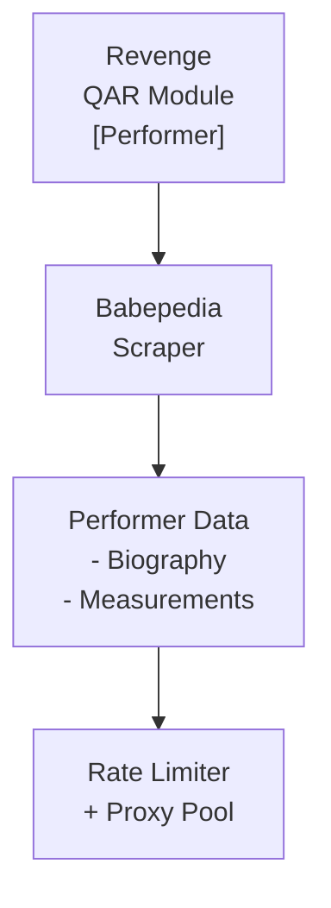

## Table of Contents

- [Babepedia](#babepedia)
  - [Status](#status)
  - [Architecture](#architecture)
    - [Integration Structure](#integration-structure)
    - [Data Flow](#data-flow)
    - [Provides](#provides)
  - [Implementation](#implementation)
    - [Key Interfaces](#key-interfaces)
    - [Dependencies](#dependencies)
  - [Configuration](#configuration)
    - [Environment Variables](#environment-variables)
    - [Config Keys](#config-keys)
  - [Related Documentation](#related-documentation)
    - [Design Documents](#design-documents)
    - [External Sources](#external-sources)

# Babepedia


**Created**: 2026-01-31
**Status**: ✅ Complete
**Category**: integration


> Integration with Babepedia

> Adult performer wiki with biographies and filmographies
**API Base URL**: `https://www.babepedia.com`
**Authentication**: none

---


## Status

| Dimension | Status | Notes |
|-----------|--------|-------|
| Design | ✅ | - |
| Sources | ✅ | - |
| Instructions | ✅ | - |
| Code | 🔴 | - |
| Linting | 🔴 | - |
| Unit Testing | 🔴 | - |
| Integration Testing | 🔴 | - |

**Overall**: ✅ Complete


---


## Architecture



### Integration Structure

```
internal/integration/babepedia/
├── client.go              # API client
├── types.go               # Response types
├── mapper.go              # Map external → internal types
├── cache.go               # Response caching
└── client_test.go         # Tests
```

### Data Flow

<!-- Data flow diagram -->

### Provides
<!-- Data provided by integration -->
## Implementation

### Key Interfaces

```go
// Babepedia enrichment provider
type BabepediaProvider struct {
  httpClient  *httpclient.Client  // From HTTP_CLIENT service
  rateLimiter *rate.Limiter
  cache       Cache
  parser      *goquery.Document
}

// Performer enrichment provider interface
type PerformerEnrichmentProvider interface {
  SearchPerformer(ctx context.Context, name string) ([]PerformerResult, error)
  GetPerformer(ctx context.Context, url string) (*PerformerProfile, error)
  MatchPerformer(ctx context.Context, name string, aliases []string) (*PerformerProfile, error)
  Priority() int  // Returns 30 (after StashDB)
}

// Babepedia performer profile
type PerformerProfile struct {
  URL          string    `json:"url"`
  Name         string    `json:"name"`
  Aliases      []string  `json:"aliases"`
  BirthDate    *time.Time `json:"birth_date,omitempty"`
  Birthplace   string    `json:"birthplace"`
  Nationality  string    `json:"nationality"`
  HeightCm     int       `json:"height_cm"`
  Measurements string    `json:"measurements"`
  HairColor    string    `json:"hair_color"`
  EyeColor     string    `json:"eye_color"`
  CareerStart  int       `json:"career_start"`
  CareerEnd    int       `json:"career_end,omitempty"`
  SocialLinks  map[string]string `json:"social_links"`
  PhotoURL     string    `json:"photo_url"`
}

// HTML parsing with goquery
func (p *BabepediaProvider) parseProfile(doc *goquery.Document) (*PerformerProfile, error) {
  profile := &PerformerProfile{}

  // Extract structured data from profile page
  doc.Find(".profbox li").Each(func(i int, s *goquery.Selection) {
    label := s.Find(".profhead").Text()
    value := s.Find(".profdata").Text()

    switch strings.TrimSuffix(label, ":") {
    case "Born":
      profile.BirthDate = parseDate(value)
    case "Birthplace":
      profile.Birthplace = value
    case "Height":
      profile.HeightCm = parseHeight(value)
    // ... etc
    }
  })

  return profile, nil
}
```


### Dependencies
**Go Packages**:
- `github.com/PuerkitoBio/goquery` - HTML parsing
- `golang.org/x/time/rate` - Rate limiting
- `github.com/jackc/pgx/v5` - PostgreSQL
- `github.com/riverqueue/river` - Background jobs
- `go.uber.org/fx` - DI

**Internal**:
- `internal/service/httpclient` - Proxy-enabled HTTP client

**External**:
- Babepedia website (no official API)

## Configuration

### Environment Variables

```bash
BABEPEDIA_ENABLED=true
BABEPEDIA_RATE_LIMIT=0.5          # req/sec (1 every 2 seconds)
BABEPEDIA_CACHE_TTL=720h          # 30 days
BABEPEDIA_USE_PROXY=true          # Use proxy pool from HTTP_CLIENT
```


### Config Keys
```yaml
qar:
  metadata:
    providers:
      babepedia:
        enabled: true
        rate_limit: 0.5
        rate_window: 1s
        cache_ttl: 720h
        role: enrichment
        priority: 30             # After StashDB (10), Boobpedia (20)
        use_proxy: true
        retry_on_block: true
```

## Related Documentation
### Design Documents
- [01_ARCHITECTURE](../../../architecture/01_ARCHITECTURE.md)
- [02_DESIGN_PRINCIPLES](../../../architecture/02_DESIGN_PRINCIPLES.md)
- [03_METADATA_SYSTEM](../../../architecture/03_METADATA_SYSTEM.md)

### External Sources
- [Dragonfly Documentation](../../../../sources/infrastructure/dragonfly.md) - Auto-resolved from dragonfly
- [Go io](../../../../sources/go/stdlib/io.md) - Auto-resolved from go-io
- [River Job Queue](../../../../sources/tooling/river.md) - Auto-resolved from river

