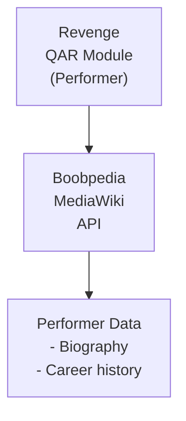

## Table of Contents

- [Boobpedia](#boobpedia)
  - [Status](#status)
  - [Architecture](#architecture)
    - [Integration Structure](#integration-structure)
    - [Data Flow](#data-flow)
    - [Provides](#provides)
  - [Implementation](#implementation)
    - [Key Interfaces](#key-interfaces)
    - [Dependencies](#dependencies)
  - [Configuration](#configuration)
    - [Environment Variables](#environment-variables)
    - [Config Keys](#config-keys)
  - [Related Documentation](#related-documentation)
    - [Design Documents](#design-documents)
    - [External Sources](#external-sources)

# Boobpedia


**Created**: 2026-01-31
**Status**: ✅ Complete
**Category**: integration


> Integration with Boobpedia

> Adult performer encyclopedia with detailed profiles
**API Base URL**: `https://www.boobpedia.com/boobs/api.php`
**Authentication**: none

---


## Status

| Dimension | Status | Notes |
|-----------|--------|-------|
| Design | ✅ | - |
| Sources | ✅ | - |
| Instructions | ✅ | - |
| Code | 🔴 | - |
| Linting | 🔴 | - |
| Unit Testing | 🔴 | - |
| Integration Testing | 🔴 | - |

**Overall**: ✅ Complete


---


## Architecture



### Integration Structure

```
internal/integration/boobpedia/
├── client.go              # API client
├── types.go               # Response types
├── mapper.go              # Map external → internal types
├── cache.go               # Response caching
└── client_test.go         # Tests
```

### Data Flow

<!-- Data flow diagram -->

### Provides
<!-- Data provided by integration -->
## Implementation

### Key Interfaces

```go
// Boobpedia enrichment provider (MediaWiki-based)
type BoobpediaProvider struct {
  baseURL     string
  client      *http.Client
  rateLimiter *rate.Limiter
  cache       Cache
}

// Performer enrichment provider interface
type PerformerEnrichmentProvider interface {
  SearchPerformer(ctx context.Context, name string) ([]SearchResult, error)
  GetArticle(ctx context.Context, title string) (*Article, error)
  GetPerformerInfo(ctx context.Context, title string) (*PerformerInfo, error)
  Priority() int  // Returns 20 (after StashDB, before Babepedia)
}

// MediaWiki article
type Article struct {
  PageID     int      `json:"pageid"`
  Title      string   `json:"title"`
  Extract    string   `json:"extract"`
  ImageURL   string   `json:"thumbnail"`
  Categories []string `json:"categories"`
}

// Parsed performer info from infobox
type PerformerInfo struct {
  Name         string     `json:"name"`
  ImageURL     string     `json:"image"`
  BirthDate    *time.Time `json:"birthdate,omitempty"`
  Birthplace   string     `json:"birthplace"`
  Measurements string     `json:"measurements"`
  HeightCm     int        `json:"height_cm"`
  WeightKg     int        `json:"weight_kg"`
  EyeColor     string     `json:"eye_color"`
  HairColor    string     `json:"hair_color"`
  Ethnicity    string     `json:"ethnicity"`
  YearsActive  string     `json:"years_active"`
  Bio          string     `json:"bio"`
}

// Infobox parser (wikitext)
func parseInfobox(wikitext string) (*PerformerInfo, error) {
  info := &PerformerInfo{}

  // Match infobox template
  infoboxRe := regexp.MustCompile(`\{\{Infobox[^}]*\}\}`)
  match := infoboxRe.FindString(wikitext)

  // Parse key=value pairs from infobox
  lines := strings.Split(match, "|")
  for _, line := range lines {
    parts := strings.SplitN(line, "=", 2)
    if len(parts) != 2 { continue }
    key := strings.TrimSpace(parts[0])
    value := strings.TrimSpace(parts[1])

    switch key {
    case "name":
      info.Name = value
    case "birthdate":
      info.BirthDate = parseWikiDate(value)
    case "measurements":
      info.Measurements = value
    // ... etc
    }
  }

  return info, nil
}
```


### Dependencies
**Go Packages**:
- `net/http` - HTTP client
- `golang.org/x/time/rate` - Rate limiting
- `github.com/jackc/pgx/v5` - PostgreSQL
- `github.com/riverqueue/river` - Background jobs
- `go.uber.org/fx` - DI

**External**:
- Boobpedia MediaWiki API (public, no key)

## Configuration

### Environment Variables

```bash
BOOBPEDIA_ENABLED=true
BOOBPEDIA_RATE_LIMIT=1            # req/sec
BOOBPEDIA_CACHE_TTL=336h          # 14 days
```


### Config Keys
```yaml
qar:
  metadata:
    providers:
      boobpedia:
        enabled: true
        rate_limit: 1
        rate_window: 1s
        cache_ttl: 336h
        role: enrichment
        priority: 20             # After StashDB (10), before Babepedia (30)
        extract_sentences: 5
```

## Related Documentation
### Design Documents
- [01_ARCHITECTURE](../../../architecture/01_ARCHITECTURE.md)
- [02_DESIGN_PRINCIPLES](../../../architecture/02_DESIGN_PRINCIPLES.md)
- [03_METADATA_SYSTEM](../../../architecture/03_METADATA_SYSTEM.md)

### External Sources
- [Dragonfly Documentation](../../../../sources/infrastructure/dragonfly.md) - Auto-resolved from dragonfly
- [River Job Queue](../../../../sources/tooling/river.md) - Auto-resolved from river

