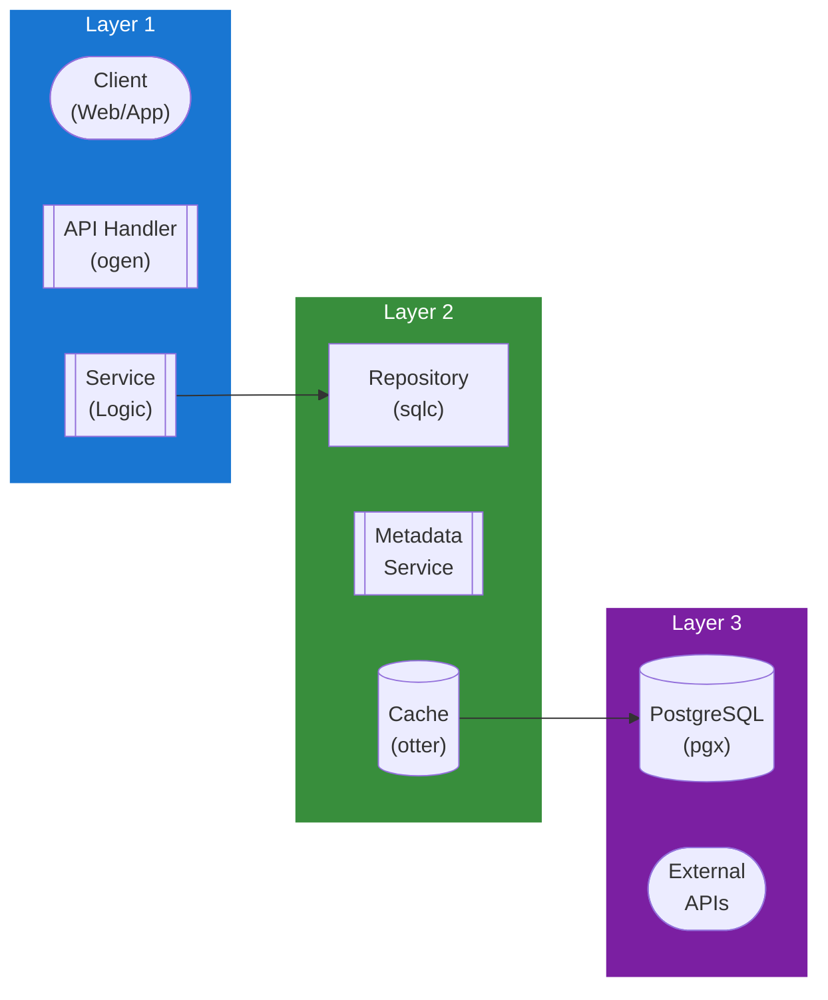

## Table of Contents

- [Comics Module](#comics-module)
  - [Status](#status)
  - [Architecture](#architecture)
    - [Database Schema](#database-schema)
    - [Module Structure](#module-structure)
    - [Component Interaction](#component-interaction)
  - [Implementation](#implementation)
    - [File Structure](#file-structure)
    - [Key Interfaces](#key-interfaces)
    - [Dependencies](#dependencies)
  - [Configuration](#configuration)
    - [Environment Variables](#environment-variables)
    - [Config Keys](#config-keys)
  - [API Endpoints](#api-endpoints)
    - [Content Management](#content-management)
      - [GET /api/v1/comics/series](#get-apiv1comicsseries)
      - [GET /api/v1/comics/series/:id](#get-apiv1comicsseriesid)
      - [GET /api/v1/comics/series/:id/issues](#get-apiv1comicsseriesidissues)
      - [GET /api/v1/comics/issues](#get-apiv1comicsissues)
      - [GET /api/v1/comics/issues/:id](#get-apiv1comicsissuesid)
      - [GET /api/v1/comics/issues/:id/read](#get-apiv1comicsissuesidread)
      - [GET /api/v1/comics/issues/:id/pages/:page](#get-apiv1comicsissuesidpagespage)
      - [GET /api/v1/comics/issues/:id/progress](#get-apiv1comicsissuesidprogress)
      - [PUT /api/v1/comics/issues/:id/progress](#put-apiv1comicsissuesidprogress)
      - [GET /api/v1/comics/publishers](#get-apiv1comicspublishers)
      - [POST /api/v1/comics/pull-list](#post-apiv1comicspull-list)
      - [GET /api/v1/comics/pull-list](#get-apiv1comicspull-list)
  - [Related Documentation](#related-documentation)
    - [Design Documents](#design-documents)
    - [External Sources](#external-sources)

# Comics Module

<!-- DESIGN: features/comics, README, test_output_claude, test_output_wiki -->


**Created**: 2026-01-31
**Status**: ✅ Complete
**Category**: feature


> Content module for Comics, Issues, Series

> Digital comics/manga/graphic novel support with metadata from ComicVine, Marvel API, GCD

Complete comics library:
- **Metadata Sources**: ComicVine (primary), Marvel API, Grand Comics Database, AniList/MAL (manga)
- **Supported Formats**: CBZ, CBR, CB7, CBT, PDF
- **Reader Features**: Page-by-page viewing, two-page spread, webtoon scroll mode
- **Progress Tracking**: Per-user reading progress with sync across devices
- **Collection Management**: Pull lists, reading lists, series tracking

---


## Status

| Dimension | Status | Notes |
|-----------|--------|-------|
| Design | ✅ | - |
| Sources | ✅ | - |
| Instructions | ✅ | - |
| Code | 🔴 | - |
| Linting | 🔴 | - |
| Unit Testing | 🔴 | - |
| Integration Testing | 🔴 | - |

**Overall**: ✅ Complete


---


## Architecture



### Database Schema

**Schema**: `public`

<!-- Schema diagram -->

### Module Structure

```
internal/content/comics/
├── module.go              # fx module definition
├── repository.go          # Database operations
├── service.go             # Business logic
├── handler.go             # HTTP handlers (ogen)
├── types.go               # Domain types
└── comics_test.go
```

### Component Interaction

<!-- Component interaction diagram -->
## Implementation

### File Structure

```
internal/content/comics/
├── module.go              # fx.Module with all providers
├── repository.go          # Database layer
├── repository_test.go     # Repository tests (testcontainers)
├── service.go             # Business logic
├── service_test.go        # Service tests (mocks)
├── handler.go             # HTTP handlers
├── handler_test.go        # Handler tests (httptest)
├── types.go               # Domain types
├── cache.go               # Caching logic
├── cache_test.go          # Cache tests
├── extractor/
│   ├── cbz.go             # CBZ extraction
│   ├── cbr.go             # CBR extraction
│   ├── cb7.go             # CB7 extraction
│   ├── cbt.go             # CBT extraction
│   ├── extractor.go       # Common extractor interface
│   └── extractor_test.go  # Extraction tests
├── metadata/
│   ├── provider.go        # Interface: MetadataProvider
│   ├── comicvine.go       # ComicVine API integration
│   ├── marvel.go          # Marvel API integration
│   ├── gcd.go             # Grand Comics Database
│   ├── anilist.go         # AniList GraphQL (manga)
│   ├── mal.go             # MyAnimeList API (manga)
│   └── enricher.go        # Enrichment orchestration
└── progress/
    ├── tracker.go         # Reading progress tracking
    └── sync.go            # Multi-device sync logic

migrations/
└── comics/
    ├── 001_series.sql     # Series and publishers schema
    ├── 002_issues.sql     # Issues and files schema
    ├── 003_creators.sql   # Creators schema
    └── 004_progress.sql   # Progress tracking schema

api/
└── openapi.yaml           # OpenAPI spec (comics/* endpoints)
```


### Key Interfaces

```go
// Repository defines database operations for comics
type Repository interface {
    // Series CRUD
    GetSeries(ctx context.Context, id uuid.UUID) (*Series, error)
    ListSeries(ctx context.Context, filters ListFilters) ([]Series, error)
    CreateSeries(ctx context.Context, series *Series) error
    UpdateSeries(ctx context.Context, series *Series) error
    DeleteSeries(ctx context.Context, id uuid.UUID) error

    // Issue CRUD
    GetIssue(ctx context.Context, id uuid.UUID) (*Issue, error)
    ListIssues(ctx context.Context, seriesID uuid.UUID, filters ListFilters) ([]Issue, error)
    CreateIssue(ctx context.Context, issue *Issue) error
    UpdateIssue(ctx context.Context, issue *Issue) error
    DeleteIssue(ctx context.Context, id uuid.UUID) error

    // Publisher and creator operations
    GetPublisher(ctx context.Context, id uuid.UUID) (*Publisher, error)
    ListPublishers(ctx context.Context) ([]Publisher, error)
    GetCreator(ctx context.Context, id uuid.UUID) (*Creator, error)
    ListCreators(ctx context.Context) ([]Creator, error)

    // Progress tracking
    GetProgress(ctx context.Context, userID, issueID uuid.UUID) (*ReadingProgress, error)
    UpdateProgress(ctx context.Context, progress *ReadingProgress) error
    GetRecentlyRead(ctx context.Context, userID uuid.UUID, limit int) ([]Issue, error)

    // Pull list management
    AddToPullList(ctx context.Context, userID, seriesID uuid.UUID) error
    RemoveFromPullList(ctx context.Context, userID, seriesID uuid.UUID) error
    GetPullList(ctx context.Context, userID uuid.UUID) ([]Series, error)
}

// Service defines business logic for comics
type Service interface {
    // Series operations
    GetSeries(ctx context.Context, id uuid.UUID) (*Series, error)
    SearchSeries(ctx context.Context, query string, filters SearchFilters) ([]Series, error)
    EnrichSeries(ctx context.Context, id uuid.UUID) error

    // Issue operations
    GetIssue(ctx context.Context, id uuid.UUID) (*Issue, error)
    GetIssuePages(ctx context.Context, issueID uuid.UUID) ([]PageInfo, error)
    GetPage(ctx context.Context, issueID uuid.UUID, pageNumber int) (image.Image, error)

    // Progress operations
    UpdateProgress(ctx context.Context, userID, issueID uuid.UUID, progress ProgressUpdate) error
    GetNextIssue(ctx context.Context, userID, issueID uuid.UUID) (*Issue, error)
}

// MetadataProvider fetches comic metadata from external sources
type MetadataProvider interface {
    GetSeriesByID(ctx context.Context, providerID string) (*SeriesMetadata, error)
    GetIssueByID(ctx context.Context, providerID string) (*IssueMetadata, error)
    SearchSeries(ctx context.Context, query string) ([]SeriesMetadata, error)
    SearchIssues(ctx context.Context, seriesID string) ([]IssueMetadata, error)
    GetCreatorByID(ctx context.Context, providerID string) (*CreatorMetadata, error)
}

// ComicExtractor extracts pages from comic archive files
type ComicExtractor interface {
    // ExtractPages extracts all pages from comic archive
    ExtractPages(ctx context.Context, filePath string, outputDir string) ([]string, error)

    // GetPageCount returns number of pages without extraction
    GetPageCount(ctx context.Context, filePath string) (int, error)

    // ExtractPage extracts a single page by number
    ExtractPage(ctx context.Context, filePath string, pageNumber int) (image.Image, error)

    // SupportedFormats returns formats this extractor can handle
    SupportedFormats() []string
}

// ProgressTracker manages reading progress synchronization
type ProgressTracker interface {
    // UpdateProgress updates user's reading position
    UpdateProgress(ctx context.Context, update ProgressUpdate) error

    // GetProgress retrieves current reading position
    GetProgress(ctx context.Context, userID, issueID uuid.UUID) (*ReadingProgress, error)

    // SyncProgress synchronizes progress across devices
    SyncProgress(ctx context.Context, userID uuid.UUID) error

    // GetNextIssue suggests next issue to read in series
    GetNextIssue(ctx context.Context, userID, currentIssueID uuid.UUID) (*Issue, error)
}
```


### Dependencies
**Go Dependencies**:
- `github.com/jackc/pgx/v5/pgxpool` - PostgreSQL connection pool
- `github.com/google/uuid` - UUID generation
- `github.com/maypok86/otter` - In-memory cache
- `github.com/gen2brain/go-unarr` - CBZ/CBR/CB7/CBT extraction
- `github.com/disintegration/imaging` - Image processing
- `github.com/go-resty/resty/v2` - HTTP client for external APIs
- `go.uber.org/fx` - Dependency injection
- `github.com/riverqueue/river` - Background job queue

**External APIs**:
- ComicVine API - Primary metadata for Western comics
- Marvel API - Official Marvel comics metadata
- Grand Comics Database - Historical comics data
- AniList GraphQL API - Manga metadata
- MyAnimeList API - Alternative manga metadata

**Database**:
- PostgreSQL 18+ with trigram extension for fuzzy search

## Configuration

### Environment Variables

**Environment Variables**:
- `REVENGE_COMIC_CACHE_TTL` - Cache TTL duration (default: 30m)
- `REVENGE_COMIC_CACHE_SIZE` - Cache size in MB (default: 200)
- `REVENGE_METADATA_COMICVINE_API_KEY` - ComicVine API key (required)
- `REVENGE_METADATA_MARVEL_API_KEY` - Marvel API public key (optional)
- `REVENGE_METADATA_MARVEL_API_PRIVATE_KEY` - Marvel API private key (optional)
- `REVENGE_METADATA_ANILIST_ENABLED` - Enable AniList for manga (default: true)
- `REVENGE_METADATA_MAL_CLIENT_ID` - MyAnimeList client ID (optional)
- `REVENGE_COMIC_PAGE_CACHE_PATH` - Path for cached extracted pages
- `REVENGE_COMIC_PAGE_CACHE_SIZE_GB` - Max page cache size in GB (default: 50)


### Config Keys
**config.yaml keys**:
```yaml
comic:
  cache:
    ttl: 30m
    size_mb: 200

  metadata:
    comicvine:
      api_key: ${REVENGE_METADATA_COMICVINE_API_KEY}
      rate_limit: 1  # Requests per second
      timeout: 15s

    marvel:
      enabled: false
      public_key: ${REVENGE_METADATA_MARVEL_API_KEY}
      private_key: ${REVENGE_METADATA_MARVEL_API_PRIVATE_KEY}

    gcd:
      enabled: true
      api_url: https://www.comics.org/api/

    anilist:
      enabled: true
      rate_limit: 90  # Per minute

    mal:
      enabled: false
      client_id: ${REVENGE_METADATA_MAL_CLIENT_ID}

    priority:
      comics:
        - comicvine
        - marvel
        - gcd
      manga:
        - anilist
        - mal

  reader:
    page_cache:
      enabled: true
      path: ${REVENGE_COMIC_PAGE_CACHE_PATH}
      max_size_gb: 50
      cleanup_policy: lru

    image_optimization:
      enabled: true
      max_width: 2048
      max_height: 2048
      quality: 85
      format: webp

    extraction:
      on_demand: false  # Extract all pages on first access
      parallel: true
      max_workers: 4

  features:
    pull_lists_enabled: true
    reading_lists_enabled: true
    series_tracking_enabled: true
    auto_suggest_next_enabled: true
```

## API Endpoints

### Content Management
#### GET /api/v1/comics/series

List all comic series with pagination and filters

---
#### GET /api/v1/comics/series/:id

Get comic series details by ID

---
#### GET /api/v1/comics/series/:id/issues

List all issues in a series

---
#### GET /api/v1/comics/issues

List all comic issues with pagination and filters

---
#### GET /api/v1/comics/issues/:id

Get comic issue details by ID

---
#### GET /api/v1/comics/issues/:id/read

Get issue content for comic reader

---
#### GET /api/v1/comics/issues/:id/pages/:page

Get a specific page image from an issue

---
#### GET /api/v1/comics/issues/:id/progress

Get user reading progress for an issue

---
#### PUT /api/v1/comics/issues/:id/progress

Update user reading progress for an issue

---
#### GET /api/v1/comics/publishers

List all comic publishers

---
#### POST /api/v1/comics/pull-list

Add a series to user pull list

---
#### GET /api/v1/comics/pull-list

Get user pull list of series

---
## Related Documentation
### Design Documents
- [01_ARCHITECTURE](../../architecture/01_ARCHITECTURE.md)
- [02_DESIGN_PRINCIPLES](../../architecture/02_DESIGN_PRINCIPLES.md)
- [03_METADATA_SYSTEM](../../architecture/03_METADATA_SYSTEM.md)

### External Sources
- [AniList GraphQL API](../../sources/apis/anilist.md) - Auto-resolved from anilist
- [ComicVine API](../../sources/apis/comicvine.md) - Auto-resolved from comicvine
- [Uber fx](../../sources/tooling/fx.md) - Auto-resolved from fx
- [MyAnimeList API](../../sources/apis/myanimelist.md) - Auto-resolved from myanimelist
- [ogen OpenAPI Generator](../../sources/tooling/ogen.md) - Auto-resolved from ogen
- [River Job Queue](../../sources/tooling/river.md) - Auto-resolved from river
- [sqlc](../../sources/database/sqlc.md) - Auto-resolved from sqlc
- [sqlc Configuration](../../sources/database/sqlc-config.md) - Auto-resolved from sqlc-config
- [Svelte 5 Runes](../../sources/frontend/svelte-runes.md) - Auto-resolved from svelte-runes
- [Svelte 5 Documentation](../../sources/frontend/svelte5.md) - Auto-resolved from svelte5
- [SvelteKit Documentation](../../sources/frontend/sveltekit.md) - Auto-resolved from sveltekit

