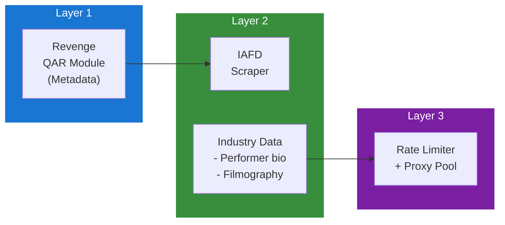

## Table of Contents

- [IAFD](#iafd)
  - [Status](#status)
  - [Architecture](#architecture)
    - [Integration Structure](#integration-structure)
    - [Data Flow](#data-flow)
    - [Provides](#provides)
  - [Implementation](#implementation)
    - [Key Interfaces](#key-interfaces)
    - [Dependencies](#dependencies)
  - [Configuration](#configuration)
    - [Environment Variables](#environment-variables)
    - [Config Keys](#config-keys)
  - [Related Documentation](#related-documentation)
    - [Design Documents](#design-documents)
    - [External Sources](#external-sources)

# IAFD

<!-- DESIGN: integrations/wiki/adult, README, test_output_claude, test_output_wiki -->


**Created**: 2026-01-31
**Status**: ✅ Complete
**Category**: integration


> Integration with IAFD

> Internet Adult Film Database - Adult performer and scene database
**API Base URL**: `https://www.iafd.com`
**Authentication**: none

---


## Status

| Dimension | Status | Notes |
|-----------|--------|-------|
| Design | ✅ | - |
| Sources | ✅ | - |
| Instructions | ✅ | - |
| Code | 🔴 | - |
| Linting | 🔴 | - |
| Unit Testing | 🔴 | - |
| Integration Testing | 🔴 | - |

**Overall**: ✅ Complete


---


## Architecture



### Integration Structure

```
internal/integration/iafd/
├── client.go              # API client
├── types.go               # Response types
├── mapper.go              # Map external → internal types
├── cache.go               # Response caching
└── client_test.go         # Tests
```

### Data Flow

<!-- Data flow diagram -->

### Provides
<!-- Data provided by integration -->
## Implementation

### Key Interfaces

```go
// IAFD metadata provider
type IAFDProvider struct {
  httpClient  *httpclient.Client  // From HTTP_CLIENT service
  rateLimiter *rate.Limiter
  cache       Cache
}

// Scene metadata provider interface
type SceneMetadataProvider interface {
  SearchPerformer(ctx context.Context, name string, gender string) ([]PerformerResult, error)
  GetPerformer(ctx context.Context, iafdID string, gender string) (*Performer, error)
  SearchTitle(ctx context.Context, title string) ([]TitleResult, error)
  GetTitle(ctx context.Context, iafdTitleID string) (*Title, error)
  GetFilmography(ctx context.Context, iafdID string, gender string) ([]FilmCredit, error)
  Priority() int  // Returns 40 (supplementary after wiki sources)
}

// IAFD Performer
type Performer struct {
  IAFDID       string     `json:"iafd_id"`
  Name         string     `json:"name"`
  Gender       string     `json:"gender"`
  Aliases      []string   `json:"aliases"`
  BirthDate    *time.Time `json:"birth_date,omitempty"`
  Birthplace   string     `json:"birthplace"`
  Ethnicity    string     `json:"ethnicity"`
  HeightCm     int        `json:"height_cm"`
  Measurements string     `json:"measurements"`
  HairColor    string     `json:"hair_color"`
  CareerStart  int        `json:"career_start"`
  CareerEnd    int        `json:"career_end,omitempty"`
  SceneCount   int        `json:"scene_count"`
  PhotoURL     string     `json:"photo_url"`
  IAFDURL      string     `json:"iafd_url"`
}

// IAFD Title/Scene
type Title struct {
  IAFDTitleID string     `json:"iafd_title_id"`
  Title       string     `json:"title"`
  Studio      string     `json:"studio"`
  ReleaseYear int        `json:"release_year"`
  ReleaseDate *time.Time `json:"release_date,omitempty"`
  Director    string     `json:"director"`
  Cast        []CastMember `json:"cast"`
  IAFDURL     string     `json:"iafd_url"`
}

// Film credit from filmography
type FilmCredit struct {
  TitleID     string `json:"title_id"`
  Title       string `json:"title"`
  Studio      string `json:"studio"`
  Year        int    `json:"year"`
  SceneNumber int    `json:"scene_number,omitempty"`
}

// HTML parsing for performer page
func (p *IAFDProvider) parsePerformer(doc *goquery.Document) (*Performer, error) {
  performer := &Performer{}

  // Extract bio data from structured page
  doc.Find("#biodata tr").Each(func(i int, s *goquery.Selection) {
    label := strings.TrimSpace(s.Find("td:first-child").Text())
    value := strings.TrimSpace(s.Find("td:last-child").Text())

    switch label {
    case "Birthday":
      performer.BirthDate = parseDateIAFD(value)
    case "Birthplace":
      performer.Birthplace = value
    case "Height":
      performer.HeightCm = parseHeightIAFD(value)
    case "Hair Color":
      performer.HairColor = value
    // ... etc
    }
  })

  // Extract filmography count
  performer.SceneCount = doc.Find("#filmography tbody tr").Length()

  return performer, nil
}
```


### Dependencies
**Go Packages**:
- `github.com/PuerkitoBio/goquery` - HTML parsing
- `golang.org/x/time/rate` - Rate limiting
- `github.com/jackc/pgx/v5` - PostgreSQL
- `github.com/riverqueue/river` - Background jobs
- `go.uber.org/fx` - DI

**Internal**:
- `internal/service/httpclient` - Proxy-enabled HTTP client

**External**:
- IAFD website (no official API)

## Configuration

### Environment Variables

```bash
IAFD_ENABLED=true
IAFD_RATE_LIMIT=0.5              # req/sec (1 every 2 seconds)
IAFD_CACHE_TTL=720h              # 30 days
IAFD_USE_PROXY=true              # Use proxy pool from HTTP_CLIENT
```


### Config Keys
```yaml
qar:
  metadata:
    providers:
      iafd:
        enabled: true
        rate_limit: 0.5
        rate_window: 1s
        cache_ttl: 720h
        role: supplementary
        priority: 40             # After StashDB, wiki sources
        use_proxy: true
        scrape_filmography: true
```

## Related Documentation
### Design Documents
- [01_ARCHITECTURE](../../../architecture/01_ARCHITECTURE.md)
- [02_DESIGN_PRINCIPLES](../../../architecture/02_DESIGN_PRINCIPLES.md)
- [03_METADATA_SYSTEM](../../../architecture/03_METADATA_SYSTEM.md)

### External Sources
- [Dragonfly Documentation](../../sources/infrastructure/dragonfly.md) - Auto-resolved from dragonfly
- [Go io](../../sources/go/stdlib/io.md) - Auto-resolved from go-io
- [River Job Queue](../../sources/tooling/river.md) - Auto-resolved from river

