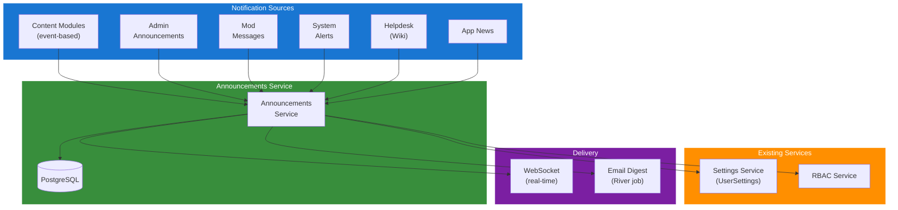

## Table of Contents

- [Announcements Service](#announcements-service)
  - [Overview](#overview)
  - [Architecture](#architecture)
    - [System Separation](#system-separation)
    - [Component Diagram](#component-diagram)
    - [Content Module Events](#content-module-events)
  - [Notification Sources](#notification-sources)
  - [Real-time Delivery (WebSocket)](#real-time-delivery-websocket)
  - [User Preferences](#user-preferences)
  - [Moderation Messages](#moderation-messages)
  - [RBAC Permissions](#rbac-permissions)
  - [API Endpoints](#api-endpoints)
  - [Database](#database)
  - [Related: Helpdesk / Wiki System](#related-helpdesk--wiki-system)
  - [Related: Push Notification Service](#related-push-notification-service)
  - [Related Documentation](#related-documentation)

# Announcements Service

<!-- DESIGN: planned/services -->


**Created**: 2026-02-06
**Status**: 🔴 Planned
**Category**: service


> In-app user-facing notifications: admin announcements, mod messages, content news, system alerts

**Package**: `internal/service/announcements` (planned)
**fx Module**: `announcements.Module` (planned)

---

## Overview

This is one of **four independent notification-related systems** in Revenge:

| # | System | Package | Purpose | Status |
|---|--------|---------|---------|--------|
| 1 | External Dispatcher | `internal/service/notification` | Outbound alerts to external channels (Discord, webhook, gotify, ntfy, email) | EXISTS |
| 2 | **Announcements** | `internal/service/announcements` | In-app user-facing notifications (THIS DOC) | PLANNED |
| 3 | Helpdesk / Wiki | TBD | Full wiki integration with contextual help | PLANNED |
| 4 | Push Notifications | `internal/service/push` | FCM/APNs, browser push, device token management | PLANNED |

**Key design decisions**:
- Systems 1 and 2 are **fully independent** - no bridge between external dispatcher and announcements
- Content modules feed announcements via **event-based pattern** (emit events, announcements subscribes)
- Notification preferences stored in **existing settings service** (UserSettings)
- Real-time delivery via **WebSocket** (shared with future playback sync, chat)
- Mod messages are **direct** (RBAC controls who can send, no approval workflow)

---

## Architecture

### System Separation

```
External Dispatcher (EXISTS)          Announcements (THIS DOC)
  - Discord webhook                     - In-app notification center
  - Generic webhook                     - Admin announcements
  - Gotify / Ntfy                       - Mod direct messages
  - Email alerts                        - Content news (event-based)
  - No database                         - Database-backed
  - No user preferences                 - User preferences via settings
  - Admin-configured agents             - Per-user, RBAC-controlled
```

### Component Diagram



### Content Module Events

Content modules emit events that the announcements service subscribes to. No direct dependency from content modules to announcements.

```
movie module ──emit──> "movie.added" event
tvshow module ──emit──> "episode.available" event
                              │
                    announcements service subscribes
                              │
                    creates announcement entries
                    for users with matching preferences
```

Each content module defines its own event types. The announcements service maintains a registry of event-to-announcement mappings.

---

## Notification Sources

| Source | Category | Examples | Who Creates |
|--------|----------|----------|-------------|
| Content modules | `content` | "New episode of X available", "Movie Y added" | Event subscription |
| Release calendar | `calendar` | "Movie X releases Jan 15", "Season 2 next week" | Event subscription |
| Admin announcements | `admin` | "Server maintenance tonight", "New feature" | Admin via API |
| Mod messages | `moderation` | "Content review", direct user message | Mod via API |
| System alerts | `system` | "Storage 90% full", "Scan failed", "Update available" | Internal services |
| Helpdesk/Wiki | `help` | Contextual tips, "Did you know?" | Wiki system |
| App news | `news` | "Revenge v0.3.0 released", changelog | Admin via API |

---

## Real-time Delivery (WebSocket)

Single WebSocket connection per user, shared across all real-time features:

```
WebSocket /api/v1/ws
  ├── announcements channel  (this service)
  ├── playback sync channel  (future)
  └── chat channel           (future)
```

The announcements service publishes to the WebSocket hub when a new announcement is created for a user. Fallback: email digest via scheduled River job for users not currently connected.

---

## User Preferences

Stored via existing `settings` service as `UserSetting` entries:

| Setting Key | Type | Default | Description |
|------------|------|---------|-------------|
| `announcements.content_enabled` | bool | `true` | Content module notifications |
| `announcements.calendar_enabled` | bool | `true` | Release calendar notifications |
| `announcements.admin_enabled` | bool | `true` | Admin announcements (cannot disable) |
| `announcements.system_enabled` | bool | `true` | System alerts (forced for admins) |
| `announcements.help_enabled` | bool | `true` | Helpdesk/wiki tips |
| `announcements.news_enabled` | bool | `true` | App news |
| `announcements.email_digest` | bool | `false` | Enable email digest |
| `announcements.email_digest_freq` | string | `weekly` | `daily` or `weekly` |
| `announcements.quiet_hours_enabled` | bool | `false` | Enable quiet hours |
| `announcements.quiet_hours_start` | string | `22:00` | Quiet hours start |
| `announcements.quiet_hours_end` | string | `08:00` | Quiet hours end |

Per-library notification filtering can use the existing `UserSetting` with composite keys like `announcements.library.<uuid>.enabled`.

---

## Moderation Messages

Mods can send direct messages to specific users. RBAC controls who can send (`announcements:mod` permission). No approval workflow.

```
Mod ──POST /api/v1/announcements/message/:user_id──> Announcements Service
                                                          │
                                                    Creates announcement
                                                    with category="moderation"
                                                    for target user
```

---

## RBAC Permissions

New permissions for `internal/service/rbac/permissions.go`:

| Permission | Description |
|------------|-------------|
| `announcements:read` | View own announcements |
| `announcements:manage` | Manage own announcement preferences |
| `announcements:admin` | Send admin announcements to all users |
| `announcements:mod` | Send direct messages to specific users |

---

## API Endpoints

```
# User announcements
GET    /api/v1/announcements                    # List own announcements (paginated, filterable by category)
GET    /api/v1/announcements/unread/count       # Get unread count (for badge)
POST   /api/v1/announcements/:id/read          # Mark as read
POST   /api/v1/announcements/read-all          # Mark all as read
DELETE /api/v1/announcements/:id               # Dismiss announcement

# Admin actions
POST   /api/v1/announcements/broadcast         # Send announcement to all/role-filtered users (admin)
POST   /api/v1/announcements/message/:user_id  # Send direct message to user (mod)

# Preferences (via settings service)
GET    /api/v1/settings/user?category=announcements    # Get announcement preferences
PUT    /api/v1/settings/user                           # Update preferences (bulk)
```

---

## Database

```sql
-- User announcements (per-user entries)
CREATE TABLE shared.user_announcements (
    id UUID PRIMARY KEY DEFAULT gen_random_uuid(),
    user_id UUID NOT NULL REFERENCES shared.users(id),
    category TEXT NOT NULL,         -- content, calendar, admin, moderation, system, help, news
    title TEXT NOT NULL,
    body TEXT,
    priority TEXT DEFAULT 'normal', -- low, normal, high, urgent
    source_type TEXT,               -- module that created it (movie, tvshow, admin, system, etc.)
    source_id UUID,                 -- optional reference to source entity
    sender_id UUID,                 -- for mod messages: who sent it
    read_at TIMESTAMPTZ,
    dismissed_at TIMESTAMPTZ,
    expires_at TIMESTAMPTZ,         -- auto-cleanup after expiry
    created_at TIMESTAMPTZ NOT NULL DEFAULT NOW()
);

CREATE INDEX idx_user_announcements_user ON shared.user_announcements(user_id, created_at DESC);
CREATE INDEX idx_user_announcements_unread ON shared.user_announcements(user_id) WHERE read_at IS NULL;

-- Broadcast announcements (admin, created once, delivered to matching users)
CREATE TABLE shared.broadcast_announcements (
    id UUID PRIMARY KEY DEFAULT gen_random_uuid(),
    author_id UUID NOT NULL REFERENCES shared.users(id),
    title TEXT NOT NULL,
    body TEXT NOT NULL,
    priority TEXT DEFAULT 'normal',
    target_roles TEXT[],            -- NULL = all users, otherwise specific roles
    published_at TIMESTAMPTZ NOT NULL DEFAULT NOW(),
    expires_at TIMESTAMPTZ
);
```

---

## Related: Helpdesk / Wiki System

The helpdesk is a **full wiki integration** (separate from announcements but can create announcement entries):

- Helpdesk content IS the wiki - bidirectional sync with GitHub wiki
- User-editable (with RBAC: `helpdesk:read`, `helpdesk:manage`)
- Contextual help per page (page-aware suggestions)
- Searchable knowledge base
- Guided troubleshooting flows

This will need its own design doc when implementation begins. Key considerations:
- Wiki storage format (Markdown in DB vs git-backed)
- Sync mechanism with GitHub wiki (already have wiki-sync workflow)
- Edit permissions and version history
- Integration with Typesense for full-text search

---

## Related: Push Notification Service

Push notifications are a **separate service** (`internal/service/push/`) due to their unique complexity:

- FCM (Firebase Cloud Messaging) for Android
- APNs (Apple Push Notification Service) for iOS
- Web Push API for browsers
- Device token registration and management
- Per-device notification delivery
- Token refresh and cleanup

This will need its own design doc when implementation begins.

---

## Related Documentation

### Design Documents
- [NOTIFICATION.md](../../services/NOTIFICATION.md) - External event dispatcher (existing system)
- [SETTINGS.md](../../services/SETTINGS.md) - User/server settings service (stores preferences)
- [RBAC.md](../../services/RBAC.md) - Permissions system
- [USER.md](../../services/USER.md) - User service

### Planned
- [USER_SETTINGS.md](USER_SETTINGS.md) - Extended user settings (related)

### Design Notes
- [QUESTIONS_INBOX_HELPDESK.md](../../../.workingdir3/QUESTIONS_INBOX_HELPDESK.md) - Design decisions log
