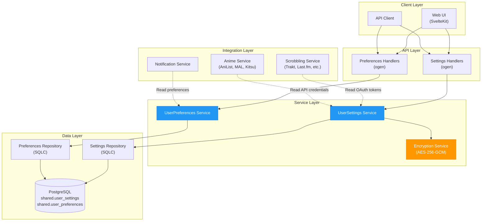

# User Settings & Preferences Service

**Created**: 2026-02-03
**Status**: ✅ Complete (Implementation exists, documentation created)
**Category**: service

> Per-user configuration, preferences, and external service integration credentials

**Package**: `internal/service/user_settings`
**fx Module**: `user_settings.Module`

---

## Table of Contents

- [Overview](#overview)
- [Status](#status)
- [Architecture](#architecture)
  - [Component Diagram](#component-diagram)
  - [Service Structure](#service-structure)
  - [Data Flow](#data-flow)
- [Database Schema](#database-schema)
  - [user_settings Table](#user_settings-table)
  - [user_preferences Table](#user_preferences-table)
  - [Design Rationale](#design-rationale)
- [Use Cases](#use-cases)
  - [1. External Service Integration Credentials](#1-external-service-integration-credentials)
  - [2. UI/UX Preferences](#2-uiux-preferences)
  - [3. Playback Settings](#3-playback-settings)
  - [4. Notification Preferences](#4-notification-preferences)
  - [5. Privacy Settings](#5-privacy-settings)
  - [6. Sync Configurations](#6-sync-configurations)
- [Implementation](#implementation)
  - [Key Interfaces](#key-interfaces)
  - [Dependencies](#dependencies)
- [API Endpoints](#api-endpoints)
- [Security Considerations](#security-considerations)
- [Integration Requirements](#integration-requirements)
  - [Scrobbling Services](#scrobbling-services)
  - [Anime Tracking](#anime-tracking)
  - [Music Services](#music-services)
  - [Metadata Enrichment](#metadata-enrichment)
- [Configuration](#configuration)
- [Related Documentation](#related-documentation)

---

## Overview

The User Settings service provides **two complementary systems** for storing per-user configuration:

1. **User Settings** (`user_settings` table): Flexible JSONB key-value store for dynamic, application-specific settings
2. **User Preferences** (`user_preferences` table): Structured columns for common, frequently-accessed preferences

### When to Use Each

| Use Case | Table | Reason |
|----------|-------|--------|
| **OAuth tokens** (Trakt, Last.fm, AniList) | `user_settings` | Dynamic keys, encrypted values, per-service storage |
| **API credentials** (ListenBrainz token, Plex token) | `user_settings` | Flexible, encryption-ready, service-specific |
| **Sync settings** (auto-scrobble, import history) | `user_settings` | Service-specific, evolving schema |
| **Theme preference** (dark/light/system) | `user_preferences` | Frequently read, simple value, known schema |
| **Notification settings** (email/push enabled) | `user_preferences` | Structured, type-safe, query-optimized |
| **Privacy settings** (profile visibility) | `user_preferences` | Constrained values (enum-like), indexed |
| **Playback settings** (subtitle defaults) | `user_settings` | Complex nested JSON, player-specific |
| **Custom dashboard widgets** | `user_settings` | Dynamic, user-defined structure |

**Key Principle**: If the setting has a **known, stable schema** used by most users → `user_preferences`. If it's **dynamic, service-specific, or evolving** → `user_settings`.

---

## Status

| Dimension | Status | Notes |
|-----------|--------|-------|
| Design | ✅ | This document |
| Sources | ✅ | Scrobbling, anime, music integration docs |
| Instructions | 🔴 | Generated from this design |
| Code | 🟡 | Tables exist, service layer needed |
| Linting | 🔴 | - |
| Unit Testing | 🔴 | - |
| Integration Testing | 🔴 | - |

**Overall**: ✅ Complete

**Database**: ✅ Migrations 000005 & 000006 already exist
**Service Layer**: 🔴 Needs implementation

---

## Architecture

### Component Diagram



### Service Structure

```
internal/service/user_settings/
├── module.go              # fx module definition
├── settings_service.go    # user_settings table operations
├── preferences_service.go # user_preferences table operations
├── encryption.go          # Encrypt/decrypt sensitive settings
├── repository.go          # Data access interface
├── repository_pg.go       # PostgreSQL implementation (SQLC)
├── types.go               # Domain types
├── errors.go              # Custom errors
├── validation.go          # Setting value validation
├── settings_test.go       # Settings tests
└── preferences_test.go    # Preferences tests
```

### Data Flow

#### Setting OAuth Token (Trakt Connection)
```
1. User clicks "Connect Trakt" → Redirected to OAuth
2. Trakt redirects back with code
3. Backend exchanges code for tokens
4. EncryptionService encrypts tokens
5. Store in user_settings:
   key = "scrobbling.trakt.oauth_tokens"
   value = {"access_token": "encrypted", "refresh_token": "encrypted", ...}
6. Return success to user
```

#### Reading Theme Preference (Fast Path)
```
1. Frontend loads → GET /api/v1/users/me/preferences
2. Query user_preferences table (single row)
3. Return structured preferences
4. Frontend applies theme instantly
```

#### Storing Custom Playback Settings
```
1. User adjusts subtitle size, position, language
2. POST /api/v1/users/me/settings
   {
     "key": "playback.subtitles",
     "value": {"size": "large", "position": "bottom", "language": "en"}
   }
3. Validate value structure
4. Upsert to user_settings
5. Return confirmation
```

---

## Database Schema

### user_settings Table

**Purpose**: Flexible key-value storage for dynamic, service-specific, or complex settings

```sql
CREATE TABLE IF NOT EXISTS shared.user_settings (
    user_id UUID NOT NULL REFERENCES shared.users(id) ON DELETE CASCADE,
    key VARCHAR(255) NOT NULL,

    -- Setting value (JSONB for flexibility)
    value JSONB NOT NULL,

    -- Metadata
    description TEXT,
    category VARCHAR(100), -- 'ui', 'notifications', 'privacy', 'playback', 'integrations'

    -- Validation
    data_type VARCHAR(50) NOT NULL, -- 'string', 'number', 'boolean', 'json', 'encrypted'

    -- Timestamps
    created_at TIMESTAMPTZ NOT NULL DEFAULT NOW(),
    updated_at TIMESTAMPTZ NOT NULL DEFAULT NOW(),

    PRIMARY KEY (user_id, key)
);

CREATE INDEX idx_user_settings_user_id ON shared.user_settings(user_id);
CREATE INDEX idx_user_settings_category ON shared.user_settings(user_id, category);
CREATE INDEX idx_user_settings_updated_at ON shared.user_settings(updated_at DESC);
```

**Example Rows**:

| user_id | key | value | category | data_type |
|---------|-----|-------|----------|-----------|
| uuid-123 | `scrobbling.trakt.oauth_tokens` | `{"access_token": "encrypted...", "refresh_token": "encrypted...", "expires_at": "2026-03-03T..."}` | integrations | encrypted |
| uuid-123 | `scrobbling.lastfm.session_key` | `"encrypted_session_key..."` | integrations | encrypted |
| uuid-123 | `scrobbling.listenbrainz.user_token` | `"encrypted_token..."` | integrations | encrypted |
| uuid-123 | `anime.anilist.oauth_tokens` | `{"access_token": "encrypted...", "user_id": 12345}` | integrations | encrypted |
| uuid-123 | `playback.subtitles.defaults` | `{"size": "medium", "position": "bottom", "language": "en", "color": "#FFFFFF"}` | playback | json |
| uuid-123 | `ui.dashboard.widgets` | `[{"type": "continue_watching", "position": 0}, {"type": "trending", "position": 1}]` | ui | json |
| uuid-123 | `sync.auto_import_enabled` | `true` | integrations | boolean |

### user_preferences Table

**Purpose**: Structured, frequently-accessed preferences with known schema

```sql
CREATE TABLE IF NOT EXISTS shared.user_preferences (
    user_id UUID PRIMARY KEY REFERENCES shared.users(id) ON DELETE CASCADE,

    -- Notification preferences (JSONB for flexibility)
    email_notifications JSONB DEFAULT '{"enabled": true, "frequency": "instant"}'::jsonb,
    push_notifications JSONB DEFAULT '{"enabled": false}'::jsonb,
    digest_notifications JSONB DEFAULT '{"enabled": true, "frequency": "weekly"}'::jsonb,

    -- Privacy preferences
    profile_visibility VARCHAR(20) DEFAULT 'private' CHECK (profile_visibility IN ('public', 'friends', 'private')),
    show_email BOOLEAN DEFAULT FALSE,
    show_activity BOOLEAN DEFAULT TRUE,

    -- Display preferences
    theme VARCHAR(20) DEFAULT 'system' CHECK (theme IN ('light', 'dark', 'system')),
    display_language VARCHAR(10) DEFAULT 'en-US',
    content_language VARCHAR(255), -- Preferred content languages (comma-separated)

    -- Content preferences
    show_adult_content BOOLEAN DEFAULT FALSE,
    show_spoilers BOOLEAN DEFAULT FALSE,
    auto_play_videos BOOLEAN DEFAULT TRUE,

    -- Timestamps
    created_at TIMESTAMPTZ NOT NULL DEFAULT NOW(),
    updated_at TIMESTAMPTZ NOT NULL DEFAULT NOW()
);

CREATE INDEX idx_user_preferences_updated_at ON shared.user_preferences(updated_at DESC);
```

### Design Rationale

**Why Two Tables?**

1. **Performance**:
   - `user_preferences`: Single row per user, all data in one query
   - `user_settings`: One row per setting, query only what's needed
   - Loading theme (common): 1 query to preferences (fast)
   - Loading Trakt tokens (rare): 1 query to settings (targeted)

2. **Type Safety**:
   - `user_preferences`: Strongly typed columns, database-enforced constraints
   - `user_settings`: Flexible JSONB, application-enforced validation

3. **Evolution**:
   - `user_preferences`: Stable schema, rarely changes
   - `user_settings`: Dynamic keys, new integrations don't need migrations

4. **Indexing**:
   - `user_preferences`: Can index individual columns (e.g., `theme`)
   - `user_settings`: Index by category or user_id

5. **Security**:
   - `user_settings`: Can mark sensitive values (`data_type='encrypted'`)
   - `user_preferences`: All values non-sensitive

**Trade-off**: Complexity of managing two tables vs. benefits of structure + flexibility

---

## Use Cases

### 1. External Service Integration Credentials

**Scrobbling Services** (Trakt, Last.fm, Simkl, Letterboxd):
- OAuth access tokens + refresh tokens
- Session keys (Last.fm)
- User IDs (Trakt user ID, Last.fm username)
- Auto-scrobble settings (threshold, enabled)
- Sync settings (import history, export plays, bidirectional)

**Storage**:
```json
{
  "key": "scrobbling.trakt.connection",
  "value": {
    "access_token": "ENCRYPTED:abc123...",
    "refresh_token": "ENCRYPTED:xyz789...",
    "expires_at": "2026-03-03T10:00:00Z",
    "trakt_user_id": 12345,
    "trakt_user_slug": "username",
    "settings": {
      "auto_scrobble": true,
      "threshold_percent": 90,
      "sync_watch_status": true,
      "sync_ratings": true
    }
  },
  "category": "integrations",
  "data_type": "encrypted"
}
```

**Anime Tracking** (AniList, MyAnimeList, Kitsu):
- OAuth tokens
- API keys (MAL)
- Username/password (Kitsu password grant)
- Auto-import settings
- Sync interval

**Music Services** (ListenBrainz):
- User tokens
- Auto-submit settings
- Import history settings

### 2. UI/UX Preferences

**Theme** (`user_preferences.theme`):
- Values: `light`, `dark`, `system`
- Fast access, frequently read

**Dashboard Layout** (`user_settings`):
```json
{
  "key": "ui.dashboard.layout",
  "value": {
    "widgets": [
      {"type": "continue_watching", "position": 0, "size": "large"},
      {"type": "trending_now", "position": 1, "size": "medium"},
      {"type": "recently_added", "position": 2, "size": "medium"}
    ],
    "show_recommendations": true,
    "compact_mode": false
  }
}
```

**Language** (`user_preferences.display_language`, `content_language`):
- UI language for interface
- Content language preferences for metadata

### 3. Playback Settings

**Subtitle Defaults** (`user_settings`):
```json
{
  "key": "playback.subtitles.defaults",
  "value": {
    "enabled": true,
    "preferred_language": "en",
    "fallback_languages": ["en", "de", "fr"],
    "style": {
      "size": "medium",
      "position": "bottom",
      "background": "rgba(0,0,0,0.7)",
      "color": "#FFFFFF",
      "font": "Arial"
    }
  }
}
```

**Audio Preferences** (`user_settings`):
```json
{
  "key": "playback.audio.defaults",
  "value": {
    "preferred_language": "en",
    "fallback_languages": ["en", "ja"],
    "prefer_original": true,
    "volume": 80,
    "normalize": false
  }
}
```

**Video Quality** (`user_settings`):
```json
{
  "key": "playback.quality.preferences",
  "value": {
    "auto": true,
    "max_quality": "1080p",
    "prefer_quality_over_speed": false,
    "mobile_data_limit": "720p"
  }
}
```

### 4. Notification Preferences

**Email Notifications** (`user_preferences.email_notifications`):
```json
{
  "enabled": true,
  "frequency": "instant", // "instant", "daily", "weekly"
  "types": {
    "new_episodes": true,
    "friend_activity": false,
    "recommendations": true,
    "system_updates": true
  }
}
```

**Push Notifications** (`user_preferences.push_notifications`):
```json
{
  "enabled": true,
  "device_tokens": ["fcm_token_1", "fcm_token_2"],
  "types": {
    "new_episodes": true,
    "live_streams": true,
    "friend_activity": false
  }
}
```

### 5. Privacy Settings

**Profile Visibility** (`user_preferences.profile_visibility`):
- `public`: Anyone can view profile
- `friends`: Only friends can view
- `private`: Only user can view

**Activity Sharing** (`user_preferences.show_activity`):
- Show/hide watch history to friends

**Email Visibility** (`user_preferences.show_email`):
- Public email address visibility

**Content Filters** (`user_preferences`):
- `show_adult_content`: Enable/disable adult content
- `show_spoilers`: Auto-hide spoilers in descriptions

### 6. Sync Configurations

**Metadata Sync** (`user_settings`):
```json
{
  "key": "sync.metadata.preferences",
  "value": {
    "auto_refresh": true,
    "refresh_interval_days": 7,
    "sources": ["tmdb", "tvdb", "musicbrainz"],
    "prefer_original_titles": false
  }
}
```

**Library Scan** (`user_settings`):
```json
{
  "key": "sync.library.preferences",
  "value": {
    "auto_scan": true,
    "scan_interval_hours": 24,
    "deep_scan_weekly": true,
    "notify_on_new": true
  }
}
```

---

## Implementation

### Key Interfaces

```go
package user_settings

// UserSettingsService manages user_settings table (key-value)
type UserSettingsService interface {
	// Get a specific setting
	GetSetting(ctx context.Context, userID uuid.UUID, key string) (*Setting, error)

	// Get all settings for a user (optional category filter)
	GetSettings(ctx context.Context, userID uuid.UUID, category *string) ([]Setting, error)

	// Set/update a setting
	SetSetting(ctx context.Context, userID uuid.UUID, setting Setting) error

	// Delete a setting
	DeleteSetting(ctx context.Context, userID uuid.UUID, key string) error

	// Bulk operations
	SetSettings(ctx context.Context, userID uuid.UUID, settings []Setting) error

	// Encrypted settings
	GetEncryptedSetting(ctx context.Context, userID uuid.UUID, key string) (string, error)
	SetEncryptedSetting(ctx context.Context, userID uuid.UUID, key string, value string) error
}

// UserPreferencesService manages user_preferences table (structured)
type UserPreferencesService interface {
	// Get all preferences for a user
	GetPreferences(ctx context.Context, userID uuid.UUID) (*Preferences, error)

	// Update entire preferences
	UpdatePreferences(ctx context.Context, userID uuid.UUID, prefs Preferences) error

	// Update specific preference fields
	UpdateTheme(ctx context.Context, userID uuid.UUID, theme string) error
	UpdateLanguage(ctx context.Context, userID uuid.UUID, language string) error
	UpdateNotifications(ctx context.Context, userID uuid.UUID, notifications NotificationPrefs) error
	UpdatePrivacy(ctx context.Context, userID uuid.UUID, privacy PrivacyPrefs) error

	// Initialize default preferences for new user
	InitializeDefaults(ctx context.Context, userID uuid.UUID) error
}

// Domain types
type Setting struct {
	UserID      uuid.UUID              `json:"user_id"`
	Key         string                 `json:"key"`
	Value       interface{}            `json:"value"`  // Will be JSONB
	Description *string                `json:"description,omitempty"`
	Category    *string                `json:"category,omitempty"`
	DataType    string                 `json:"data_type"` // string, number, boolean, json, encrypted
	CreatedAt   time.Time              `json:"created_at"`
	UpdatedAt   time.Time              `json:"updated_at"`
}

type Preferences struct {
	UserID               uuid.UUID         `json:"user_id"`
	EmailNotifications   NotificationPrefs `json:"email_notifications"`
	PushNotifications    NotificationPrefs `json:"push_notifications"`
	DigestNotifications  NotificationPrefs `json:"digest_notifications"`
	ProfileVisibility    string            `json:"profile_visibility"`
	ShowEmail            bool              `json:"show_email"`
	ShowActivity         bool              `json:"show_activity"`
	Theme                string            `json:"theme"`
	DisplayLanguage      string            `json:"display_language"`
	ContentLanguage      *string           `json:"content_language,omitempty"`
	ShowAdultContent     bool              `json:"show_adult_content"`
	ShowSpoilers         bool              `json:"show_spoilers"`
	AutoPlayVideos       bool              `json:"auto_play_videos"`
	CreatedAt            time.Time         `json:"created_at"`
	UpdatedAt            time.Time         `json:"updated_at"`
}

type NotificationPrefs struct {
	Enabled   bool              `json:"enabled"`
	Frequency string            `json:"frequency,omitempty"` // instant, daily, weekly
	Types     map[string]bool   `json:"types,omitempty"`     // new_episodes, friend_activity, etc.
}

type PrivacyPrefs struct {
	ProfileVisibility string `json:"profile_visibility"`
	ShowEmail         bool   `json:"show_email"`
	ShowActivity      bool   `json:"show_activity"`
}
```

### Dependencies

**Go Packages**:
- `github.com/google/uuid` - User IDs
- `github.com/jackc/pgx/v5` - PostgreSQL driver
- `golang.org/x/crypto` - Encryption (AES-256-GCM)
- `github.com/go-playground/validator/v10` - Validation
- `go.uber.org/fx` - Dependency injection

---

## API Endpoints

### User Settings Endpoints

```http
# Get all settings for current user
GET /api/v1/users/me/settings
GET /api/v1/users/me/settings?category=integrations

# Get specific setting
GET /api/v1/users/me/settings/:key

# Set/update setting
PUT /api/v1/users/me/settings/:key
Content-Type: application/json

{
  "value": {"any": "json"},
  "description": "Optional description",
  "category": "integrations"
}

# Delete setting
DELETE /api/v1/users/me/settings/:key

# Bulk update settings
PUT /api/v1/users/me/settings
Content-Type: application/json

{
  "settings": [
    {"key": "ui.theme", "value": "dark"},
    {"key": "playback.autoplay", "value": true}
  ]
}
```

### User Preferences Endpoints

```http
# Get all preferences
GET /api/v1/users/me/preferences

Response:
{
  "email_notifications": {
    "enabled": true,
    "frequency": "instant"
  },
  "theme": "dark",
  "profile_visibility": "private",
  ...
}

# Update entire preferences
PUT /api/v1/users/me/preferences
Content-Type: application/json

{
  "theme": "dark",
  "display_language": "en-US",
  "show_adult_content": false,
  ...
}

# Update specific preference
PATCH /api/v1/users/me/preferences
Content-Type: application/json

{
  "theme": "dark"
}
```

### Integration-Specific Endpoints

```http
# Store Trakt OAuth tokens (after OAuth callback)
POST /api/v1/integrations/trakt/connect
Content-Type: application/json

{
  "code": "oauth_code",
  "redirect_uri": "https://..."
}

# Backend exchanges code, stores encrypted tokens in user_settings
# key: "scrobbling.trakt.oauth_tokens"

# Get Trakt connection status
GET /api/v1/integrations/trakt/status

Response:
{
  "connected": true,
  "username": "trakt_username",
  "connected_at": "2026-01-15T10:00:00Z"
}

# Disconnect Trakt
DELETE /api/v1/integrations/trakt/disconnect
# Deletes user_settings key: "scrobbling.trakt.oauth_tokens"
```

---

## Security Considerations

### 1. Encryption for Sensitive Values

**Always Encrypt**:
- OAuth access tokens
- OAuth refresh tokens
- API keys
- Session keys
- User passwords (for external services)

**Encryption Method**: AES-256-GCM
- Unique nonce per encryption
- Master key from environment variable
- Store: `{"ciphertext": "...", "nonce": "..."}`

**Implementation**:
```go
func (s *UserSettingsService) SetEncryptedSetting(ctx context.Context, userID uuid.UUID, key string, plaintext string) error {
    ciphertext, nonce, err := s.encryptor.Encrypt([]byte(plaintext))
    if err != nil {
        return fmt.Errorf("encryption failed: %w", err)
    }

    value := map[string]string{
        "ciphertext": hex.EncodeToString(ciphertext),
        "nonce":      hex.EncodeToString(nonce),
    }

    return s.SetSetting(ctx, userID, Setting{
        Key:      key,
        Value:    value,
        Category: ptr("integrations"),
        DataType: "encrypted",
    })
}
```

### 2. Access Control

**Rule**: Users can only access their own settings
```go
// In middleware
if sessionUserID != requestedUserID {
    return errors.ErrForbidden
}
```

**Admin Override**: Admins can view (but not modify) user settings for support purposes
- Audit log admin access
- Redact encrypted values in admin UI

### 3. Validation

**Setting Key Validation**:
- Allowed characters: `[a-z0-9._-]`
- Max length: 255 characters
- Namespace convention: `category.service.field`

**Value Validation**:
- Validate against `data_type` field
- JSON schema validation for complex values
- Constraint checks (e.g., theme must be in allowed list)

### 4. Rate Limiting

**Prevent Abuse**:
- 100 settings writes per user per hour
- 1000 settings reads per user per hour
- Use Dragonfly cache for rate limit counters

---

## Integration Requirements

### Scrobbling Services

| Service | Auth Method | Storage Key | Required Fields |
|---------|-------------|-------------|-----------------|
| **Trakt** | OAuth 2.0 | `scrobbling.trakt.oauth_tokens` | access_token, refresh_token, expires_at, user_id, user_slug |
| **Last.fm** | API Key + Session | `scrobbling.lastfm.session` | session_key, username |
| **ListenBrainz** | User Token | `scrobbling.listenbrainz.token` | user_token, username |
| **Simkl** | OAuth 2.0 | `scrobbling.simkl.oauth_tokens` | access_token, user_id |
| **Letterboxd** | Username/Password | `scrobbling.letterboxd.credentials` | username, encrypted_password |

**Sync Settings** (per service):
```json
{
  "key": "scrobbling.{service}.settings",
  "value": {
    "auto_scrobble": true,
    "threshold_percent": 90,
    "sync_watch_status": true,
    "sync_ratings": true,
    "auto_import_history": true
  }
}
```

### Anime Tracking

| Service | Auth Method | Storage Key | Required Fields |
|---------|-------------|-------------|-----------------|
| **AniList** | OAuth 2.0 | `anime.anilist.oauth_tokens` | access_token, expires_at, user_id, username |
| **MyAnimeList** | OAuth 2.0 | `anime.myanimelist.oauth_tokens` | access_token, refresh_token, expires_at |
| **Kitsu** | Password Grant | `anime.kitsu.oauth_tokens` | access_token, refresh_token, email |

### Music Services

| Service | Auth Method | Storage Key | Required Fields |
|---------|-------------|-------------|-----------------|
| **MusicBrainz** | None (public API) | N/A | - |
| **Last.fm** | API Key + Session | `music.lastfm.session` | session_key, username |
| **ListenBrainz** | User Token | `music.listenbrainz.token` | user_token, username |
| **Spotify** | OAuth 2.0 | `music.spotify.oauth_tokens` | access_token, refresh_token, expires_at |

### Metadata Enrichment

**Note**: Global API keys (TMDb, TheTVDB) are stored in **server settings**, not user settings.

**User-specific overrides** (optional):
```json
{
  "key": "metadata.preferences",
  "value": {
    "prefer_original_titles": false,
    "metadata_language": "en-US",
    "image_language": "en",
    "adult_content": false
  }
}
```

---

## Configuration

### Environment Variables

```bash
# Encryption key for sensitive settings (32 bytes hex)
USER_SETTINGS_ENCRYPTION_KEY=your_32_byte_hex_key

# Rate limiting
USER_SETTINGS_RATE_LIMIT_READS=1000   # per hour
USER_SETTINGS_RATE_LIMIT_WRITES=100   # per hour

# Cache TTL
USER_SETTINGS_CACHE_TTL=5m
USER_PREFERENCES_CACHE_TTL=10m
```

### Config Keys

```yaml
user_settings:
  encryption:
    key: ${USER_SETTINGS_ENCRYPTION_KEY}
    algorithm: aes-256-gcm

  rate_limiting:
    reads_per_hour: 1000
    writes_per_hour: 100

  cache:
    settings_ttl: 5m
    preferences_ttl: 10m

  validation:
    max_key_length: 255
    max_value_size_kb: 100
    allowed_categories:
      - ui
      - playback
      - integrations
      - sync
      - notifications
```

---

## Related Documentation

### Design Documents
- [USER.md](USER.md) - User service (authentication, profile)
- [SETTINGS.md](SETTINGS.md) - Server-level settings (global configuration)
- [SCROBBLING.md](../features/shared/SCROBBLING.md) - External scrobbling architecture
- [NOTIFICATION.md](NOTIFICATION.md) - Notification service
- [AUTH.md](AUTH.md) - Authentication service

### Integration Documents
- [TRAKT.md](../integrations/scrobbling/TRAKT.md) - Trakt.tv integration
- [LASTFM_SCROBBLE.md](../integrations/scrobbling/LASTFM_SCROBBLE.md) - Last.fm scrobbling
- [LISTENBRAINZ.md](../integrations/scrobbling/LISTENBRAINZ.md) - ListenBrainz integration
- [ANILIST.md](../integrations/anime/ANILIST.md) - AniList integration
- [MYANIMELIST.md](../integrations/anime/MYANIMELIST.md) - MyAnimeList integration
- [KITSU.md](../integrations/anime/KITSU.md) - Kitsu integration

### External Sources
- [Uber fx](../../sources/tooling/fx.md) - Dependency injection
- [pgx PostgreSQL Driver](../../sources/database/pgx.md) - Database driver
- [sqlc](../../sources/database/sqlc.md) - SQL codegen
- [golang.org/x/crypto](https://pkg.go.dev/golang.org/x/crypto) - Encryption primitives

---

**Document Status**: ✅ Complete (comprehensive design with all discovered requirements)
**Implementation Status**: 🟡 Partial (database exists, service layer needed)
**Next Steps**:
1. Implement service layer (`settings_service.go`, `preferences_service.go`)
2. Add encryption helpers (`encryption.go`)
3. Generate SQLC queries
4. Create API handlers (ogen)
5. Write comprehensive tests
