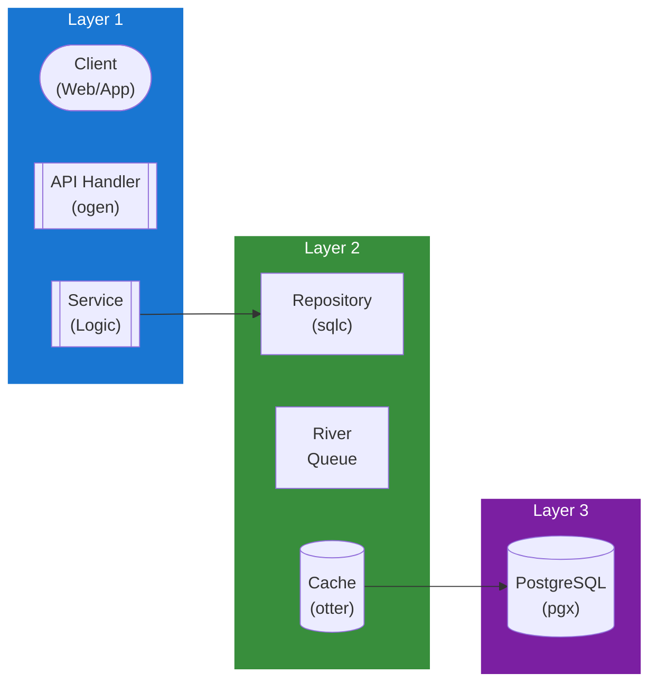

## Table of Contents

- [Activity Service](#activity-service)
  - [Status](#status)
  - [Architecture](#architecture)
    - [Service Structure](#service-structure)
    - [Dependencies](#dependencies)
    - [Provides](#provides)
    - [Component Diagram](#component-diagram)
  - [Implementation](#implementation)
    - [Key Interfaces](#key-interfaces)
    - [Dependencies](#dependencies)
  - [Configuration](#configuration)
    - [Environment Variables](#environment-variables)
    - [Config Keys](#config-keys)
  - [API Endpoints](#api-endpoints)
  - [Related Documentation](#related-documentation)
    - [Design Documents](#design-documents)
    - [External Sources](#external-sources)

# Activity Service

<!-- DESIGN: services, README, test_output_claude, test_output_wiki -->


**Created**: 2026-01-31
**Status**: 🟡 In Progress
**Category**: service


> > Audit logging and event tracking

**Package**: `internal/service/activity`
**fx Module**: `activity.Module`

---


## Status

| Dimension | Status | Notes |
|-----------|--------|-------|
| Design | ✅ | - |
| Sources | ✅ | - |
| Instructions | ✅ | - |
| Code | 🟡 Partial | - |
| Linting | 🔴 | - |
| Unit Testing | 🔴 | - |
| Integration Testing | 🔴 | - |

**Overall**: 🟡 In Progress


---


## Architecture



### Service Structure

```
internal/service/activity/
├── module.go              # fx module (NewService, NewPostgresRepository, NewServiceLogger)
├── service.go             # Service struct + business logic (12 methods) + types
├── repository.go          # Repository interface (14 methods) + domain types
├── repository_pg.go       # PostgreSQL implementation (sqlc)
├── logger.go              # Logger interface + ServiceLogger + NoopLogger implementations
└── (no tests yet)
```

### Dependencies
**Go Packages**:
- `github.com/google/uuid`
- `go.uber.org/fx`, `go.uber.org/zap`

**Internal Dependencies**:
- `internal/infra/database/db` - sqlc generated queries

### Provides

`activity.Module` provides: `NewService`, `NewPostgresRepository`, `NewServiceLogger` (as `activity.Logger`)

**Note**: The `Logger` interface is injected into other services (auth, user, rbac, library) for audit logging.

## Implementation

### Key Interfaces (from code) ✅

```go
// Service is a concrete struct.
// Source: internal/service/activity/service.go
type Service struct {
  repo   Repository
  logger *zap.Logger
}

// Logging (3 methods)
func (s *Service) Log(ctx context.Context, req LogRequest) error
func (s *Service) LogWithContext(ctx context.Context, req LogActionRequest) error
func (s *Service) LogFailure(ctx context.Context, req LogFailureRequest) error

// Querying (7 methods)
func (s *Service) Get(ctx context.Context, id uuid.UUID) (*Entry, error)
func (s *Service) List(ctx context.Context, filters SearchFilters) ([]Entry, int64, error)
func (s *Service) Search(ctx context.Context, filters SearchFilters) ([]Entry, int64, error)
func (s *Service) GetUserActivity(ctx context.Context, userID uuid.UUID, filters SearchFilters) ([]Entry, int64, error)
func (s *Service) GetResourceActivity(ctx context.Context, resourceType string, resourceID uuid.UUID) ([]Entry, error)
func (s *Service) GetFailedActivity(ctx context.Context, filters SearchFilters) ([]Entry, int64, error)
func (s *Service) GetStats(ctx context.Context) (*Stats, error)
func (s *Service) GetRecentActions(ctx context.Context, limit int) ([]Entry, error)

// Cleanup (2 methods)
func (s *Service) CleanupOldLogs(ctx context.Context, olderThan time.Time) (int64, error)
func (s *Service) CountOldLogs(ctx context.Context, olderThan time.Time) (int64, error)

// Logger interface (injected into other services)
type Logger interface {
  LogAction(ctx context.Context, req LogActionRequest) error
  LogFailure(ctx context.Context, req LogFailureRequest) error
}
// Implementations: ServiceLogger (wraps Service), NoopLogger (for testing)
```

**Key Types**:
- `Entry` - Activity log entry (UserID, Action, ResourceType, ResourceID, IPAddress, UserAgent, Success, etc.)
- `SearchFilters` - Filtering and pagination for queries
- `Stats` - Aggregated activity statistics
- `ActionCount` - Action frequency count
- `LogRequest` / `LogActionRequest` / `LogFailureRequest` - Typed log request params
- 27 predefined action constants (user.login, user.create, session.create, library.scan, etc.)
- 9 resource types (user, session, apikey, oidc, setting, library, movie, tvshow, episode)

## Configuration

### Current Config (from code) ✅

From `config.go` `ActivityConfig` (koanf namespace `activity.*`):
```yaml
activity:
  retention_days: 90               # Days to keep activity logs
```

### Planned Config (🔴 not yet in config.go)

```bash
ACTIVITY_CLEANUP_INTERVAL=24h
```

```yaml
activity:
  cleanup_interval: 24h
  log_failed_attempts: true
```

## API Endpoints
```
GET    /api/v1/activity                # Search activity logs
GET    /api/v1/activity/users/:id      # Get user activity
GET    /api/v1/activity/resources/:type/:id # Get resource activity
```

**Example Response**:
```json
{
  "entries": [
    {
      "id": "uuid-123",
      "user_id": "uuid-456",
      "username": "admin",
      "action": "settings.update",
      "resource_type": "setting",
      "resource_id": "uuid-789",
      "changes": {
        "server.name": {
          "old": "Revenge",
          "new": "My Server"
        }
      },
      "ip_address": "192.168.1.100",
      "success": true,
      "created_at": "2026-02-01T10:00:00Z"
    }
  ],
  "total": 1,
  "page": 1
}
```

## Related Documentation
### Design Documents
- [services](INDEX.md)
- [01_ARCHITECTURE](../architecture/ARCHITECTURE.md)
- [02_DESIGN_PRINCIPLES](../architecture/DESIGN_PRINCIPLES.md)
- [03_METADATA_SYSTEM](../architecture/METADATA_SYSTEM.md)

### External Sources
- [Uber fx](../../sources/tooling/fx.md) - Auto-resolved from fx
- [ogen OpenAPI Generator](../../sources/tooling/ogen.md) - Auto-resolved from ogen
- [sqlc](../../sources/database/sqlc.md) - Auto-resolved from sqlc
- [sqlc Configuration](../../sources/database/sqlc-config.md) - Auto-resolved from sqlc-config

