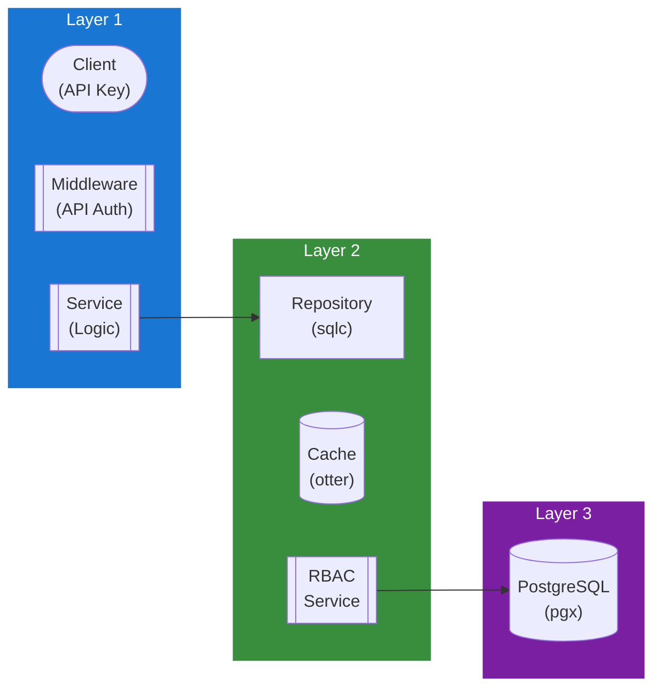

## Table of Contents

- [API Keys Service](#api-keys-service)
  - [Status](#status)
  - [Architecture](#architecture)
    - [Service Structure](#service-structure)
    - [Dependencies](#dependencies)
    - [Provides](#provides)
    - [Component Diagram](#component-diagram)
  - [Implementation](#implementation)
    - [Key Interfaces](#key-interfaces)
    - [Dependencies](#dependencies)
  - [Configuration](#configuration)
    - [Environment Variables](#environment-variables)
    - [Config Keys](#config-keys)
  - [API Endpoints](#api-endpoints)
  - [Related Documentation](#related-documentation)
    - [Design Documents](#design-documents)
    - [External Sources](#external-sources)

# API Keys Service

<!-- DESIGN: services, README, test_output_claude, test_output_wiki -->


**Created**: 2026-01-31
**Status**: 🟡 In Progress
**Category**: service


> > API key generation, validation, and management

**Package**: `internal/service/apikeys`
**fx Module**: `apikeys.Module`

---


## Status

| Dimension | Status | Notes |
|-----------|--------|-------|
| Design | ✅ | - |
| Sources | ✅ | - |
| Instructions | ✅ | - |
| Code | 🟡 Partial | - |
| Linting | 🔴 | - |
| Unit Testing | 🔴 | - |
| Integration Testing | 🔴 | - |

**Overall**: 🟡 In Progress


---


## Architecture



### Service Structure

```
internal/service/apikeys/
├── module.go              # fx module (NewService, NewPostgresRepository)
├── service.go             # Service struct + business logic (8 methods) + types + constants
├── repository.go          # Repository interface (12 methods) + domain types
├── repository_pg.go       # PostgreSQL implementation (sqlc)
└── service_test.go        # Tests (🔴 not yet)
```

### Dependencies
**Go Packages**:
- `github.com/google/uuid`
- `crypto/rand` - Key generation
- `crypto/sha256` - Key hashing
- `go.uber.org/fx`, `go.uber.org/zap`

**Internal Dependencies**:
- `internal/infra/database/db` - sqlc generated queries

### Provides

`apikeys.Module` provides: `NewService`, `NewPostgresRepository`

## Implementation

### Key Interfaces (from code) ✅

```go
// Service is a concrete struct (not interface).
// Source: internal/service/apikeys/service.go
type Service struct {
  repo           Repository
  logger         *zap.Logger
  maxKeysPerUser int
  defaultExpiry  time.Duration
}

// Key management (8 methods)
func (s *Service) CreateKey(ctx context.Context, userID uuid.UUID, req CreateKeyRequest) (*CreateKeyResponse, error)
func (s *Service) GetKey(ctx context.Context, keyID uuid.UUID) (*APIKey, error)
func (s *Service) ListUserKeys(ctx context.Context, userID uuid.UUID) ([]APIKey, error)
func (s *Service) ValidateKey(ctx context.Context, rawKey string) (*APIKey, error)
func (s *Service) RevokeKey(ctx context.Context, keyID uuid.UUID) error
func (s *Service) CheckScope(ctx context.Context, keyID uuid.UUID, requiredScope string) (bool, error)
func (s *Service) UpdateScopes(ctx context.Context, keyID uuid.UUID, scopes []string) error
func (s *Service) CleanupExpiredKeys(ctx context.Context) (int64, error)

// Repository interface (12 methods): CreateAPIKey, GetAPIKey, GetAPIKeyByHash, GetAPIKeyByPrefix,
// ListUserAPIKeys, ListActiveUserAPIKeys, CountUserAPIKeys, RevokeAPIKey,
// UpdateAPIKeyLastUsed, UpdateAPIKeyScopes, DeleteAPIKey, DeleteExpiredAPIKeys
```

**Note**: No `RecordUsage` or `GetUsageStats` methods (planned, not implemented). `CreateKey` returns `*CreateKeyResponse` which includes the `RawKey` (shown once).

**Key Types & Constants**:
- `APIKey` - Key metadata (name, scopes, expiry, last_used, etc.)
- `CreateKeyRequest` - Name, description, scopes, expiry
- `CreateKeyResponse` - Includes `RawKey` (only shown at creation)
- `KeyPrefix = "rv_"`, `KeyLength = 32`, `DefaultMaxKeysPerUser = 10`

## Configuration

### Current Config (from code) ✅

No dedicated `APIKeysConfig` struct in `config.go`. Values are hardcoded as constants:
- `KeyPrefix`: `"rv_"` (prefix for all API keys)
- `KeyLength`: `32` bytes (results in 64-char hex string)
- `DefaultMaxKeysPerUser`: `10`

### Planned Config (🔴 not yet in config.go)

```bash
APIKEYS_LENGTH=32               # bytes
APIKEYS_DEFAULT_EXPIRY=0        # 0 = never expire
APIKEYS_MAX_PER_USER=10
```

```yaml
apikeys:
  length: 32
  default_expiry: 0  # 0 = never expire
  max_per_user: 10
```

## API Endpoints
```
POST   /api/v1/apikeys              # Create API key
GET    /api/v1/apikeys              # List user's keys
GET    /api/v1/apikeys/:id          # Get key details
DELETE /api/v1/apikeys/:id          # Revoke key
GET    /api/v1/apikeys/:id/usage    # Get usage stats
```

**Example Create Request**:
```json
{
  "name": "Mobile App",
  "description": "API key for my mobile app",
  "scopes": ["read", "write"],
  "expires_at": "2027-02-01T00:00:00Z"
}
```

**Example Create Response**:
```json
{
  "id": "123e4567-e89b-12d3-a456-426614174000",
  "name": "Mobile App",
  "scopes": ["read", "write"],
  "api_key": "rv_1234567890abcdefghijklmnopqrstuvwxyz",
  "created_at": "2026-02-01T10:00:00Z",
  "message": "Store this key securely. It won't be shown again."
}
```

## Related Documentation
### Design Documents
- [services](INDEX.md)
- [01_ARCHITECTURE](../architecture/ARCHITECTURE.md)
- [02_DESIGN_PRINCIPLES](../architecture/DESIGN_PRINCIPLES.md)
- [03_METADATA_SYSTEM](../architecture/METADATA_SYSTEM.md)

### External Sources
- [Uber fx](../../sources/tooling/fx.md) - Auto-resolved from fx
- [ogen OpenAPI Generator](../../sources/tooling/ogen.md) - Auto-resolved from ogen
- [pgx PostgreSQL Driver](../../sources/database/pgx.md) - Auto-resolved from pgx
- [PostgreSQL Arrays](../../sources/database/postgresql-arrays.md) - Auto-resolved from postgresql-arrays
- [PostgreSQL JSON Functions](../../sources/database/postgresql-json.md) - Auto-resolved from postgresql-json
- [River Job Queue](../../sources/tooling/river.md) - Auto-resolved from river
- [sqlc](../../sources/database/sqlc.md) - Auto-resolved from sqlc
- [sqlc Configuration](../../sources/database/sqlc-config.md) - Auto-resolved from sqlc-config

