## Table of Contents

- [API Keys Service](#api-keys-service)
  - [Status](#status)
  - [Architecture](#architecture)
    - [Service Structure](#service-structure)
    - [Dependencies](#dependencies)
    - [Provides](#provides)
    - [Component Diagram](#component-diagram)
  - [Implementation](#implementation)
    - [File Structure](#file-structure)
    - [Key Interfaces](#key-interfaces)
    - [Dependencies](#dependencies)
  - [Configuration](#configuration)
    - [Environment Variables](#environment-variables)
    - [Config Keys](#config-keys)
  - [API Endpoints](#api-endpoints)
  - [Testing Strategy](#testing-strategy)
    - [Unit Tests](#unit-tests)
    - [Integration Tests](#integration-tests)
    - [Test Coverage](#test-coverage)
  - [Related Documentation](#related-documentation)
    - [Design Documents](#design-documents)
    - [External Sources](#external-sources)

# API Keys Service


**Created**: 2026-01-31
**Status**: ✅ Complete
**Category**: service


> > API key generation, validation, and management

**Package**: `internal/service/apikeys`
**fx Module**: `apikeys.Module`

---


## Status

| Dimension | Status | Notes |
|-----------|--------|-------|
| Design | ✅ | - |
| Sources | ✅ | - |
| Instructions | ✅ | - |
| Code | 🔴 | - |
| Linting | 🔴 | - |
| Unit Testing | 🔴 | - |
| Integration Testing | 🔴 | - |

**Overall**: ✅ Complete


---


## Architecture

```mermaid
flowchart TD
    node1["Client<br/>(API Key)"]
    node2["Middleware<br/>(API Auth)"]
    node3["Service<br/>(Logic)"]
    node4["▼                      ▼            ▼<br/>──────┐          ┌───────────┐  ┌────<br/>sitory"]
    node5["PostgreSQL<br/>(pgx)"]
    node1 --> node2
    node2 --> node3
    node3 --> node4
    node4 --> node5
```



### Service Structure

```
internal/service/apikeys/
├── module.go              # fx module definition
├── service.go             # Service implementation
├── repository.go          # Data access (if needed)
├── handler.go             # HTTP handlers (if exposed)
├── middleware.go          # Middleware (if needed)
├── types.go               # Domain types
└── service_test.go        # Tests
```

### Dependencies
**Go Packages**:
- `github.com/google/uuid`
- `github.com/jackc/pgx/v5`
- `github.com/maypok86/otter` - API key cache
- `crypto/rand` - Key generation
- `crypto/sha256` - Key hashing
- `go.uber.org/fx`


### Provides
<!-- Service provides -->

### Component Diagram

<!-- Component diagram -->


## Implementation

### File Structure

<!-- File structure -->

### Key Interfaces

```go
type APIKeysService interface {
  // Key management
  CreateKey(ctx context.Context, userID uuid.UUID, req CreateKeyRequest) (*APIKey, string, error) // Returns key and raw token
  GetKey(ctx context.Context, keyID uuid.UUID) (*APIKey, error)
  ListUserKeys(ctx context.Context, userID uuid.UUID) ([]APIKey, error)
  RevokeKey(ctx context.Context, keyID uuid.UUID) error

  // Validation
  ValidateKey(ctx context.Context, rawKey string) (*APIKey, error)
  CheckScope(ctx context.Context, keyID uuid.UUID, requiredScope string) (bool, error)

  // Usage tracking
  RecordUsage(ctx context.Context, keyID uuid.UUID, method, path string, statusCode int) error
  GetUsageStats(ctx context.Context, keyID uuid.UUID) (*UsageStats, error)
}

type APIKey struct {
  ID          uuid.UUID  `db:"id" json:"id"`
  UserID      uuid.UUID  `db:"user_id" json:"user_id"`
  Name        string     `db:"name" json:"name"`
  Description *string    `db:"description" json:"description,omitempty"`
  Scopes      []string   `db:"scopes" json:"scopes"`
  IsActive    bool       `db:"is_active" json:"is_active"`
  ExpiresAt   *time.Time `db:"expires_at" json:"expires_at,omitempty"`
  LastUsedAt  *time.Time `db:"last_used_at" json:"last_used_at,omitempty"`
  CreatedAt   time.Time  `db:"created_at" json:"created_at"`
}

type CreateKeyRequest struct {
  Name        string     `json:"name"`
  Description string     `json:"description,omitempty"`
  Scopes      []string   `json:"scopes"`
  ExpiresAt   *time.Time `json:"expires_at,omitempty"`
}
```


### Dependencies
**Go Packages**:
- `github.com/google/uuid`
- `github.com/jackc/pgx/v5`
- `github.com/maypok86/otter` - API key cache
- `crypto/rand` - Key generation
- `crypto/sha256` - Key hashing
- `go.uber.org/fx`


## Configuration
### Environment Variables

```bash
APIKEYS_LENGTH=32               # bytes
APIKEYS_DEFAULT_EXPIRY=0        # 0 = never expire
APIKEYS_MAX_PER_USER=10
```


### Config Keys
```yaml
apikeys:
  length: 32
  default_expiry: 0  # 0 = never expire
  max_per_user: 10
```


## API Endpoints
```
POST   /api/v1/apikeys              # Create API key
GET    /api/v1/apikeys              # List user's keys
GET    /api/v1/apikeys/:id          # Get key details
DELETE /api/v1/apikeys/:id          # Revoke key
GET    /api/v1/apikeys/:id/usage    # Get usage stats
```

**Example Create Request**:
```json
{
  "name": "Mobile App",
  "description": "API key for my mobile app",
  "scopes": ["read", "write"],
  "expires_at": "2027-02-01T00:00:00Z"
}
```

**Example Create Response**:
```json
{
  "id": "123e4567-e89b-12d3-a456-426614174000",
  "name": "Mobile App",
  "scopes": ["read", "write"],
  "api_key": "rv_1234567890abcdefghijklmnopqrstuvwxyz",
  "created_at": "2026-02-01T10:00:00Z",
  "message": "Store this key securely. It won't be shown again."
}
```


## Testing Strategy

### Unit Tests

<!-- Unit test strategy -->

### Integration Tests

<!-- Integration test strategy -->

### Test Coverage

Target: **80% minimum**


## Related Documentation
### Design Documents
- [services](INDEX.md)
- [01_ARCHITECTURE](../architecture/01_ARCHITECTURE.md)
- [02_DESIGN_PRINCIPLES](../architecture/02_DESIGN_PRINCIPLES.md)
- [03_METADATA_SYSTEM](../architecture/03_METADATA_SYSTEM.md)

### External Sources
- [Uber fx](../../sources/tooling/fx.md) - Auto-resolved from fx
- [ogen OpenAPI Generator](../../sources/tooling/ogen.md) - Auto-resolved from ogen
- [pgx PostgreSQL Driver](../../sources/database/pgx.md) - Auto-resolved from pgx
- [PostgreSQL Arrays](../../sources/database/postgresql-arrays.md) - Auto-resolved from postgresql-arrays
- [PostgreSQL JSON Functions](../../sources/database/postgresql-json.md) - Auto-resolved from postgresql-json
- [River Job Queue](../../sources/tooling/river.md) - Auto-resolved from river
- [sqlc](../../sources/database/sqlc.md) - Auto-resolved from sqlc
- [sqlc Configuration](../../sources/database/sqlc-config.md) - Auto-resolved from sqlc-config

