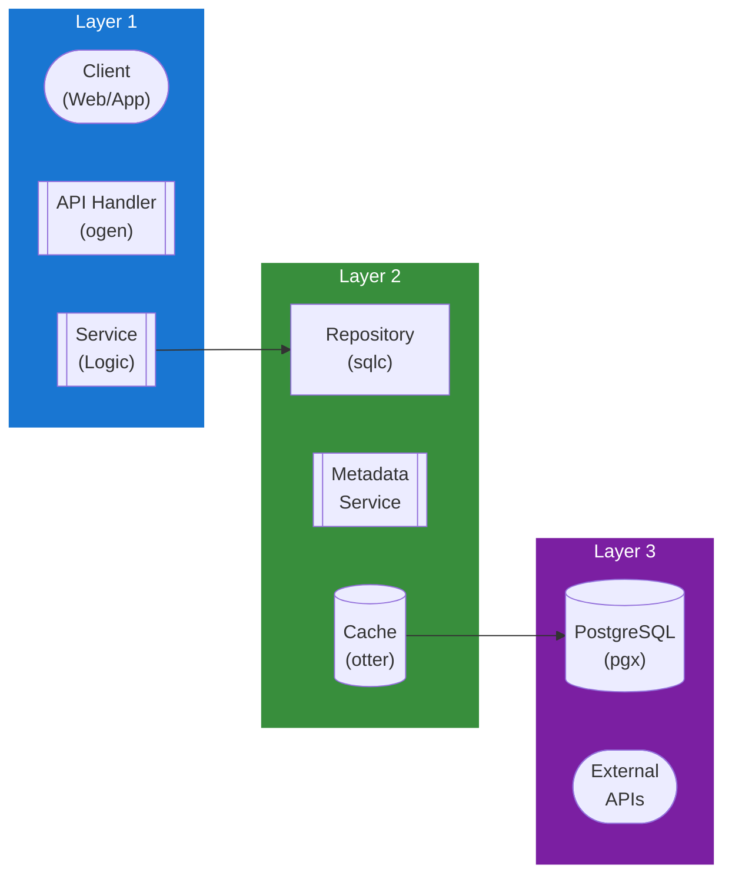

## Table of Contents

- [Auth Service](#auth-service)
  - [Status](#status)
  - [Architecture](#architecture)
    - [Service Structure](#service-structure)
    - [Dependencies](#dependencies)
    - [Provides](#provides)
    - [Component Diagram](#component-diagram)
  - [Implementation](#implementation)
    - [Key Interfaces](#key-interfaces)
    - [Dependencies](#dependencies)
  - [Configuration](#configuration)
    - [Environment Variables](#environment-variables)
    - [Config Keys](#config-keys)
  - [API Endpoints](#api-endpoints)
  - [Related Documentation](#related-documentation)
    - [Design Documents](#design-documents)
    - [External Sources](#external-sources)

# Auth Service

<!-- DESIGN: services, README, test_output_claude, test_output_wiki -->


**Created**: 2026-01-31
**Status**: 🟡 In Progress
**Category**: service


> > Authentication, registration, and password management

**Package**: `internal/service/auth`
**fx Module**: `auth.Module`

---


## Status

| Dimension | Status | Notes |
|-----------|--------|-------|
| Design | ✅ | - |
| Sources | ✅ | - |
| Instructions | ✅ | - |
| Code | 🟡 Partial | - |
| Linting | 🔴 | - |
| Unit Testing | 🔴 | - |
| Integration Testing | 🔴 | - |

**Overall**: 🟡 In Progress


---


## Architecture



### Service Structure

```
internal/service/auth/
├── module.go                      # fx module definition
├── service.go                     # Service struct + business logic (Register, Login, MFA, etc.)
├── repository.go                  # Repository interface + token/param types
├── repository_pg.go               # PostgreSQL implementation (sqlc)
├── jwt.go                         # TokenManager interface + JWT/refresh token implementation
├── mfa_integration.go             # MFAAuthenticator + MFA login flow types
├── service_testing.go             # Test helpers
├── service_exhaustive_test.go     # Exhaustive unit tests
├── service_integration_test.go    # Integration tests
├── jwt_test.go                    # JWT tests
├── mock_repository_test.go        # Mock repository for tests
└── mock_token_manager_test.go     # Mock token manager for tests
```

### Dependencies
**Go Packages**:
- `github.com/google/uuid`
- `github.com/jackc/pgx/v5` - Database via pgxpool
- `github.com/alexedwards/argon2id` - Password hashing (via `internal/crypto.PasswordHasher`)
- `crypto/rand` - Token generation (refresh tokens)
- `crypto/hmac` + `crypto/sha256` - JWT signing + refresh token hashing
- `go.uber.org/fx`

**Internal Dependencies**:
- `internal/crypto` - `PasswordHasher` (Argon2id)
- `internal/service/email` - Verification & password reset emails
- `internal/service/activity` - Login/security activity logging
- `internal/service/mfa` - MFA verification during login (optional)
- `internal/infra/database/db` - sqlc generated queries (`db.SharedUser`, etc.)


### Provides
<!-- Service provides -->

### Component Diagram

<!-- Component diagram -->
## Implementation

### Key Interfaces (from code)

```go
// Service is a concrete struct (not interface) with methods.
// Source: internal/service/auth/service.go
type Service struct {
  pool             *pgxpool.Pool
  repo             Repository
  tokenManager     TokenManager
  hasher           *crypto.PasswordHasher
  activityLogger   activity.Logger
  emailService     *email.Service
  jwtExpiry        time.Duration
  refreshExpiry    time.Duration
  lockoutThreshold int
  lockoutWindow    time.Duration
  lockoutEnabled   bool
}

// Registration
func (s *Service) Register(ctx context.Context, req RegisterRequest) (*db.SharedUser, error)
func (s *Service) VerifyEmail(ctx context.Context, token string) error
func (s *Service) ResendVerification(ctx context.Context, userID uuid.UUID) error
func (s *Service) RegisterFromOIDC(ctx context.Context, req RegisterFromOIDCRequest) (*db.SharedUser, error)

// Login & Session
func (s *Service) Login(ctx context.Context, username, password string, ipAddress *netip.Addr, userAgent, deviceName, deviceFingerprint *string) (*LoginResponse, error)
func (s *Service) Logout(ctx context.Context, refreshToken string) error
func (s *Service) LogoutAll(ctx context.Context, userID uuid.UUID) error
func (s *Service) RefreshToken(ctx context.Context, refreshToken string) (*LoginResponse, error)
func (s *Service) CreateSessionForUser(ctx context.Context, userID uuid.UUID, ipAddress *netip.Addr, userAgent, deviceName *string) (*LoginResponse, error)

// Password Management
func (s *Service) ChangePassword(ctx context.Context, userID uuid.UUID, oldPassword, newPassword string) error
func (s *Service) RequestPasswordReset(ctx context.Context, email string, ipAddress *netip.Addr, userAgent *string) error
func (s *Service) ResetPassword(ctx context.Context, token, newPassword string) error

// MFA Support
func (s *Service) LoginWithMFA(ctx context.Context, username, password string, ipAddress *netip.Addr, userAgent, deviceName, deviceFingerprint *string, mfaAuthenticator *MFAAuthenticator) (*LoginResponse, *MFALoginResponse, error)
func (s *Service) CompleteMFALogin(ctx context.Context, sessionID uuid.UUID, verificationResult *mfa.VerificationResult) error
func (s *Service) GetSessionMFAInfo(ctx context.Context, sessionID uuid.UUID) (*SessionMFAInfo, error)

// TokenManager interface (jwt.go)
type TokenManager interface {
  GenerateAccessToken(userID uuid.UUID, username string) (string, error)
  GenerateRefreshToken() (string, error)
  ValidateAccessToken(token string) (*Claims, error)
  HashRefreshToken(token string) string
  ExtractClaims(token string) (*Claims, error)
}

type RegisterRequest struct {
  Username    string
  Email       string
  Password    string
  DisplayName *string  // pointer, optional
}

type LoginResponse struct {
  User         *db.SharedUser
  AccessToken  string
  RefreshToken string
  ExpiresIn    int64  // seconds until access token expires
}
```

## Configuration

### Current Config (from code) ✅

From `config.go` `AuthConfig` (koanf namespace `auth.*`):
```yaml
auth:
  jwt_secret: ""               # JWT signing secret (min 32 chars)
  jwt_expiry: 24h              # JWT access token validity
  refresh_expiry: 168h         # Refresh token validity (7 days)
  lockout_threshold: 5         # Failed attempts before lockout
  lockout_window: 15m          # Window for counting failed attempts
  lockout_enabled: true        # Enable/disable account lockout
```

Argon2id parameters use `argon2id.DefaultParams` (not configurable via koanf yet).

### Planned Config (🔴 not yet in config.go)

```bash
AUTH_PASSWORD_MIN_LENGTH=8
AUTH_ARGON2_TIME=1
AUTH_ARGON2_MEMORY=64
AUTH_ARGON2_THREADS=4
AUTH_RESET_TOKEN_EXPIRY=1h
AUTH_VERIFICATION_TOKEN_EXPIRY=24h
```

```yaml
auth:
  # 🔴 Planned - password policy config
  password:
    min_length: 8
    require_uppercase: true
    require_lowercase: true
    require_number: true
    require_special: false
  # 🔴 Planned - configurable Argon2id params
  argon2:
    time: 1
    memory: 64  # MiB
    threads: 4
  # 🔴 Planned - token expiry config
  tokens:
    reset_expiry: 1h
    verification_expiry: 24h
```

## API Endpoints
```
POST   /api/v1/auth/register          # Register new user
POST   /api/v1/auth/login             # Login with credentials
POST   /api/v1/auth/logout            # Logout (invalidate session)
POST   /api/v1/auth/verify-email      # Verify email with token
POST   /api/v1/auth/resend-verification # Resend verification email
POST   /api/v1/auth/forgot-password   # Request password reset
POST   /api/v1/auth/reset-password    # Reset password with token
POST   /api/v1/auth/change-password   # Change password (authenticated)
```

**Example Register Request**:
```json
{
  "username": "johndoe",
  "email": "john@example.com",
  "password": "SecurePass123!",
  "display_name": "John Doe"
}
```

**Example Register Response**:
```json
{
  "id": "123e4567-e89b-12d3-a456-426614174000",
  "username": "johndoe",
  "email": "john@example.com",
  "display_name": "John Doe",
  "email_verified": false,
  "is_active": true,
  "created_at": "2026-02-01T10:00:00Z"
}
```

**Example Login Request**:
```json
{
  "username": "johndoe",
  "password": "SecurePass123!"
}
```

**Example Login Response** (matches `LoginResponse` struct):
```json
{
  "user": {
    "id": "123e4567-e89b-12d3-a456-426614174000",
    "username": "johndoe",
    "email": "john@example.com"
  },
  "access_token": "eyJhbGciOiJIUzI1NiIsInR5cCI6IkpXVCJ9...",
  "refresh_token": "a1b2c3d4e5f6...",
  "expires_in": 86400
}
```

## Related Documentation
### Design Documents
- [services](INDEX.md)
- [01_ARCHITECTURE](../architecture/ARCHITECTURE.md)
- [02_DESIGN_PRINCIPLES](../architecture/DESIGN_PRINCIPLES.md)
- [03_METADATA_SYSTEM](../architecture/METADATA_SYSTEM.md)

### External Sources
- [Uber fx](../../sources/tooling/fx.md) - Auto-resolved from fx
- [ogen OpenAPI Generator](../../sources/tooling/ogen.md) - Auto-resolved from ogen

