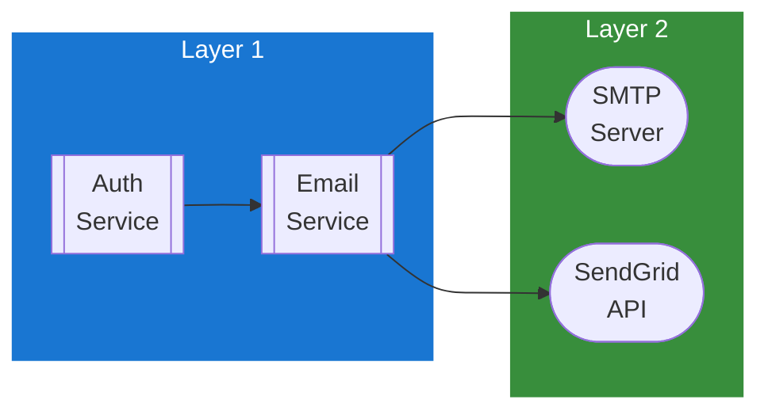

## Table of Contents

- [Email Service](#email-service)
  - [Status](#status)
  - [Architecture](#architecture)
    - [Service Structure](#service-structure)
    - [Dependencies](#dependencies)
  - [Implementation](#implementation)
    - [Key Interfaces](#key-interfaces)
  - [Configuration](#configuration)
  - [Related Documentation](#related-documentation)

# Email Service

<!-- DESIGN: services, README, test_output_claude, test_output_wiki -->


**Created**: 2026-02-06
**Status**: 🟡 In Progress
**Category**: service


> > Transactional email delivery (verification, password reset, welcome)

**Package**: `internal/service/email`
**fx Module**: `email.Module` (fx.Options)

---


## Status

| Dimension | Status | Notes |
|-----------|--------|-------|
| Design | ✅ | This document |
| Sources | ✅ | - |
| Instructions | ✅ | - |
| Code | 🟡 Partial | Service implemented, SendGrid partial |
| Linting | 🔴 | - |
| Unit Testing | 🟡 Partial | service_test.go exists |
| Integration Testing | 🔴 | - |

**Overall**: 🟡 In Progress


---


## Architecture



### Service Structure

```
internal/service/email/
├── module.go              # fx module (provideService)
├── service.go             # Service struct + methods (4 public) + HTML templates
└── service_test.go        # Tests
```

### Dependencies
**Go Packages**:
- `net/smtp` - SMTP delivery
- `crypto/tls` - TLS for SMTP
- `go.uber.org/zap`

**Internal Dependencies**:
- `internal/config` - `config.EmailConfig`, `config.SMTPConfig`, `config.SendGridConfig`

## Implementation

### Key Interfaces (from code) ✅

```go
// Service is a concrete struct.
// Source: internal/service/email/service.go
type Service struct {
  cfg    config.EmailConfig
  logger *zap.Logger
}

// Public methods (4)
func (s *Service) SendVerificationEmail(ctx context.Context, toAddress, username, token string) error
func (s *Service) SendPasswordResetEmail(ctx context.Context, toAddress, username, token string) error
func (s *Service) SendWelcomeEmail(ctx context.Context, toAddress, username string) error
func (s *Service) IsEnabled() bool
```

**Delivery backends**:
- SMTP (fully implemented) - `sendSMTP()` with TLS/STARTTLS support
- SendGrid (partial) - `sendSendGrid()` placeholder

**HTML Templates**: Built-in HTML email templates for verification, password reset, and welcome emails with `buildEmailTemplate()` helper.

## Configuration

### Current Config (from code) ✅

From `config.go` `EmailConfig` (koanf namespace `email.*`):
```yaml
email:
  enabled: false                    # Enable/disable email sending
  provider: smtp                    # "smtp" or "sendgrid"
  from_address: noreply@example.com
  from_name: Revenge
  base_url: http://localhost:3000   # Base URL for email links
  smtp:
    host: localhost
    port: 587
    username: ""
    password: ""
    use_tls: false
    use_starttls: true
    skip_verify: false
    timeout: 10s
  sendgrid:
    api_key: ""
```

## Related Documentation
### Design Documents
- [services](INDEX.md)
- [AUTH.md](AUTH.md) - Auth service uses email for verification and password reset
