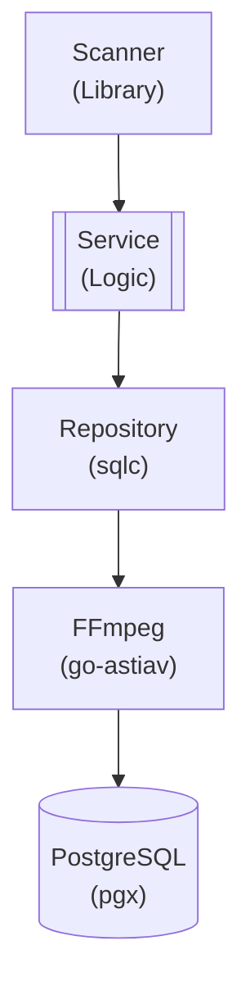

## Table of Contents

- [Fingerprint Service](#fingerprint-service)
  - [Status](#status)
  - [Architecture](#architecture)
    - [Service Structure](#service-structure)
    - [Dependencies](#dependencies)
    - [Provides](#provides)
    - [Component Diagram](#component-diagram)
  - [Implementation](#implementation)
    - [Key Interfaces](#key-interfaces)
    - [Dependencies](#dependencies)
  - [Configuration](#configuration)
    - [Environment Variables](#environment-variables)
    - [Config Keys](#config-keys)
  - [API Endpoints](#api-endpoints)
  - [Related Documentation](#related-documentation)
    - [Design Documents](#design-documents)
    - [External Sources](#external-sources)

# Fingerprint Service


**Created**: 2026-01-31
**Status**: ✅ Complete
**Category**: service


> > Media file identification via perceptual hashing and acoustic fingerprinting

**Package**: `internal/service/fingerprint`
**fx Module**: `fingerprint.Module`

---


## Status

| Dimension | Status | Notes |
|-----------|--------|-------|
| Design | ✅ | - |
| Sources | ✅ | - |
| Instructions | ✅ | - |
| Code | 🔴 | - |
| Linting | 🔴 | - |
| Unit Testing | 🔴 | - |
| Integration Testing | 🔴 | - |

**Overall**: ✅ Complete


---


## Architecture



### Service Structure

```
internal/service/fingerprint/
├── module.go              # fx module definition
├── service.go             # Service implementation
├── repository.go          # Data access (if needed)
├── handler.go             # HTTP handlers (if exposed)
├── middleware.go          # Middleware (if needed)
├── types.go               # Domain types
└── service_test.go        # Tests
```

### Dependencies
**Go Packages**:
- `github.com/google/uuid`
- `github.com/jackc/pgx/v5`
- `github.com/asticode/go-astiav` - FFmpeg for frame extraction
- `crypto/md5` - File hashing
- `crypto/sha256` - File hashing
- `github.com/riverqueue/river` - Background fingerprinting jobs
- `go.uber.org/fx`

**External Tools**:
- FFmpeg (for frame extraction)
- fpcalc (Chromaprint fingerprinting tool)


### Provides
<!-- Service provides -->

### Component Diagram

<!-- Component diagram -->
## Implementation

### Key Interfaces

```go
type FingerprintService interface {
  // Generate fingerprints
  GenerateFingerprint(ctx context.Context, contentType string, contentID uuid.UUID, filePath string) (*Fingerprint, error)
  GenerateBatch(ctx context.Context, files []FileInfo) error

  // Query
  GetFingerprint(ctx context.Context, contentType string, contentID uuid.UUID) (*Fingerprint, error)
  FindSimilar(ctx context.Context, fingerprint Fingerprint, threshold float64) ([]Fingerprint, error)

  // Duplicate detection
  DetectDuplicates(ctx context.Context) ([]DuplicateMatch, error)
  GetDuplicates(ctx context.Context, fingerprintID uuid.UUID) ([]DuplicateMatch, error)
}

type Fingerprint struct {
  ID              uuid.UUID  `db:"id" json:"id"`
  ContentType     string     `db:"content_type" json:"content_type"`
  ContentID       uuid.UUID  `db:"content_id" json:"content_id"`
  FilePath        string     `db:"file_path" json:"file_path"`
  PHash           *int64     `db:"phash" json:"phash,omitempty"`
  Chromaprint     *string    `db:"chromaprint" json:"chromaprint,omitempty"`
  MD5Hash         *string    `db:"md5_hash" json:"md5_hash,omitempty"`
  SHA256Hash      *string    `db:"sha256_hash" json:"sha256_hash,omitempty"`
  FileSizeBytes   int64      `db:"file_size_bytes" json:"file_size_bytes"`
}
```


### Dependencies
**Go Packages**:
- `github.com/google/uuid`
- `github.com/jackc/pgx/v5`
- `github.com/asticode/go-astiav` - FFmpeg for frame extraction
- `crypto/md5` - File hashing
- `crypto/sha256` - File hashing
- `github.com/riverqueue/river` - Background fingerprinting jobs
- `go.uber.org/fx`

**External Tools**:
- FFmpeg (for frame extraction)
- fpcalc (Chromaprint fingerprinting tool)

## Configuration

### Environment Variables

```bash
FINGERPRINT_ENABLED=true
FINGERPRINT_AUTO_SCAN=true
FINGERPRINT_DUPLICATE_THRESHOLD=0.95
```


### Config Keys
```yaml
fingerprint:
  enabled: true
  auto_scan: true
  duplicate_threshold: 0.95
  chromaprint_path: /usr/bin/fpcalc
```

## API Endpoints
```
POST   /api/v1/fingerprints/generate/:type/:id  # Generate fingerprint
GET    /api/v1/fingerprints/:type/:id           # Get fingerprint
POST   /api/v1/fingerprints/detect-duplicates   # Detect duplicates
GET    /api/v1/fingerprints/duplicates          # List all duplicates
DELETE /api/v1/fingerprints/duplicates/:id      # Mark as not duplicate
```

## Related Documentation
### Design Documents
- [services](INDEX.md)
- [01_ARCHITECTURE](../architecture/01_ARCHITECTURE.md)
- [02_DESIGN_PRINCIPLES](../architecture/02_DESIGN_PRINCIPLES.md)
- [03_METADATA_SYSTEM](../architecture/03_METADATA_SYSTEM.md)

### External Sources
- [FFmpeg Documentation](../../sources/media/ffmpeg.md) - Auto-resolved from ffmpeg
- [FFmpeg Codecs](../../sources/media/ffmpeg-codecs.md) - Auto-resolved from ffmpeg-codecs
- [FFmpeg Formats](../../sources/media/ffmpeg-formats.md) - Auto-resolved from ffmpeg-formats
- [Uber fx](../../sources/tooling/fx.md) - Auto-resolved from fx
- [go-astiav (FFmpeg bindings)](../../sources/media/go-astiav.md) - Auto-resolved from go-astiav
- [go-astiav GitHub README](../../sources/media/go-astiav-guide.md) - Auto-resolved from go-astiav-docs
- [pgx PostgreSQL Driver](../../sources/database/pgx.md) - Auto-resolved from pgx
- [PostgreSQL Arrays](../../sources/database/postgresql-arrays.md) - Auto-resolved from postgresql-arrays
- [PostgreSQL JSON Functions](../../sources/database/postgresql-json.md) - Auto-resolved from postgresql-json
- [River Job Queue](../../sources/tooling/river.md) - Auto-resolved from river

