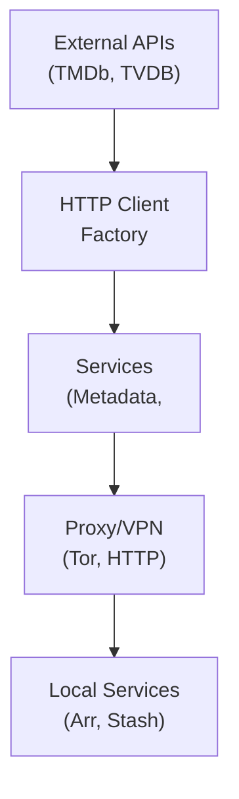

## Table of Contents

- [HTTP Client & Proxy](#http-client-proxy)
  - [Status](#status)
  - [Architecture](#architecture)
    - [Service Structure](#service-structure)
    - [Dependencies](#dependencies)
    - [Provides](#provides)
    - [Component Diagram](#component-diagram)
  - [Implementation](#implementation)
    - [File Structure](#file-structure)
    - [Key Interfaces](#key-interfaces)
    - [Dependencies](#dependencies)
  - [Configuration](#configuration)
    - [Environment Variables](#environment-variables)
- [HTTP proxy](#http-proxy)
- [SOCKS5 proxy (Tor)](#socks5-proxy-tor)
- [VPN interface](#vpn-interface)
- [Default proxy for external APIs](#default-proxy-for-external-apis)
    - [Config Keys](#config-keys)
  - [Testing Strategy](#testing-strategy)
    - [Unit Tests](#unit-tests)
    - [Integration Tests](#integration-tests)
    - [Test Coverage](#test-coverage)
  - [Related Documentation](#related-documentation)
    - [Design Documents](#design-documents)
    - [External Sources](#external-sources)

# HTTP Client & Proxy


**Created**: 2026-02-01
**Status**: ✅ Complete
**Category**: service


> > Centralized HTTP client factory with proxy/VPN support for external API calls

**Package**: `internal/httpclient`
**fx Module**: `**fx Dependency Injection**:

```go
package httpclient

import (
  "go.uber.org/fx"
)

var Module = fx.Module("httpclient",
  fx.Provide(
    NewConfig,        // Load config from koanf
    NewFactory,       // Create factory
    NewHealthChecker, // Background health checking
  ),

  // Named HTTP clients for different services
  fx.Provide(
    fx.Annotate(
      func(f *Factory) *http.Client {
        return f.GetClient("tmdb")
      },
      fx.ResultTags(`name:"tmdb"`),
    ),
    fx.Annotate(
      func(f *Factory) *http.Client {
        return f.GetClient("tvdb")
      },
      fx.ResultTags(`name:"tvdb"`),
    ),
    fx.Annotate(
      func(f *Factory) *http.Client {
        return f.GetClient("musicbrainz")
      },
      fx.ResultTags(`name:"musicbrainz"`),
    ),
    fx.Annotate(
      func(f *Factory) *http.Client {
        return f.GetClient("radarr")
      },
      fx.ResultTags(`name:"radarr"`),
    ),
    // ... more services
  ),
)

// Usage in other services:
package tmdb

type Client struct {
  httpClient *http.Client
}

func NewClient(httpClient *http.Client) *Client {
  return &Client{httpClient: httpClient}
}

// In fx module:
fx.Provide(
  fx.Annotate(
    tmdb.NewClient,
    fx.ParamTags(`name:"tmdb"`),  // Inject TMDb HTTP client
  ),
)
```
`

---


## Status

| Dimension | Status | Notes |
|-----------|--------|-------|
| Design | ✅ | - |
| Sources | ✅ | - |
| Instructions | 🟡 | - |
| Code | 🔴 | - |
| Linting | 🔴 | - |
| Unit Testing | 🔴 | - |
| Integration Testing | 🔴 | - |

**Overall**: ✅ Complete


---


## Architecture



### Service Structure

```
internal/httpclient/
├── module.go              # fx module definition
├── service.go             # Service implementation
├── repository.go          # Data access (if needed)
├── handler.go             # HTTP handlers (if exposed)
├── middleware.go          # Middleware (if needed)
├── types.go               # Domain types
└── service_test.go        # Tests
```

### Dependencies
**Go Packages**:
- `net/http` - HTTP client
- `net/http.Transport` - Transport configuration
- `net` - Network interface binding (VPN)
- `golang.org/x/net/proxy` - SOCKS5 proxy support
- `golang.org/x/time/rate` - Rate limiting
- `github.com/knadh/koanf/v2` - Configuration
- `go.uber.org/fx` - Dependency injection
- `log/slog` - Structured logging


### Provides
<!-- Service provides -->

### Component Diagram

<!-- Component diagram -->


## Implementation

### File Structure

<!-- File structure -->

### Key Interfaces

```go
// HTTP client factory
type ClientFactory interface {
  // Get HTTP client for specific service
  GetClient(service string) *http.Client

  // Get HTTP client with specific proxy
  GetClientWithProxy(proxyURL string) *http.Client

  // Get HTTP client bound to VPN interface
  GetClientWithVPN(interfaceName string) (*http.Client, error)

  // Health check for proxy
  CheckProxyHealth(ctx context.Context, proxyURL string) error
}

// Proxy configuration
type ProxyConfig struct {
  Enabled bool   `koanf:"enabled"`
  Type    string `koanf:"type"`  // "http", "socks5", "vpn"
  URL     string `koanf:"url"`

  // Optional auth
  Username string `koanf:"username"`
  Password string `koanf:"password"`

  // VPN-specific
  Interface string `koanf:"interface"`  // "tun0", "wg0"

  // Health checking
  HealthCheckURL      string        `koanf:"health_check_url"`
  HealthCheckInterval time.Duration `koanf:"health_check_interval"`
}

// Service routing configuration
type ServiceRoute struct {
  Service   string `koanf:"service"`   // "tmdb", "tvdb", "musicbrainz"
  ProxyName string `koanf:"proxy"`     // "default", "tor", "vpn", "none"
}

// Complete configuration
type Config struct {
  // Proxies
  Proxies map[string]ProxyConfig `koanf:"proxies"`

  // Default proxy for external services
  DefaultProxy string `koanf:"default_proxy"`

  // Service-specific routing
  Routes []ServiceRoute `koanf:"routes"`

  // Global settings
  Timeout         time.Duration `koanf:"timeout"`
  MaxIdleConns    int           `koanf:"max_idle_conns"`
  IdleConnTimeout time.Duration `koanf:"idle_conn_timeout"`
}

// HTTP client with metadata
type Client struct {
  *http.Client
  Service   string
  ProxyName string
  ProxyURL  string
}

// Middleware chain
type Middleware func(http.RoundTripper) http.RoundTripper

// Logging middleware
func LoggingMiddleware(logger *slog.Logger) Middleware

// Metrics middleware
func MetricsMiddleware(registry prometheus.Registry) Middleware

// Rate limiting middleware
func RateLimitMiddleware(limiter *rate.Limiter) Middleware

// Retry middleware
func RetryMiddleware(maxRetries int, backoff time.Duration) Middleware
```


### Dependencies
**Go Packages**:
- `net/http` - HTTP client
- `net/http.Transport` - Transport configuration
- `net` - Network interface binding (VPN)
- `golang.org/x/net/proxy` - SOCKS5 proxy support
- `golang.org/x/time/rate` - Rate limiting
- `github.com/knadh/koanf/v2` - Configuration
- `go.uber.org/fx` - Dependency injection
- `log/slog` - Structured logging


## Configuration
### Environment Variables

```bash
# HTTP proxy
HTTP_PROXY=http://proxy.example.com:8080
HTTPS_PROXY=http://proxy.example.com:8080

# SOCKS5 proxy (Tor)
SOCKS5_PROXY=socks5://127.0.0.1:9050

# VPN interface
VPN_INTERFACE=tun0

# Default proxy for external APIs
DEFAULT_PROXY=tor  # "tor", "http", "vpn", "none"
```


### Config Keys
```yaml
httpclient:
  # Global settings
  timeout: 30s
  max_idle_conns: 100
  idle_conn_timeout: 90s

  # Default proxy for external services
  default_proxy: tor

  # Proxy definitions
  proxies:
    tor:
      enabled: true
      type: socks5
      url: socks5://127.0.0.1:9050

    http_proxy:
      enabled: true
      type: http
      url: http://proxy.example.com:8080
      username: user
      password: pass

    vpn:
      enabled: true
      type: vpn
      interface: tun0
      health_check_url: https://api.ipify.org
      health_check_interval: 5m

  # Service-specific routing
  routes:
    - service: tmdb
      proxy: tor              # TMDb → Tor

    - service: tvdb
      proxy: tor              # TheTVDB → Tor

    - service: musicbrainz
      proxy: http_proxy       # MusicBrainz → HTTP proxy

    - service: radarr
      proxy: none             # Radarr → Direct (local)

    - service: sonarr
      proxy: none             # Sonarr → Direct (local)

    - service: lidarr
      proxy: none             # Lidarr → Direct (local)

    - service: stash
      proxy: none             # Stash → Direct (local)
```


## Testing Strategy

### Unit Tests

<!-- Unit test strategy -->

### Integration Tests

<!-- Integration test strategy -->

### Test Coverage

Target: **80% minimum**


## Related Documentation
### Design Documents
- [01_ARCHITECTURE](../architecture/01_ARCHITECTURE.md)
- [02_DESIGN_PRINCIPLES](../architecture/02_DESIGN_PRINCIPLES.md)
- [03_METADATA_SYSTEM](../architecture/03_METADATA_SYSTEM.md)

### External Sources
- [Go context](../../sources/go/stdlib/context.md) - Auto-resolved from go-context
- [Go net/http](../../sources/go/stdlib/nethttp.md) - Auto-resolved from go-http
- [Go net/http.Transport](https://pkg.go.dev/net/http#Transport) - Auto-resolved from go-http-transport
- [golang.org/x/net/proxy](https://pkg.go.dev/golang.org/x/net/proxy) - Auto-resolved from go-proxy
- [koanf](../../sources/tooling/koanf.md) - Auto-resolved from koanf
- [Uber fx](../../sources/tooling/fx.md) - Auto-resolved from fx

