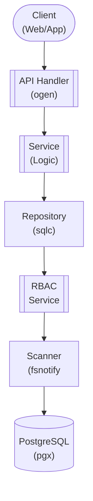

## Table of Contents

- [Library Service](#library-service)
  - [Status](#status)
  - [Architecture](#architecture)
    - [Service Structure](#service-structure)
    - [Dependencies](#dependencies)
    - [Provides](#provides)
    - [Component Diagram](#component-diagram)
  - [Implementation](#implementation)
    - [Key Interfaces](#key-interfaces)
    - [Dependencies](#dependencies)
  - [Configuration](#configuration)
    - [Environment Variables](#environment-variables)
    - [Config Keys](#config-keys)
  - [API Endpoints](#api-endpoints)
  - [Related Documentation](#related-documentation)
    - [Design Documents](#design-documents)
    - [External Sources](#external-sources)

# Library Service


**Created**: 2026-01-31
**Status**: ✅ Complete
**Category**: service


> > Library management and access control

**Package**: `internal/service/library`
**fx Module**: `library.Module`

---


## Status

| Dimension | Status | Notes |
|-----------|--------|-------|
| Design | ✅ | - |
| Sources | ✅ | - |
| Instructions | ✅ | - |
| Code | 🔴 | - |
| Linting | 🔴 | - |
| Unit Testing | 🔴 | - |
| Integration Testing | 🔴 | - |

**Overall**: ✅ Complete


---


## Architecture



### Service Structure

```
internal/service/library/
├── module.go              # fx module definition
├── service.go             # Service implementation
├── repository.go          # Data access (if needed)
├── handler.go             # HTTP handlers (if exposed)
├── middleware.go          # Middleware (if needed)
├── types.go               # Domain types
└── service_test.go        # Tests
```

### Dependencies
**Go Packages**:
- `github.com/google/uuid`
- `github.com/jackc/pgx/v5`
- `github.com/fsnotify/fsnotify`
- `go.uber.org/fx`


### Provides
<!-- Service provides -->

### Component Diagram

<!-- Component diagram -->
## Implementation

### Key Interfaces

```go
type LibraryService interface {
  // Library CRUD (delegates to library types feature)
  GetLibrary(ctx context.Context, libraryID uuid.UUID) (*Library, error)
  ListLibraries(ctx context.Context, userID uuid.UUID) ([]Library, error)

  // Permissions
  GrantPermission(ctx context.Context, libraryID, userID uuid.UUID, permission string) error
  RevokePermission(ctx context.Context, libraryID, userID uuid.UUID, permission string) error
  CheckPermission(ctx context.Context, libraryID, userID uuid.UUID, permission string) (bool, error)

  // Scan operations
  TriggerScan(ctx context.Context, libraryID uuid.UUID, scanType string) error
}
```


### Dependencies
**Go Packages**:
- `github.com/google/uuid`
- `github.com/jackc/pgx/v5`
- `github.com/fsnotify/fsnotify`
- `go.uber.org/fx`

## Configuration

### Environment Variables

```bash
LIBRARY_DEFAULT_SCAN_INTERVAL=6h
```


### Config Keys
```yaml
library:
  default_scan_interval: 6h
  realtime_monitoring: true
```

## API Endpoints
```
GET    /api/v1/libraries                   # List accessible libraries
GET    /api/v1/libraries/:id               # Get library details
POST   /api/v1/libraries/:id/permissions   # Grant permission
DELETE /api/v1/libraries/:id/permissions/:user_id # Revoke permission
```

## Related Documentation
### Design Documents
- [services](INDEX.md)
- [01_ARCHITECTURE](../architecture/01_ARCHITECTURE.md)
- [02_DESIGN_PRINCIPLES](../architecture/02_DESIGN_PRINCIPLES.md)
- [03_METADATA_SYSTEM](../architecture/03_METADATA_SYSTEM.md)

### External Sources
- [Casbin](../../sources/security/casbin.md) - Auto-resolved from casbin
- [Uber fx](../../sources/tooling/fx.md) - Auto-resolved from fx
- [ogen OpenAPI Generator](../../sources/tooling/ogen.md) - Auto-resolved from ogen
- [pgx PostgreSQL Driver](../../sources/database/pgx.md) - Auto-resolved from pgx
- [PostgreSQL Arrays](../../sources/database/postgresql-arrays.md) - Auto-resolved from postgresql-arrays
- [PostgreSQL JSON Functions](../../sources/database/postgresql-json.md) - Auto-resolved from postgresql-json
- [River Job Queue](../../sources/tooling/river.md) - Auto-resolved from river
- [sqlc](../../sources/database/sqlc.md) - Auto-resolved from sqlc
- [sqlc Configuration](../../sources/database/sqlc-config.md) - Auto-resolved from sqlc-config

