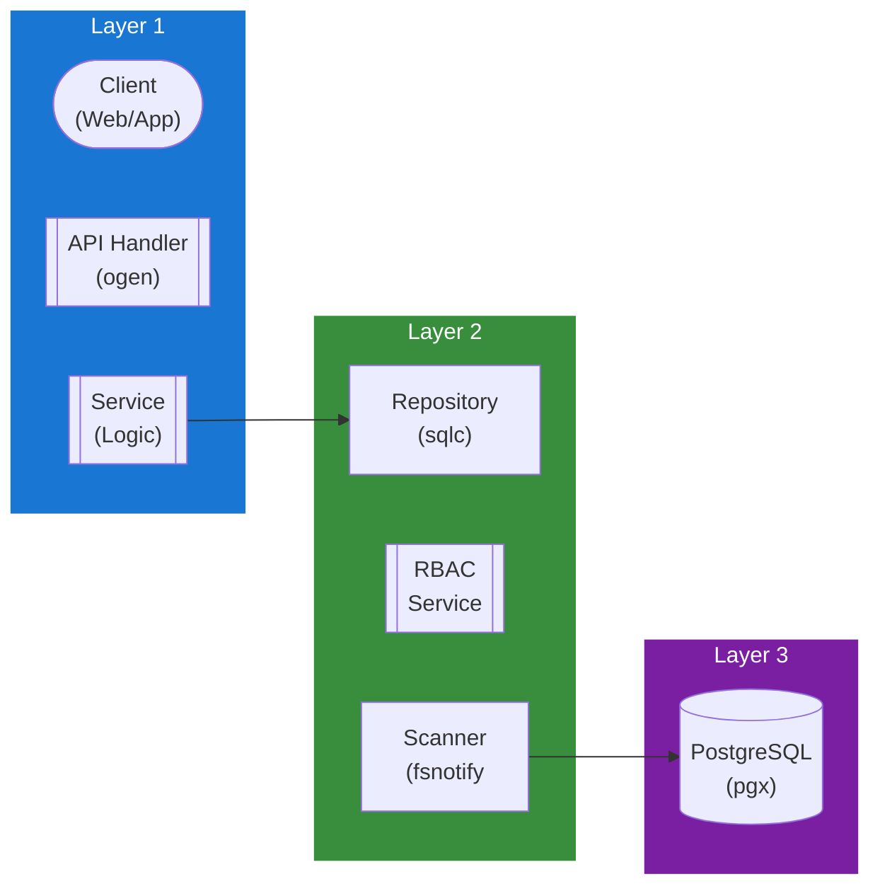

## Table of Contents

- [Library Service](#library-service)
  - [Status](#status)
  - [Architecture](#architecture)
    - [Service Structure](#service-structure)
    - [Dependencies](#dependencies)
    - [Provides](#provides)
    - [Component Diagram](#component-diagram)
  - [Implementation](#implementation)
    - [Key Interfaces](#key-interfaces)
    - [Dependencies](#dependencies)
  - [Configuration](#configuration)
    - [Environment Variables](#environment-variables)
    - [Config Keys](#config-keys)
  - [API Endpoints](#api-endpoints)
  - [Related Documentation](#related-documentation)
    - [Design Documents](#design-documents)
    - [External Sources](#external-sources)

# Library Service

<!-- DESIGN: services, README, test_output_claude, test_output_wiki -->


**Created**: 2026-01-31
**Status**: 🟡 In Progress
**Category**: service


> > Library management and access control

**Package**: `internal/service/library`
**fx Module**: `library.Module`

---


## Status

| Dimension | Status | Notes |
|-----------|--------|-------|
| Design | ✅ | - |
| Sources | ✅ | - |
| Instructions | ✅ | - |
| Code | 🟡 Partial | - |
| Linting | 🔴 | - |
| Unit Testing | 🔴 | - |
| Integration Testing | 🔴 | - |

**Overall**: 🟡 In Progress


---


## Architecture



### Service Structure

```
internal/service/library/
├── module.go              # fx module (NewService, NewPostgresRepository)
├── service.go             # Service struct + business logic (29 methods) + types
├── repository.go          # Repository interface (30 methods) + domain types
├── repository_pg.go       # PostgreSQL implementation (sqlc)
├── cached_service.go      # CachedService wrapping Service with cache layer
├── cleanup.go             # LibraryScanCleanupWorker (River job, uses raft.LeaderElection)
└── service_test.go        # Tests (🔴 not yet)
```

### Dependencies
**Go Packages**:
- `github.com/google/uuid`
- `github.com/jackc/pgx/v5`
- `go.uber.org/fx`, `go.uber.org/zap`

**Internal Dependencies**:
- `internal/service/activity` - `activity.Logger` for audit logging
- `internal/infra/database/db` - sqlc generated queries
- `internal/infra/cache` - `cache.Cache` for CachedService

**Note**: No `fsnotify` dependency in current code.

### Provides

`library.Module` provides: `NewService`, `NewPostgresRepository`

## Implementation

### Key Interfaces (from code) ✅

```go
// Service is a concrete struct (not interface).
// Source: internal/service/library/service.go
type Service struct {
  repo           Repository
  logger         *zap.Logger
  activityLogger activity.Logger
}

// Library CRUD (8 methods)
func (s *Service) Create(ctx context.Context, req CreateLibraryRequest) (*Library, error)
func (s *Service) Get(ctx context.Context, id uuid.UUID) (*Library, error)
func (s *Service) GetByName(ctx context.Context, name string) (*Library, error)
func (s *Service) List(ctx context.Context) ([]Library, error)
func (s *Service) ListEnabled(ctx context.Context) ([]Library, error)
func (s *Service) ListByType(ctx context.Context, libType string) ([]Library, error)
func (s *Service) ListAccessible(ctx context.Context, userID uuid.UUID) ([]Library, error)
func (s *Service) Update(ctx context.Context, id uuid.UUID, upd LibraryUpdate) (*Library, error)
func (s *Service) Delete(ctx context.Context, id uuid.UUID) error
func (s *Service) Count(ctx context.Context) (int64, error)

// Scan operations (10 methods)
func (s *Service) TriggerScan(ctx context.Context, id uuid.UUID) (*LibraryScan, error)
func (s *Service) GetScan(ctx context.Context, scanID uuid.UUID) (*LibraryScan, error)
func (s *Service) ListScans(ctx context.Context, libraryID uuid.UUID) ([]LibraryScan, error)
func (s *Service) GetLatestScan(ctx context.Context, libraryID uuid.UUID) (*LibraryScan, error)
func (s *Service) GetRunningScans(ctx context.Context) ([]LibraryScan, error)
func (s *Service) StartScan(ctx context.Context, scanID uuid.UUID) error
func (s *Service) CompleteScan(ctx context.Context, scanID uuid.UUID) error
func (s *Service) FailScan(ctx context.Context, scanID uuid.UUID, errMsg string) error
func (s *Service) CancelScan(ctx context.Context, scanID uuid.UUID) error
func (s *Service) UpdateScanProgress(ctx context.Context, scanID uuid.UUID, progress ScanProgress) error

// Permissions (9 methods)
func (s *Service) GrantPermission(ctx context.Context, req Permission) error
func (s *Service) RevokePermission(ctx context.Context, libraryID, userID uuid.UUID) error
func (s *Service) CheckPermission(ctx context.Context, libraryID, userID uuid.UUID) (*Permission, error)
func (s *Service) ListPermissions(ctx context.Context, libraryID uuid.UUID) ([]Permission, error)
func (s *Service) ListUserPermissions(ctx context.Context, userID uuid.UUID) ([]Permission, error)
func (s *Service) GetPermission(ctx context.Context, libraryID, userID uuid.UUID) (*Permission, error)
func (s *Service) CanAccess(ctx context.Context, libraryID, userID uuid.UUID) (bool, error)
func (s *Service) CanDownload(ctx context.Context, libraryID, userID uuid.UUID) (bool, error)
func (s *Service) CanManage(ctx context.Context, libraryID, userID uuid.UUID) (bool, error)

// Repository interface (30 methods): Library CRUD (10), Scans (9), Permissions (11)
```

**Key Types**:
- `Library` - Library with name, type, paths, settings
- `LibraryUpdate` - Library update params
- `LibraryScan` - Scan status with progress tracking
- `ScanProgress` - Progress update (items processed/total)
- `Permission` - Library-user permission (can_access, can_download, can_manage)
- `CreateLibraryRequest` - Library creation params
- `CachedService` - Cache wrapper
- `LibraryScanCleanupWorker` - River job for cleaning up stale scans

## Configuration

### Current Config (from code) ✅

No dedicated `LibraryConfig` struct in `config.go`. Values are hardcoded or derived from context.

### Planned Config (🔴 not yet in config.go)

```bash
LIBRARY_DEFAULT_SCAN_INTERVAL=6h
```

```yaml
library:
  default_scan_interval: 6h
  realtime_monitoring: true
```

## API Endpoints
```
GET    /api/v1/libraries                   # List accessible libraries
GET    /api/v1/libraries/:id               # Get library details
POST   /api/v1/libraries/:id/permissions   # Grant permission
DELETE /api/v1/libraries/:id/permissions/:user_id # Revoke permission
```

## Related Documentation
### Design Documents
- [services](INDEX.md)
- [01_ARCHITECTURE](../architecture/ARCHITECTURE.md)
- [02_DESIGN_PRINCIPLES](../architecture/DESIGN_PRINCIPLES.md)
- [03_METADATA_SYSTEM](../architecture/METADATA_SYSTEM.md)

### External Sources
- [Casbin](../../sources/security/casbin.md) - Auto-resolved from casbin
- [Uber fx](../../sources/tooling/fx.md) - Auto-resolved from fx
- [ogen OpenAPI Generator](../../sources/tooling/ogen.md) - Auto-resolved from ogen
- [pgx PostgreSQL Driver](../../sources/database/pgx.md) - Auto-resolved from pgx
- [PostgreSQL Arrays](../../sources/database/postgresql-arrays.md) - Auto-resolved from postgresql-arrays
- [PostgreSQL JSON Functions](../../sources/database/postgresql-json.md) - Auto-resolved from postgresql-json
- [River Job Queue](../../sources/tooling/river.md) - Auto-resolved from river
- [sqlc](../../sources/database/sqlc.md) - Auto-resolved from sqlc
- [sqlc Configuration](../../sources/database/sqlc-config.md) - Auto-resolved from sqlc-config

