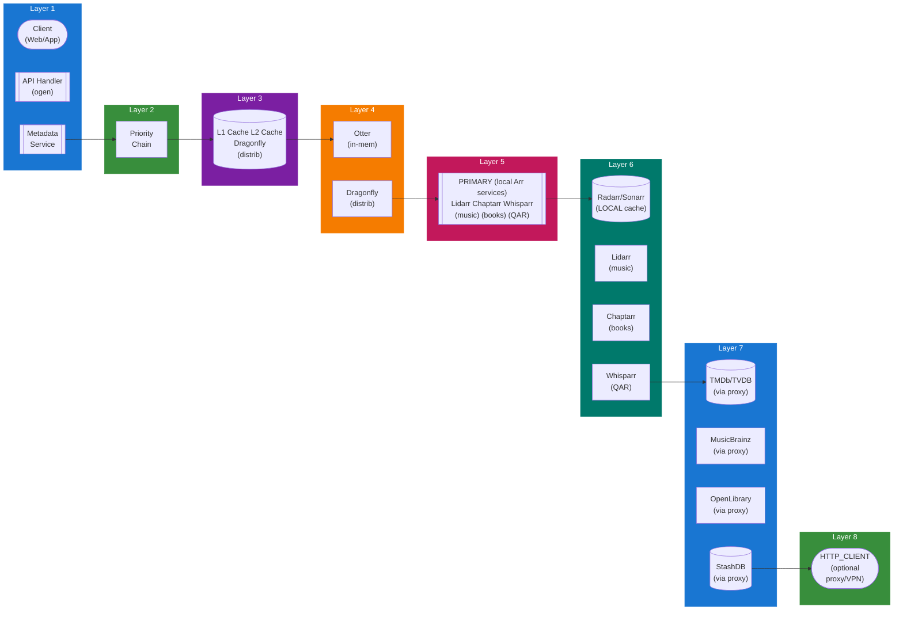

## Table of Contents

- [Metadata Service](#metadata-service)
  - [Status](#status)
  - [Architecture](#architecture)
    - [Service Structure](#service-structure)
    - [Dependencies](#dependencies)
    - [Provides](#provides)
    - [Component Diagram](#component-diagram)
  - [Implementation](#implementation)
    - [Key Interfaces](#key-interfaces)
    - [Dependencies](#dependencies)
  - [Configuration](#configuration)
    - [Environment Variables](#environment-variables)
    - [Config Keys](#config-keys)
  - [API Endpoints](#api-endpoints)
- [Search](#search)
- [Match](#match)
- [Refresh](#refresh)
- [Providers](#providers)
  - [Related Documentation](#related-documentation)
    - [Design Documents](#design-documents)
    - [External Sources](#external-sources)

# Metadata Service

<!-- DESIGN: services, README, test_output_claude, test_output_wiki -->


**Created**: 2026-01-31
**Status**: 🟡 In Progress
**Category**: service


> > Metadata aggregation with PRIMARY (Arr) and SUPPLEMENTARY (external) providers

**Package**: `internal/service/metadata`
**fx Module**: `metadata.Module`

---


## Status

| Dimension | Status | Notes |
|-----------|--------|-------|
| Design | ✅ | - |
| Sources | ✅ | - |
| Instructions | ✅ | - |
| Code | 🟡 Partial | - |
| Linting | 🔴 | - |
| Unit Testing | 🔴 | - |
| Integration Testing | 🔴 | - |

**Overall**: 🟡 In Progress


---


## Architecture



### Service Structure

```
internal/service/metadata/
├── module.go              # fx module definition
├── service.go             # Service implementation
├── repository.go          # Data access (if needed)
├── handler.go             # HTTP handlers (if exposed)
├── middleware.go          # Middleware (if needed)
├── types.go               # Domain types
└── service_test.go        # Tests
```

### Dependencies
**Go Packages**:
- `github.com/google/uuid`
- `github.com/jackc/pgx/v5`
- `github.com/riverqueue/river` - Background metadata fetch jobs
- `github.com/maypok86/otter` - L1 cache (in-memory)
- `github.com/redis/rueidis` - L2 cache (Dragonfly)
- `net/http` - HTTP client base
- `golang.org/x/net/proxy` - SOCKS5 proxy support
- `go.uber.org/fx`

**PRIMARY APIs** (Arr services - local, no proxy):
- Radarr API v3 (http://localhost:7878/api/v3) - Movies
- Sonarr API v3 (http://localhost:8989/api/v3) - TV Shows
- Lidarr API v1 (http://localhost:8686/api/v1) - Music
- Chaptarr/Readarr API (http://localhost:8787/api/v1) - Books/Audiobooks
- Whisparr API v3 (http://localhost:6969/api/v3) - QAR/Adult

**SUPPLEMENTARY APIs** (external, via optional proxy/VPN):
- TMDb API v3 (https://api.themoviedb.org/3/)
- TheTVDB API v4 (https://api4.thetvdb.com/v4/)
- MusicBrainz API v2 (https://musicbrainz.org/ws/2/)
- OpenLibrary API (https://openlibrary.org/api/)
- StashDB GraphQL API (https://stashdb.org/graphql)
- Last.fm API (https://ws.audioscrobbler.com/2.0/)


### Provides
<!-- Service provides -->

### Component Diagram

<!-- Component diagram -->
## Implementation

### Key Interfaces

```go
type MetadataService interface {
  // Fetch metadata
  FetchMetadata(ctx context.Context, contentType string, contentID uuid.UUID, providerName string) error
  SearchMetadata(ctx context.Context, providerName, query string) ([]MetadataSearchResult, error)
  MatchMetadata(ctx context.Context, contentID uuid.UUID, externalID string, provider string) error

  // Providers
  ListProviders(ctx context.Context, contentType string) ([]MetadataProvider, error)
  ConfigureProvider(ctx context.Context, providerName string, config ProviderConfig) error

  // Refresh
  ScheduleRefresh(ctx context.Context, contentID uuid.UUID, interval time.Duration) error
  RefreshMetadata(ctx context.Context, contentID uuid.UUID) error
}

type MetadataProvider interface {
  Name() string
  Type() string
  Search(ctx context.Context, query string) ([]MetadataSearchResult, error)
  GetByID(ctx context.Context, externalID string) (*Metadata, error)
  GetImages(ctx context.Context, externalID string) ([]Image, error)
}

type Metadata struct {
  Title       string                 `json:"title"`
  Overview    string                 `json:"overview"`
  ReleaseDate *time.Time             `json:"release_date,omitempty"`
  Runtime     *int                   `json:"runtime,omitempty"`
  Genres      []string               `json:"genres"`
  Cast        []CastMember           `json:"cast"`
  Crew        []CrewMember           `json:"crew"`
  Rating      *float64               `json:"rating,omitempty"`
  PosterURL   string                 `json:"poster_url,omitempty"`
  BackdropURL string                 `json:"backdrop_url,omitempty"`
  ExternalIDs map[string]interface{} `json:"external_ids"`
}
```


### Dependencies
**Go Packages**:
- `github.com/google/uuid`
- `github.com/jackc/pgx/v5`
- `github.com/riverqueue/river` - Background metadata fetch jobs
- `github.com/maypok86/otter` - L1 cache (in-memory)
- `github.com/redis/rueidis` - L2 cache (Dragonfly)
- `net/http` - HTTP client base
- `golang.org/x/net/proxy` - SOCKS5 proxy support
- `go.uber.org/fx`

**PRIMARY APIs** (Arr services - local, no proxy):
- Radarr API v3 (http://localhost:7878/api/v3) - Movies
- Sonarr API v3 (http://localhost:8989/api/v3) - TV Shows
- Lidarr API v1 (http://localhost:8686/api/v1) - Music
- Chaptarr/Readarr API (http://localhost:8787/api/v1) - Books/Audiobooks
- Whisparr API v3 (http://localhost:6969/api/v3) - QAR/Adult

**SUPPLEMENTARY APIs** (external, via optional proxy/VPN):
- TMDb API v3 (https://api.themoviedb.org/3/)
- TheTVDB API v4 (https://api4.thetvdb.com/v4/)
- MusicBrainz API v2 (https://musicbrainz.org/ws/2/)
- OpenLibrary API (https://openlibrary.org/api/)
- StashDB GraphQL API (https://stashdb.org/graphql)
- Last.fm API (https://ws.audioscrobbler.com/2.0/)

## Configuration

### Environment Variables

```bash
METADATA_TMDB_API_KEY=your_api_key
METADATA_TVDB_API_KEY=your_api_key
METADATA_LASTFM_API_KEY=your_api_key
METADATA_REFRESH_INTERVAL=168h  # 7 days
METADATA_CACHE_TTL=24h
```


### Config Keys
```yaml
metadata:
  # Priority chain configuration
  priority:
    - cache_l1      # Otter (in-memory)
    - cache_l2      # Dragonfly (distributed)
    - arr           # Arr services (PRIMARY)
    - external      # External APIs (SUPPLEMENTARY)

  # PRIMARY providers (Arr services)
  arr:
    radarr:
      enabled: true
      url: http://localhost:7878
      api_key: ${RADARR_API_KEY}
    sonarr:
      enabled: true
      url: http://localhost:8989
      api_key: ${SONARR_API_KEY}
    lidarr:
      enabled: true
      url: http://localhost:8686
      api_key: ${LIDARR_API_KEY}
    chaptarr:
      enabled: true
      url: http://localhost:8787
      api_key: ${CHAPTARR_API_KEY}
    whisparr:
      enabled: true
      url: http://localhost:6969
      api_key: ${WHISPARR_API_KEY}

  # SUPPLEMENTARY providers (external APIs)
  external:
    tmdb:
      api_key: ${TMDB_API_KEY}
      enabled: true
      rate_limit: 40
      proxy: tor  # Optional proxy/VPN routing
    tvdb:
      api_key: ${TVDB_API_KEY}
      enabled: true
      proxy: tor
    musicbrainz:
      enabled: true
      rate_limit: 1
      proxy: false  # No proxy needed
    openlib:
      enabled: true
      proxy: false
    stashdb:
      enabled: true
      proxy: tor  # Privacy for adult content

  refresh:
    interval: 168h
    auto_refresh: true

  cache:
    l1_ttl: 5m   # Otter cache
    l2_ttl: 24h  # Dragonfly cache
```

## API Endpoints
```
# Search
GET    /api/v1/metadata/search?provider=tmdb&query=Inception # Search provider

# Match
POST   /api/v1/metadata/match            # Match content to external ID
DELETE /api/v1/metadata/match/:id        # Remove match

# Refresh
POST   /api/v1/metadata/refresh/:id      # Trigger metadata refresh

# Providers
GET    /api/v1/metadata/providers        # List providers
PUT    /api/v1/metadata/providers/:name  # Configure provider
```

**Example Search Response**:
```json
{
  "results": [
    {
      "external_id": "27205",
      "title": "Inception",
      "release_date": "2010-07-16",
      "overview": "A thief who steals corporate secrets...",
      "poster_url": "https://image.tmdb.org/t/p/w500/9gk7adHYeDvHkCSEqAvQNLV5Uge.jpg",
      "rating": 8.4
    }
  ]
}
```

## Related Documentation
### Design Documents
- [03_METADATA_SYSTEM (PRIMARY architecture doc)](../architecture/METADATA_SYSTEM.md)
- [DRAGONFLY (cache architecture)](../integrations/infrastructure/DRAGONFLY.md)
- [HTTP_CLIENT (proxy/VPN support)](./HTTP_CLIENT.md)
- [RADARR (PRIMARY for movies)](../integrations/servarr/RADARR.md)
- [SONARR (PRIMARY for TV shows)](../integrations/servarr/SONARR.md)
- [LIDARR (PRIMARY for music)](../integrations/servarr/LIDARR.md)
- [CHAPTARR (PRIMARY for books/audiobooks)](../integrations/servarr/CHAPTARR.md)
- [WHISPARR (PRIMARY for QAR/adult)](../integrations/servarr/WHISPARR.md)

### External Sources
- [Uber fx](../../sources/tooling/fx.md) - Auto-resolved from fx
- [Last.fm API](../../sources/apis/lastfm.md) - Auto-resolved from lastfm-api
- [River Job Queue](../../sources/tooling/river.md) - Auto-resolved from river

