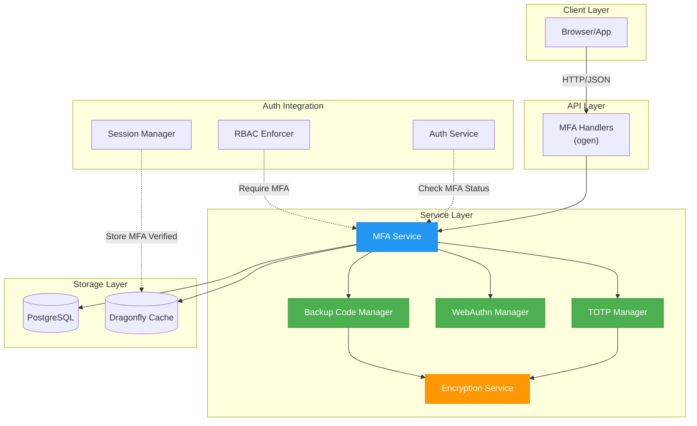

# Multi-Factor Authentication (MFA) Service

**Created**: 2026-02-03
**Status**: 🟡 In Progress
**Category**: service

> Comprehensive Multi-Factor Authentication supporting TOTP, WebAuthn/Passkeys, and backup recovery codes

**Package**: `internal/service/mfa`
**fx Module**: `mfa.Module`

---

## Table of Contents

- [Overview](#overview)
- [Status](#status)
- [Architecture](#architecture)
  - [Component Diagram](#component-diagram)
  - [Service Structure](#service-structure)
  - [Data Flow](#data-flow)
- [Database Schema](#database-schema)
- [Implementation Plan](#implementation-plan)
  - [Phase 1: Foundation](#phase-1-foundation)
  - [Phase 2: TOTP](#phase-2-totp)
  - [Phase 3: WebAuthn](#phase-3-webauthn)
  - [Phase 4: Integration](#phase-4-integration)
  - [Phase 5: Production Hardening](#phase-5-production-hardening)
- [API Endpoints](#api-endpoints)
- [Security Considerations](#security-considerations)
- [User Flows](#user-flows)
- [Configuration](#configuration)
- [Testing Strategy](#testing-strategy)
- [Deployment Checklist](#deployment-checklist)
- [Related Documentation](#related-documentation)

---

## Overview

The MFA service provides enterprise-grade multi-factor authentication supporting three methods:

1. **TOTP (Time-based One-Time Password)** - RFC 6238 compliant
   - Compatible with Google Authenticator, Authy, 1Password, etc.
   - 30-second time windows with 1-step skew tolerance
   - QR code enrollment for easy setup

2. **WebAuthn/FIDO2** - W3C WebAuthn Level 3 specification
   - Passwordless authentication (Passkeys)
   - Hardware security keys (YubiKey, Titan Key)
   - Platform authenticators (Touch ID, Face ID, Windows Hello)
   - Phishing-resistant authentication

3. **Backup Recovery Codes** - One-time use emergency access
   - 10 codes generated per user (8 bytes each, hex encoded to 16 chars)
   - Argon2id hashed for secure storage (via `crypto.PasswordHasher`)
   - Regeneration on demand

### Key Features

- **Encrypted Storage**: All secrets encrypted at rest with AES-256-GCM
- **Rate Limiting**: 5 attempts per 15 minutes per user
- **Audit Logging**: All MFA events tracked for security analysis
- **RBAC Integration**: Per-resource MFA requirements
- **Device Management**: Track and revoke trusted devices
- **Remember Device**: 30-day trusted device cookies (optional)

---

## Status

| Dimension | Status | Notes |
|-----------|--------|-------|
| Design | ✅ | This document |
| Sources | ✅ | RFC 6238, W3C WebAuthn Level 3, pquerna/otp, go-webauthn/webauthn |
| Instructions | ✅ | - |
| Code | 🟡 Partial | MFAManager, TOTPService, WebAuthnService, BackupCodesService implemented |
| Linting | 🔴 | - |
| Unit Testing | 🟡 Partial | manager_test, totp_test, webauthn_test, backup_codes_test exist |
| Integration Testing | 🔴 | - |

**Overall**: 🟡 In Progress

---

## Architecture

### Component Diagram



### Service Structure

```
internal/service/mfa/
├── module.go              # fx module (NewTOTPServiceFromConfig, NewBackupCodesService, NewWebAuthnServiceFromConfig, NewMFAManager)
├── manager.go             # MFAManager struct (coordinates TOTP, WebAuthn, backup codes)
├── totp.go                # TOTPService (pquerna/otp + crypto.Encryptor)
├── webauthn.go            # WebAuthnService (go-webauthn/webauthn + cache.Cache sessions)
├── backup_codes.go        # BackupCodesService (crypto.PasswordHasher = Argon2id)
├── manager_test.go        # MFAManager tests
├── totp_test.go           # TOTP tests
├── webauthn_test.go       # WebAuthn tests
└── backup_codes_test.go   # Backup code tests
```

**Note**: No separate `encryption.go`, `types.go`, `errors.go`, or `repository.go` — encryption uses `internal/crypto.Encryptor`, types are defined in their respective files, and data access uses `db.Queries` directly.

### Key Interfaces (from code) ✅

```go
// MFAManager coordinates all MFA methods (manager.go)
type MFAManager struct {
  queries     *db.Queries
  totp        *TOTPService
  webauthn    *WebAuthnService
  backupCodes *BackupCodesService
  logger      *zap.Logger
}

// MFAManager methods (11)
func (m *MFAManager) GetStatus(ctx context.Context, userID uuid.UUID) (*MFAStatus, error)
func (m *MFAManager) HasAnyMethod(ctx context.Context, userID uuid.UUID) (bool, error)
func (m *MFAManager) RequiresMFA(ctx context.Context, userID uuid.UUID) (bool, error)
func (m *MFAManager) EnableMFA(ctx context.Context, userID uuid.UUID) error
func (m *MFAManager) DisableMFA(ctx context.Context, userID uuid.UUID) error
func (m *MFAManager) SetRememberDevice(ctx context.Context, userID uuid.UUID, enabled bool, durationDays int32) error
func (m *MFAManager) GetRememberDeviceSettings(ctx context.Context, userID uuid.UUID) (enabled bool, durationDays int32, err error)
func (m *MFAManager) VerifyTOTP(ctx context.Context, userID uuid.UUID, code string) (*VerificationResult, error)
func (m *MFAManager) VerifyBackupCode(ctx context.Context, userID uuid.UUID, code string, clientIP string) (*VerificationResult, error)
func (m *MFAManager) RemoveAllMethods(ctx context.Context, userID uuid.UUID) error

// TOTPService (totp.go) - uses crypto.Encryptor for secret encryption
type TOTPService struct {
  queries   *db.Queries
  encryptor *crypto.Encryptor
  logger    *zap.Logger
  issuer    string
}

func (s *TOTPService) GenerateSecret(ctx context.Context, userID uuid.UUID, accountName string) (*TOTPSetup, error)
func (s *TOTPService) VerifyCode(ctx context.Context, userID uuid.UUID, code string) (bool, error)
func (s *TOTPService) EnableTOTP(ctx context.Context, userID uuid.UUID) error
func (s *TOTPService) DisableTOTP(ctx context.Context, userID uuid.UUID) error
func (s *TOTPService) DeleteTOTP(ctx context.Context, userID uuid.UUID) error
func (s *TOTPService) HasTOTP(ctx context.Context, userID uuid.UUID) (bool, error)

// WebAuthnService (webauthn.go) - uses cache.Cache for session storage
type WebAuthnService struct {
  queries  *db.Queries
  logger   *zap.Logger
  webAuthn *webauthn.WebAuthn
  cache    *cache.Cache
}

func (s *WebAuthnService) BeginRegistration(ctx context.Context, userID uuid.UUID, username, displayName string) (*protocol.CredentialCreation, error)
func (s *WebAuthnService) FinishRegistration(ctx context.Context, userID uuid.UUID, username, displayName string, response *protocol.ParsedCredentialCreationData) error
func (s *WebAuthnService) BeginLogin(ctx context.Context, userID uuid.UUID, username string) (*protocol.CredentialAssertion, error)
func (s *WebAuthnService) FinishLogin(ctx context.Context, userID uuid.UUID, username string, response *protocol.ParsedCredentialAssertionData) error
func (s *WebAuthnService) ListCredentials(ctx context.Context, userID uuid.UUID) ([]WebAuthnCredential, error)
func (s *WebAuthnService) DeleteCredential(ctx context.Context, userID uuid.UUID, credentialID uuid.UUID) error
func (s *WebAuthnService) RenameCredential(ctx context.Context, userID uuid.UUID, credentialID uuid.UUID, name string) error
func (s *WebAuthnService) HasWebAuthn(ctx context.Context, userID uuid.UUID) (bool, error)

// BackupCodesService (backup_codes.go) - uses crypto.PasswordHasher (Argon2id)
type BackupCodesService struct {
  queries *db.Queries
  hasher  *crypto.PasswordHasher
  logger  *zap.Logger
}

func (s *BackupCodesService) GenerateCodes(ctx context.Context, userID uuid.UUID) ([]string, error)
func (s *BackupCodesService) RegenerateCodes(ctx context.Context, userID uuid.UUID) ([]string, error)
func (s *BackupCodesService) VerifyCode(ctx context.Context, userID uuid.UUID, code string, clientIP string) (bool, error)
func (s *BackupCodesService) GetRemainingCount(ctx context.Context, userID uuid.UUID) (int, error)
func (s *BackupCodesService) HasBackupCodes(ctx context.Context, userID uuid.UUID) (bool, error)
func (s *BackupCodesService) DeleteAllCodes(ctx context.Context, userID uuid.UUID) error

// Key types
type MFAStatus struct {
  UserID, HasTOTP, WebAuthnCount, UnusedBackupCodes, RequireMFA, RememberDeviceEnabled
}
type VerificationResult struct { Success bool; Method VerifyMethod; UserID uuid.UUID }
type TOTPSetup struct { Secret string; QRCode []byte; URL string }
type VerifyMethod string // "totp", "webauthn", "backup_code"
```

### Dependencies (from code) ✅

**Go Packages**:
- `github.com/pquerna/otp` + `github.com/pquerna/otp/totp` - TOTP implementation (RFC 6238)
- `github.com/go-webauthn/webauthn` - WebAuthn/FIDO2/Passkeys
- `github.com/google/uuid`
- `github.com/jackc/pgx/v5`
- `go.uber.org/fx`, `go.uber.org/zap`

**Internal Dependencies**:
- `internal/crypto` - `Encryptor` (AES-256-GCM for TOTP secrets), `PasswordHasher` (Argon2id for backup codes)
- `internal/infra/database/db` - `db.Queries` (sqlc generated)
- `internal/infra/cache` - `cache.Cache` + `cache.Client` for WebAuthn session storage
- `internal/config` - Server host/port for WebAuthn RP configuration
- `internal/util` - Utility functions

### Data Flow

#### TOTP Enrollment Flow
```
1. User requests TOTP setup → Generate secret (20 bytes)
2. Encrypt secret with master key
3. Store encrypted secret in DB (not verified yet)
4. Generate QR code (otpauth:// URL)
5. Return QR code + secret to user
6. User scans QR with authenticator app
7. User submits verification code
8. Verify code against stored secret
9. Mark TOTP as verified in DB
10. Generate backup codes
```

#### TOTP Login Flow
```
1. User enters username + password → Auth service validates
2. Check if user has MFA enabled → Query MFA service
3. If TOTP enabled → Return MFA challenge response
4. User submits TOTP code
5. Decrypt user's secret
6. Verify code (30s window, ±1 step skew)
7. Check rate limit (5 attempts per 15min)
8. Log verification attempt
9. If valid → Set MFA_VERIFIED flag in session
10. Return success, continue login flow
```

#### WebAuthn Registration Flow
```
1. User requests WebAuthn setup
2. Generate challenge (32 bytes random)
3. Store challenge in cache (5min TTL)
4. Return PublicKeyCredentialCreationOptions
5. Browser/authenticator creates credential
6. User returns attestation
7. Validate attestation signature
8. Extract and verify credential public key
9. Store credential in DB (id, public_key, counter, aaguid)
10. Mark as verified
```

#### WebAuthn Authentication Flow
```
1. User begins WebAuthn login
2. Generate challenge
3. Retrieve user's credentials from DB
4. Return PublicKeyCredentialRequestOptions with allowCredentials
5. Browser/authenticator signs challenge
6. Validate assertion signature with stored public key
7. Verify counter (must increment, detect cloned authenticators)
8. Update counter in DB
9. Set MFA_VERIFIED in session
10. Return success
```

---

## Database Schema

### Migration 016: Create MFA Tables

```sql
-- Migration: 000016_create_mfa_tables.up.sql

-- TOTP secrets table (encrypted)
CREATE TABLE IF NOT EXISTS public.user_totp_secrets (
    user_id UUID PRIMARY KEY REFERENCES public.users(id) ON DELETE CASCADE,

    -- Encrypted secret (AES-256-GCM encrypted base32 string)
    encrypted_secret BYTEA NOT NULL,

    -- Encryption metadata
    nonce BYTEA NOT NULL,  -- GCM nonce

    -- Status
    verified_at TIMESTAMPTZ,  -- NULL until first successful verification
    enabled BOOLEAN NOT NULL DEFAULT false,

    -- Metadata
    created_at TIMESTAMPTZ NOT NULL DEFAULT NOW(),
    updated_at TIMESTAMPTZ NOT NULL DEFAULT NOW(),

    -- Ensure secret exists
    CONSTRAINT secret_not_empty CHECK (length(encrypted_secret) > 0)
);

CREATE INDEX idx_totp_secrets_user_enabled ON public.user_totp_secrets(user_id) WHERE enabled = true;

-- WebAuthn credentials table
CREATE TABLE IF NOT EXISTS public.webauthn_credentials (
    id UUID PRIMARY KEY DEFAULT gen_random_uuid(),
    user_id UUID NOT NULL REFERENCES public.users(id) ON DELETE CASCADE,

    -- Credential data (from WebAuthn spec)
    credential_id BYTEA NOT NULL UNIQUE,  -- Raw credential ID
    public_key BYTEA NOT NULL,             -- COSE encoded public key

    -- Counter for clone detection (must always increment)
    sign_count INTEGER NOT NULL DEFAULT 0,

    -- Authenticator data
    aaguid BYTEA,                          -- Authenticator AAGUID (16 bytes)
    attestation_type TEXT NOT NULL,        -- "none", "packed", "fido-u2f", etc.

    -- Transports (for UX hints)
    transports TEXT[],                     -- ["usb", "nfc", "ble", "internal"]

    -- Flags from authenticator data
    backup_eligible BOOLEAN NOT NULL DEFAULT false,
    backup_state BOOLEAN NOT NULL DEFAULT false,
    user_present BOOLEAN NOT NULL DEFAULT false,
    user_verified BOOLEAN NOT NULL DEFAULT false,

    -- User-facing metadata
    name TEXT,                             -- User-given name ("My YubiKey", "Touch ID")

    -- Status
    created_at TIMESTAMPTZ NOT NULL DEFAULT NOW(),
    last_used_at TIMESTAMPTZ,

    CONSTRAINT credential_id_not_empty CHECK (length(credential_id) > 0),
    CONSTRAINT public_key_not_empty CHECK (length(public_key) > 0)
);

CREATE INDEX idx_webauthn_credentials_user ON public.webauthn_credentials(user_id);
CREATE INDEX idx_webauthn_credentials_credential_id ON public.webauthn_credentials(credential_id);
CREATE INDEX idx_webauthn_credentials_last_used ON public.webauthn_credentials(last_used_at DESC);

-- Backup/Recovery codes table
CREATE TABLE IF NOT EXISTS public.mfa_backup_codes (
    id UUID PRIMARY KEY DEFAULT gen_random_uuid(),
    user_id UUID NOT NULL REFERENCES public.users(id) ON DELETE CASCADE,

    -- Argon2id hashed code (8 bytes, hex encoded)
    code_hash TEXT NOT NULL,

    -- Usage tracking
    used_at TIMESTAMPTZ,
    used_from_ip INET,

    -- Metadata
    created_at TIMESTAMPTZ NOT NULL DEFAULT NOW(),

    CONSTRAINT code_hash_not_empty CHECK (length(code_hash) > 0)
);

CREATE INDEX idx_backup_codes_user ON public.mfa_backup_codes(user_id);
CREATE INDEX idx_backup_codes_unused ON public.mfa_backup_codes(user_id) WHERE used_at IS NULL;

-- MFA enforcement rules (per-user overrides)
CREATE TABLE IF NOT EXISTS public.user_mfa_settings (
    user_id UUID PRIMARY KEY REFERENCES public.users(id) ON DELETE CASCADE,

    -- Enforcement
    mfa_required BOOLEAN NOT NULL DEFAULT false,  -- Force MFA for this user

    -- Remember device settings
    remember_device_enabled BOOLEAN NOT NULL DEFAULT true,
    remember_device_duration_days INTEGER NOT NULL DEFAULT 30,

    -- Trusted devices (stored as JSON array of device fingerprints)
    trusted_devices JSONB DEFAULT '[]'::jsonb,

    -- Metadata
    created_at TIMESTAMPTZ NOT NULL DEFAULT NOW(),
    updated_at TIMESTAMPTZ NOT NULL DEFAULT NOW()
);

-- Migration: 000016_create_mfa_tables.down.sql
DROP TABLE IF EXISTS public.user_mfa_settings;
DROP TABLE IF EXISTS public.mfa_backup_codes;
DROP TABLE IF EXISTS public.webauthn_credentials;
DROP TABLE IF EXISTS public.user_totp_secrets;
```

### SQLC Queries

```sql
-- name: GetUserTOTPSecret :one
SELECT * FROM public.user_totp_secrets WHERE user_id = $1;

-- name: CreateTOTPSecret :one
INSERT INTO public.user_totp_secrets (
    user_id, encrypted_secret, nonce, enabled
) VALUES (
    $1, $2, $3, false
) RETURNING *;

-- name: VerifyTOTPSecret :exec
UPDATE public.user_totp_secrets
SET verified_at = NOW(), enabled = true, updated_at = NOW()
WHERE user_id = $1 AND verified_at IS NULL;

-- name: DisableTOTP :exec
UPDATE public.user_totp_secrets
SET enabled = false, updated_at = NOW()
WHERE user_id = $1;

-- name: ListWebAuthnCredentials :many
SELECT * FROM public.webauthn_credentials
WHERE user_id = $1
ORDER BY last_used_at DESC NULLS LAST;

-- name: CreateWebAuthnCredential :one
INSERT INTO public.webauthn_credentials (
    user_id, credential_id, public_key, attestation_type,
    transports, backup_eligible, backup_state,
    user_present, user_verified, name
) VALUES (
    $1, $2, $3, $4, $5, $6, $7, $8, $9, $10
) RETURNING *;

-- name: GetWebAuthnCredential :one
SELECT * FROM public.webauthn_credentials
WHERE credential_id = $1;

-- name: UpdateWebAuthnCounter :exec
UPDATE public.webauthn_credentials
SET sign_count = $2, last_used_at = NOW()
WHERE credential_id = $1;

-- name: DeleteWebAuthnCredential :exec
DELETE FROM public.webauthn_credentials WHERE id = $1 AND user_id = $2;

-- name: CreateBackupCodes :exec
INSERT INTO public.mfa_backup_codes (user_id, code_hash)
SELECT $1, unnest($2::text[]);

-- name: GetUnusedBackupCodes :many
SELECT * FROM public.mfa_backup_codes
WHERE user_id = $1 AND used_at IS NULL;

-- name: UseBackupCode :exec
UPDATE public.mfa_backup_codes
SET used_at = NOW(), used_from_ip = $3
WHERE id = $1 AND user_id = $2 AND used_at IS NULL;

-- name: DeleteAllBackupCodes :exec
DELETE FROM public.mfa_backup_codes WHERE user_id = $1;

-- name: GetUserMFAStatus :one
SELECT
    (SELECT COUNT(*) > 0 FROM public.user_totp_secrets WHERE user_id = $1 AND enabled = true) as has_totp,
    (SELECT COUNT(*) FROM public.webauthn_credentials WHERE user_id = $1) as webauthn_count,
    (SELECT COUNT(*) FROM public.mfa_backup_codes WHERE user_id = $1 AND used_at IS NULL) as unused_backup_codes
;
```

---

## Implementation Plan

### Phase 1: Foundation (2-3 hours)

**Goal**: Set up infrastructure and encryption

**Tasks**:
1. Create database migrations (000016_create_mfa_tables)
2. Run `sqlc generate` to create query functions
3. Create `internal/service/mfa/` package structure
4. Implement encryption service (AES-256-GCM)
   - `EncryptSecret(plaintext []byte) (ciphertext, nonce []byte, err error)`
   - `DecryptSecret(ciphertext, nonce []byte) (plaintext []byte, err error)`
5. Add encryption key to config (from environment variable)
6. Create MFA domain types and errors
7. Write encryption tests

**Deliverables**:
- ✅ Migrations applied
- ✅ SQLC queries generated
- ✅ Encryption service with tests
- ✅ Base package structure

---

### Phase 2: TOTP Implementation (3-4 hours)

**Goal**: Full TOTP support with QR codes

**Tasks**:
1. Add `github.com/pquerna/otp` to go.mod
2. Implement `totp.go`:
   - `GenerateSecret() (secret string, qrCode []byte, err error)`
   - `VerifyCode(userID uuid.UUID, code string) (valid bool, err error)`
   - `EnableTOTP(userID uuid.UUID, secret string) error`
   - `DisableTOTP(userID uuid.UUID) error`
3. QR code generation (otpauth:// URL format)
4. Add rate limiting (5 attempts per 15 minutes)
5. Implement TOTP repository methods
6. Write comprehensive tests:
   - RFC 6238 test vectors
   - Time skew handling (±1 step)
   - Rate limiting
   - Encryption/decryption round-trip

**Deliverables**:
- ✅ TOTP service fully functional
- ✅ QR code generation
- ✅ Rate limiting protection
- ✅ 100% test coverage on core logic

---

### Phase 3: WebAuthn Implementation (4-6 hours)

**Goal**: WebAuthn/FIDO2/Passkeys support

**Tasks**:
1. Add `github.com/go-webauthn/webauthn` to go.mod
2. Implement `webauthn.go`:
   - `BeginRegistration(userID uuid.UUID) (options *protocol.CredentialCreation, session *SessionData, err error)`
   - `FinishRegistration(userID uuid.UUID, response *protocol.ParsedCredentialCreationData) (credential *Credential, err error)`
   - `BeginLogin(userID uuid.UUID) (options *protocol.CredentialAssertion, session *SessionData, err error)`
   - `FinishLogin(userID uuid.UUID, response *protocol.ParsedCredentialAssertionData) (credential *Credential, err error)`
   - `ListCredentials(userID uuid.UUID) ([]*Credential, error)`
   - `DeleteCredential(userID uuid.UUID, credentialID []byte) error`
3. Configure WebAuthn library (RPID, RPOrigins, RPDisplayName)
4. Implement credential repository methods
5. Add counter validation (detect cloned authenticators)
6. Session management for challenges (5-minute TTL in cache)
7. Write tests:
   - Registration ceremony
   - Authentication ceremony
   - Counter validation
   - Clone detection

**Deliverables**:
- ✅ WebAuthn registration working
- ✅ WebAuthn authentication working
- ✅ Credential management (list/delete)
- ✅ Clone detection via counter
- ✅ Tests for complete flows

---

### Phase 4: Backup Codes & Integration (2-3 hours)

**Goal**: Backup codes and auth service integration

**Tasks**:
1. Implement `backup.go`:
   - `GenerateCodes(userID uuid.UUID) (codes []string, err error)` - 10 codes, 8 chars each
   - `VerifyCode(userID uuid.UUID, code string) (valid bool, err error)`
   - `RegenerateCodes(userID uuid.UUID) (codes []string, err error)`
2. Use Argon2id for hashing codes (via `crypto.PasswordHasher`)
3. Constant-time comparison for verification
4. Integration with `internal/service/auth`:
   - Check MFA status after password validation
   - Require MFA verification if enabled
   - Add `mfa_verified` flag to session
5. Session modifications:
   - Add `MFAVerified bool` to session struct
   - Add `MFAMethod string` ("totp", "webauthn", "backup")
6. Remember device implementation:
   - Signed 30-day cookie with device fingerprint
   - Store trusted devices in user_mfa_settings
7. Write tests:
   - Code generation (randomness)
   - Verification (timing attacks)
   - Integration with auth flow

**Deliverables**:
- ✅ Backup codes functional
- ✅ Auth service integration
- ✅ Session MFA tracking
- ✅ Remember device feature
- ✅ End-to-end auth flow tests

---

### Phase 5: Production Hardening (2-4 hours)

**Goal**: Security, monitoring, and operational readiness

**Tasks**:
1. Rate limiting implementation:
   - Per-user attempt tracking (Dragonfly)
   - 5 attempts per 15 minutes
   - Exponential backoff after limit
2. Audit logging:
   - MFA setup events
   - MFA disable events
   - Verification attempts (success/failure)
   - Device trust events
3. RBAC integration:
   - Add `require_mfa` to Casbin policies
   - Middleware to check MFA status
   - Admin override capability
4. Metrics and monitoring:
   - MFA enrollment rate
   - Verification success/failure rate
   - Method distribution (TOTP vs WebAuthn)
   - Failed attempt alerts
5. Configuration:
   - TOTP window size
   - WebAuthn timeout
   - Backup code count
   - Remember device duration
6. Documentation:
   - API documentation
   - User setup guides
   - Admin operations guide
   - Security best practices

**Deliverables**:
- ✅ Rate limiting enforced
- ✅ Comprehensive audit logging
- ✅ RBAC MFA enforcement
- ✅ Metrics and alerts
- ✅ Complete documentation
- ✅ Production-ready

---

## API Endpoints

### TOTP Endpoints

#### Setup TOTP
```http
POST /api/v1/auth/mfa/totp/setup
Authorization: Bearer <session-token>

Response 200:
{
  "secret": "JBSWY3DPEHPK3PXP",
  "qr_code": "data:image/png;base64,iVBORw0KG...",
  "backup_codes": [
    "A1B2C3D4",
    "E5F6G7H8",
    ...
  ]
}
```

#### Verify TOTP Setup
```http
POST /api/v1/auth/mfa/totp/verify
Authorization: Bearer <session-token>
Content-Type: application/json

{
  "code": "123456"
}

Response 200:
{
  "success": true,
  "message": "TOTP enabled successfully"
}

Response 400:
{
  "error": "invalid_code",
  "message": "The code you entered is incorrect"
}

Response 429:
{
  "error": "rate_limit_exceeded",
  "message": "Too many attempts. Please try again in 10 minutes",
  "retry_after": 600
}
```

#### Verify TOTP Login
```http
POST /api/v1/auth/mfa/totp/login
Content-Type: application/json

{
  "username": "user@example.com",
  "code": "123456"
}

Response 200:
{
  "success": true,
  "session_token": "...",
  "remember_device_token": "..."  // If remember device enabled
}
```

#### Disable TOTP
```http
DELETE /api/v1/auth/mfa/totp/disable
Authorization: Bearer <session-token>

Response 200:
{
  "success": true,
  "message": "TOTP disabled successfully"
}
```

### WebAuthn Endpoints

#### Begin Registration
```http
POST /api/v1/auth/mfa/webauthn/register/begin
Authorization: Bearer <session-token>

Response 200:
{
  "publicKey": {
    "challenge": "base64-encoded-challenge",
    "rp": {
      "name": "Revenge Media Server",
      "id": "revenge.example.com"
    },
    "user": {
      "id": "base64-user-id",
      "name": "user@example.com",
      "displayName": "John Doe"
    },
    "pubKeyCredParams": [...],
    "timeout": 60000,
    "attestation": "none",
    "authenticatorSelection": {
      "requireResidentKey": false,
      "userVerification": "preferred"
    }
  }
}
```

#### Finish Registration
```http
POST /api/v1/auth/mfa/webauthn/register/finish
Authorization: Bearer <session-token>
Content-Type: application/json

{
  "id": "credential-id",
  "rawId": "base64-raw-id",
  "type": "public-key",
  "response": {
    "attestationObject": "base64-attestation",
    "clientDataJSON": "base64-client-data"
  }
}

Response 200:
{
  "success": true,
  "credential_id": "base64-credential-id",
  "message": "Security key registered successfully"
}
```

#### Begin Login
```http
POST /api/v1/auth/mfa/webauthn/login/begin
Content-Type: application/json

{
  "username": "user@example.com"
}

Response 200:
{
  "publicKey": {
    "challenge": "base64-challenge",
    "timeout": 60000,
    "rpId": "revenge.example.com",
    "allowCredentials": [
      {
        "type": "public-key",
        "id": "base64-credential-id",
        "transports": ["usb", "nfc"]
      }
    ],
    "userVerification": "preferred"
  }
}
```

#### Finish Login
```http
POST /api/v1/auth/mfa/webauthn/login/finish
Content-Type: application/json

{
  "id": "credential-id",
  "rawId": "base64-raw-id",
  "type": "public-key",
  "response": {
    "authenticatorData": "base64-auth-data",
    "clientDataJSON": "base64-client-data",
    "signature": "base64-signature",
    "userHandle": "base64-user-handle"
  }
}

Response 200:
{
  "success": true,
  "session_token": "..."
}
```

#### List Credentials
```http
GET /api/v1/auth/mfa/webauthn/credentials
Authorization: Bearer <session-token>

Response 200:
{
  "credentials": [
    {
      "id": "uuid",
      "name": "My YubiKey",
      "created_at": "2026-01-15T10:00:00Z",
      "last_used_at": "2026-02-01T14:30:00Z",
      "aaguid": "base64-aaguid",
      "transports": ["usb"]
    }
  ]
}
```

#### Delete Credential
```http
DELETE /api/v1/auth/mfa/webauthn/credentials/:id
Authorization: Bearer <session-token>

Response 200:
{
  "success": true,
  "message": "Credential deleted successfully"
}
```

### Backup Code Endpoints

#### Get Backup Codes
```http
GET /api/v1/auth/mfa/backup-codes
Authorization: Bearer <session-token>

Response 200:
{
  "codes": [
    {
      "code": "A1B2C3D4",  // Only shown once during generation
      "used": false
    },
    ...
  ],
  "unused_count": 10
}
```

#### Regenerate Backup Codes
```http
POST /api/v1/auth/mfa/backup-codes/regenerate
Authorization: Bearer <session-token>

Response 200:
{
  "codes": [
    "A1B2C3D4",
    "E5F6G7H8",
    ...
  ],
  "message": "New backup codes generated. Previous codes are now invalid."
}
```

#### Verify Backup Code
```http
POST /api/v1/auth/mfa/backup-code/verify
Content-Type: application/json

{
  "username": "user@example.com",
  "code": "A1B2C3D4"
}

Response 200:
{
  "success": true,
  "remaining_codes": 9,
  "message": "Backup code accepted. This code cannot be used again."
}
```

### Status Endpoint

#### Get MFA Status
```http
GET /api/v1/auth/mfa/status
Authorization: Bearer <session-token>

Response 200:
{
  "enabled": true,
  "methods": {
    "totp": {
      "enabled": true,
      "verified_at": "2026-01-15T10:00:00Z"
    },
    "webauthn": {
      "enabled": true,
      "credential_count": 2
    },
    "backup_codes": {
      "enabled": true,
      "unused_count": 8
    }
  },
  "required": false,  // User-level requirement
  "remember_device_enabled": true
}
```

---

## Security Considerations

### 1. Secret Storage

**TOTP Secrets**:
- MUST be encrypted at rest using AES-256-GCM
- Encryption key MUST be stored separately from database (environment variable or secrets manager)
- Nonce MUST be unique per encryption operation (stored alongside ciphertext)
- Key rotation procedure MUST be documented

**WebAuthn Credentials**:
- Public keys can be stored in plaintext (they're public)
- Credential IDs should be treated as sensitive (unique per user)
- Private keys never leave the authenticator (FIDO2 guarantee)

**Backup Codes**:
- MUST be hashed with Argon2id (via `crypto.PasswordHasher`)
- Original codes shown ONCE during generation
- Constant-time comparison to prevent timing attacks

### 2. Rate Limiting

**Implementation**:
```go
// Dragonfly key: mfa:attempts:{userID}
// TTL: 15 minutes
// Limit: 5 attempts

func checkRateLimit(userID uuid.UUID) error {
    key := fmt.Sprintf("mfa:attempts:%s", userID)
    count, _ := cache.Incr(ctx, key)

    if count == 1 {
        cache.Expire(ctx, key, 15*time.Minute)
    }

    if count > 5 {
        return ErrRateLimitExceeded
    }

    return nil
}
```

**Considerations**:
- Track attempts per user (not per IP to avoid shared IPs)
- Use exponential backoff after limit exceeded
- Admin override capability for locked accounts
- Alert on repeated failures (potential attack)

### 3. Replay Attack Prevention

**TOTP**:
- Time-based, inherently resistant to replay (30s windows)
- Optional: Store last used timestamp to prevent reuse within same window
- Database check: `last_used_at > NOW() - INTERVAL '30 seconds'`

**WebAuthn**:
- Challenge MUST be cryptographically random (32 bytes)
- Challenge MUST have short TTL (5 minutes)
- Challenge MUST be single-use (delete after verification)
- Store in Dragonfly with automatic expiration

**Backup Codes**:
- One-time use enforced by database (used_at NOT NULL)
- Mark as used in transaction (no double-spending)

### 4. Clone Detection

**WebAuthn Counter Validation**:
```go
func validateCounter(storedCounter, receivedCounter uint32) error {
    if receivedCounter <= storedCounter {
        // Possible cloned authenticator
        return ErrClonedAuthenticator
    }
    return nil
}
```

**Actions on Clone Detection**:
1. Refuse authentication
2. Log security event
3. Alert user via email
4. Optionally disable credential
5. Require admin review

### 5. Audit Logging

**Required Events**:
- MFA setup initiated
- MFA setup completed
- MFA verification success
- MFA verification failure (with reason)
- MFA disabled
- Backup code used
- Backup codes regenerated
- Credential added/removed
- Device trusted/untrusted
- Rate limit exceeded
- Clone detected

**Log Format**:
```json
{
  "event": "mfa.verification.success",
  "user_id": "uuid",
  "method": "totp",
  "ip_address": "1.2.3.4",
  "user_agent": "...",
  "timestamp": "2026-02-03T10:00:00Z",
  "metadata": {
    "attempts": 1,
    "device_fingerprint": "..."
  }
}
```

### 6. Remember Device

**Implementation**:
- Signed cookie with device fingerprint
- 30-day expiration (configurable)
- Signature using HMAC-SHA256 with server secret
- Device fingerprint: Hash of (User-Agent + IP subnet + salt)

**Cookie Structure**:
```
remember_device=<user_id>.<device_fingerprint>.<expiry>.<signature>
```

**Validation**:
```go
func validateRememberDevice(cookie string) (userID uuid.UUID, valid bool) {
    parts := strings.Split(cookie, ".")
    if len(parts) != 4 {
        return uuid.Nil, false
    }

    // Verify signature
    expectedSig := hmacSign(parts[0:3])
    if !hmac.Equal([]byte(parts[3]), expectedSig) {
        return uuid.Nil, false
    }

    // Check expiry
    expiry, _ := time.Parse(time.RFC3339, parts[2])
    if time.Now().After(expiry) {
        return uuid.Nil, false
    }

    userID, _ = uuid.Parse(parts[0])
    return userID, true
}
```

---

## User Flows

### 1. First-Time TOTP Setup

```
1. User navigates to Security Settings
2. Clicks "Enable Two-Factor Authentication"
3. System generates secret and QR code
4. QR code displayed with manual entry option
5. User scans QR with authenticator app (Google Authenticator, Authy, etc.)
6. User enters verification code from app
7. System validates code
8. System generates 10 backup codes
9. User downloads/prints backup codes
10. TOTP is now enabled
```

### 2. Login with TOTP

```
1. User enters username + password
2. System validates credentials
3. System checks if user has MFA enabled
4. If TOTP enabled: Show "Enter verification code" prompt
5. User enters 6-digit code from authenticator app
6. System verifies code (with ±1 time step tolerance)
7. If valid: Create session with mfa_verified=true
8. User is logged in
```

### 3. Security Key Registration

```
1. User navigates to Security Settings → Security Keys
2. Clicks "Add Security Key"
3. System generates WebAuthn challenge
4. Browser prompts "Please insert and touch your security key"
5. User inserts YubiKey and touches it
6. Authenticator creates credential (private key stays on device)
7. System receives public key and attestation
8. System validates attestation and stores credential
9. User gives key a friendly name ("My YubiKey 5")
10. Security key is registered
```

### 4. Passwordless Login (Passkey)

```
1. User navigates to login page
2. Enters username (no password required)
3. Clicks "Sign in with passkey"
4. Browser prompts "Use Touch ID to sign in?"
5. User authenticates with Touch ID / Face ID
6. System verifies signature from credential
7. User is logged in (passwordless)
```

### 5. Backup Code Recovery

```
1. User enters username + password
2. System prompts for MFA code
3. User clicks "Use backup code"
4. User enters one of their backup codes
5. System validates code (Argon2id comparison)
6. System marks code as used
7. User is logged in
8. System shows warning: "You have 9 backup codes remaining"
9. System prompts user to regenerate codes
```

---

## Configuration

### Current Config (from code) ✅

No dedicated `MFAConfig` struct in `config.go` yet. Current values are hardcoded or derived from other config:
- **TOTP issuer**: Hardcoded as `"Revenge"` in `module.go`
- **TOTP algorithm**: SHA1, 6 digits, 30s period (hardcoded in `totp.go`)
- **WebAuthn RP**: Derived from `server.host` and `server.port` in `module.go`
- **WebAuthn session TTL**: 5 minutes (hardcoded in `webauthn.go`)
- **Backup code count**: 10 codes, 8 bytes each (constants in `backup_codes.go`)
- **Encryption key**: Via `crypto.Encryptor` (configured separately)

### Planned Config (🔴 not yet in config.go)

### Environment Variables

```bash
# MFA Configuration
MFA_ENCRYPTION_KEY=<32-byte hex string>  # Required: AES-256 key
MFA_TOTP_ISSUER="Revenge Media Server"
MFA_TOTP_PERIOD=30                       # TOTP time step in seconds
MFA_TOTP_SKEW=1                          # Allow ±1 time step
MFA_WEBAUTHN_TIMEOUT=60000               # WebAuthn ceremony timeout (ms)
MFA_WEBAUTHN_RPID="revenge.example.com"
MFA_WEBAUTHN_RPORIGINS="https://revenge.example.com,https://app.revenge.example.com"
MFA_BACKUP_CODE_COUNT=10
MFA_BACKUP_CODE_LENGTH=8
MFA_RATE_LIMIT_ATTEMPTS=5
MFA_RATE_LIMIT_WINDOW=900                # 15 minutes in seconds
MFA_REMEMBER_DEVICE_DAYS=30
```

### Config File (config.yaml)

```yaml
mfa:
  # Encryption
  encryption:
    key: ${MFA_ENCRYPTION_KEY}  # MUST be set via environment

  # TOTP Configuration
  totp:
    issuer: "Revenge Media Server"
    period: 30              # Time step (seconds)
    skew: 1                 # Time step tolerance (±steps)
    digits: 6               # Code length
    algorithm: "SHA1"       # SHA1, SHA256, or SHA512

  # WebAuthn Configuration
  webauthn:
    rpid: "revenge.example.com"
    rp_display_name: "Revenge Media Server"
    rp_origins:
      - "https://revenge.example.com"
      - "https://app.revenge.example.com"
    timeout: 60000          # Milliseconds
    attestation: "none"     # none, indirect, direct, enterprise
    authenticator_selection:
      require_resident_key: false
      user_verification: "preferred"  # required, preferred, discouraged

  # Backup Codes
  backup_codes:
    count: 10
    length: 8
    charset: "ABCDEFGHJKLMNPQRSTUVWXYZ23456789"  # No ambiguous chars (0, O, 1, I)

  # Rate Limiting
  rate_limit:
    attempts: 5
    window_seconds: 900     # 15 minutes
    backoff_multiplier: 2   # Exponential backoff

  # Remember Device
  remember_device:
    enabled: true
    duration_days: 30
    cookie_name: "revenge_mfa_device"
    cookie_secure: true
    cookie_http_only: true
    cookie_same_site: "strict"

  # Enforcement
  enforcement:
    admin_require_mfa: true           # Force MFA for admins
    resource_policies_enabled: true   # Check RBAC policies
```

---

## Testing Strategy

### Unit Tests

**totp_test.go**:
```go
- TestGenerateSecret (length, randomness)
- TestVerifyCode_RFC6238TestVectors
- TestVerifyCode_TimeSkew
- TestVerifyCode_InvalidCode
- TestEncryptDecrypt_RoundTrip
- TestQRCodeGeneration
```

**webauthn_test.go**:
```go
- TestBeginRegistration
- TestFinishRegistration_ValidAttestation
- TestFinishRegistration_InvalidSignature
- TestBeginLogin
- TestFinishLogin_ValidAssertion
- TestFinishLogin_CounterNotIncremented (clone detection)
- TestFinishLogin_InvalidSignature
```

**backup_test.go**:
```go
- TestGenerateCodes (count, length, uniqueness)
- TestVerifyCode_Valid
- TestVerifyCode_Invalid
- TestVerifyCode_AlreadyUsed
- TestVerifyCode_TimingAttack (constant time comparison)
- TestRegenerateCodes (old codes invalidated)
```

**encryption_test.go**:
```go
- TestEncryptDecrypt
- TestUniqueNonces
- TestInvalidKey
- TestTamperedCiphertext
```

### Integration Tests

**mfa_integration_test.go**:
```go
- TestTOTPEnrollmentFlow
- TestTOTPLoginFlow
- TestWebAuthnRegistrationFlow
- TestWebAuthnLoginFlow
- TestBackupCodeRecovery
- TestRateLimiting
- TestRememberDevice
- TestMFARequiredByRBAC
```

### Load Tests

**Scenarios**:
1. 1000 concurrent TOTP verifications
2. 100 concurrent WebAuthn registrations
3. 10,000 TOTP verifications per minute (rate limit stress test)

**Tools**: `go test -bench`, `hey`, `k6`

### Security Tests

1. **Replay Attack**: Reuse TOTP code within same window
2. **Timing Attack**: Statistical analysis of backup code verification
3. **Clone Detection**: Submit old WebAuthn counter
4. **Rate Limit Bypass**: Attempt >5 verifications
5. **Encryption**: Verify ciphertext uniqueness (same plaintext → different ciphertext)

---

## Deployment Checklist

### Pre-Deployment

- [ ] Generate MFA_ENCRYPTION_KEY (32 random bytes, hex encoded)
- [ ] Store encryption key in secrets manager (AWS Secrets Manager, Vault, etc.)
- [ ] Review and adjust rate limiting settings
- [ ] Configure WebAuthn RPID and RPOrigins for production domains
- [ ] Enable audit logging
- [ ] Set up monitoring and alerts

### Deployment

- [ ] Apply database migrations (000016_create_mfa_tables.up.sql)
- [ ] Deploy new application version with MFA service
- [ ] Verify encryption key is loaded correctly
- [ ] Test TOTP enrollment in production
- [ ] Test WebAuthn registration with real security keys
- [ ] Verify rate limiting is working
- [ ] Check audit logs are being written

### Post-Deployment

- [ ] Announce MFA availability to users
- [ ] Monitor enrollment rate
- [ ] Monitor verification success/failure rates
- [ ] Review audit logs for suspicious activity
- [ ] Document user setup process
- [ ] Train support team on MFA issues

### Rollback Plan

1. Disable MFA enforcement in RBAC
2. Set `mfa.enforcement.required = false` in config
3. Users can still login with password only
4. MFA data remains in database (no data loss)
5. Restore previous application version if needed

---

## Related Documentation

### Design Documents
- [AUTH.md](AUTH.md) - Authentication service (password-based)
- [SESSION.md](SESSION.md) - Session management
- [RBAC.md](RBAC.md) - Role-based access control

### External Sources
- [RFC 6238](https://datatracker.ietf.org/doc/html/rfc6238) - TOTP: Time-Based One-Time Password Algorithm
- [RFC 4226](https://datatracker.ietf.org/doc/html/rfc4226) - HOTP: HMAC-Based One-Time Password Algorithm
- [W3C WebAuthn Level 3](https://www.w3.org/TR/webauthn-3/) - Web Authentication Specification
- [FIDO2 Specification](https://fidoalliance.org/specs/fido-v2.0-ps-20190130/fido-client-to-authenticator-protocol-v2.0-ps-20190130.html)
- [pquerna/otp](https://github.com/pquerna/otp) - Go TOTP/HOTP library
- [go-webauthn/webauthn](https://github.com/go-webauthn/webauthn) - Go WebAuthn library

### Security Resources
- [OWASP Authentication Cheat Sheet](https://cheatsheetseries.owasp.org/cheatsheets/Authentication_Cheat_Sheet.html)
- [OWASP Multi-Factor Authentication Cheat Sheet](https://cheatsheetseries.owasp.org/cheatsheets/Multifactor_Authentication_Cheat_Sheet.html)
- [NIST SP 800-63B](https://pages.nist.gov/800-63-3/sp800-63b.html) - Digital Identity Guidelines: Authentication

---

**Document Status**: 🟡 In Progress
**Code Status**: MFAManager, TOTPService, WebAuthnService, BackupCodesService implemented. API handlers and production hardening pending.
**Next Steps**: API handlers, rate limiting, audit logging integration, RBAC enforcement
