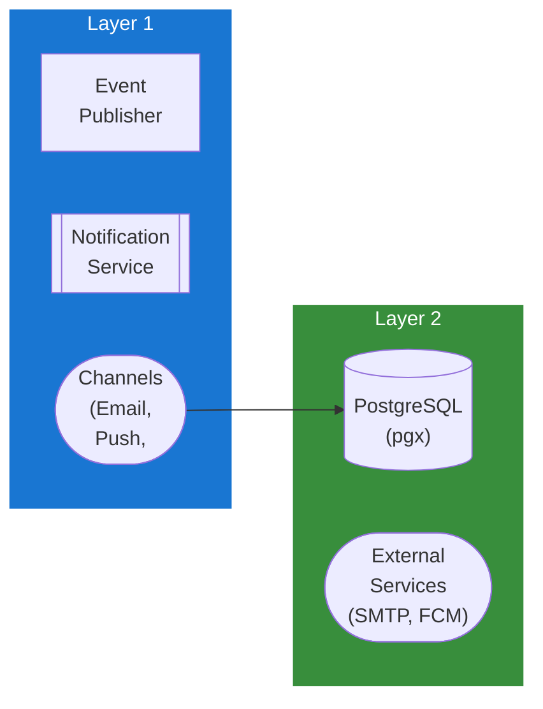

## Table of Contents

- [Notification Service](#notification-service)
  - [Status](#status)
  - [Architecture](#architecture)
    - [Service Structure](#service-structure)
    - [Dependencies](#dependencies)
    - [Provides](#provides)
    - [Component Diagram](#component-diagram)
  - [Implementation](#implementation)
    - [Key Interfaces](#key-interfaces)
    - [Dependencies](#dependencies)
  - [Configuration](#configuration)
    - [Environment Variables](#environment-variables)
    - [Config Keys](#config-keys)
  - [API Endpoints](#api-endpoints)
- [In-app notifications](#in-app-notifications)
- [Preferences](#preferences)
- [Push devices](#push-devices)
  - [Related Documentation](#related-documentation)
    - [Design Documents](#design-documents)
    - [External Sources](#external-sources)

# Notification Service

<!-- DESIGN: services, README, test_output_claude, test_output_wiki -->


**Created**: 2026-01-31
**Status**: 🟡 In Progress
**Category**: service


> > Multi-channel notifications for users and admins

**Package**: `internal/service/notification`
**fx Module**: None (standalone, no fx module yet)

---


## Status

| Dimension | Status | Notes |
|-----------|--------|-------|
| Design | ✅ | - |
| Sources | ✅ | - |
| Instructions | ✅ | - |
| Code | 🟡 Partial | - |
| Linting | 🔴 | - |
| Unit Testing | 🔴 | - |
| Integration Testing | 🔴 | - |

**Overall**: 🟡 In Progress


---


## Architecture



### Service Structure

```
internal/service/notification/
├── notification.go        # Event types, Event struct, Agent interface, Service interface, AgentConfig
├── dispatcher.go          # Dispatcher struct implementing Service interface
├── notification_test.go   # Core type tests
├── dispatcher_test.go     # Dispatcher tests
├── mock_agent_test.go     # Mock agent for tests
└── agents/
    ├── discord.go         # Discord webhook agent
    ├── email.go           # Email (SMTP) agent
    ├── gotify.go          # Gotify + Ntfy agents
    ├── webhook.go         # Generic webhook agent
    └── agents_test.go     # Agent tests
```

**Note**: No `module.go` or fx module yet. No database/repository layer — this is a pure event dispatcher with pluggable agents.

### Dependencies
**Go Packages**:
- `github.com/google/uuid`
- `log/slog` - Structured logging (not zap)
- `net/http` - HTTP clients for agent delivery
- `net/smtp` - Email agent
- `text/template` / `html/template` - Webhook payload templates

**No Internal Dependencies** - self-contained package.

## Implementation

### Key Interfaces (from code) ✅

```go
// Service is an interface.
// Source: internal/service/notification/notification.go
type Service interface {
  Dispatch(ctx context.Context, event *Event) error
  DispatchSync(ctx context.Context, event *Event) ([]NotificationResult, error)
  RegisterAgent(agent Agent) error
  UnregisterAgent(name string) error
  ListAgents() []Agent
  TestAgent(ctx context.Context, agentName string) (*NotificationResult, error)
}

// Agent interface - implemented by all notification agents
type Agent interface {
  Type() AgentType
  Name() string
  Send(ctx context.Context, event *Event) error
  Validate() error
  IsEnabled() bool
}

// Dispatcher implements Service
type Dispatcher struct {
  agents map[string]Agent
  logger *slog.Logger
}

// Event is the core notification payload
type Event struct {
  ID        uuid.UUID
  Type      EventType
  Timestamp time.Time
  UserID    *uuid.UUID
  TargetID  *uuid.UUID
  Data      map[string]any
  Metadata  map[string]string
}

func NewEvent(eventType EventType) *Event
func (e *Event) WithUser(userID uuid.UUID) *Event
func (e *Event) WithTarget(targetID uuid.UUID) *Event
func (e *Event) WithData(key string, value any) *Event
```

**Agent Types** (5): `webhook`, `discord`, `email`, `gotify`, `ntfy`

**Event Types** (27): `movie.added`, `movie.available`, `request.created`, `request.approved`, `library.scan_started`, `library.scan_done`, `user.created`, `auth.login_success`, `auth.mfa_enabled`, `playback.started`, `system.startup`, `integration.radarr_sync`, etc.

**Event Categories** (7): `content`, `requests`, `library`, `user`, `auth`, `playback`, `system`

**Key Types**:
- `AgentConfig` - Base config with event type/category filtering (`ShouldSend()`)
- `NotificationResult` - Agent name, success/error, timestamp
- Agent-specific configs: `DiscordConfig`, `GotifyConfig`, `NtfyConfig`, `WebhookConfig`, `EmailConfig` (each with own fields)

**Note**: This is a pure event dispatch system. No in-app notifications, no database storage, no push device management, no user preferences — those are planned features.

## Configuration

### Current Config (from code) ✅

No dedicated `NotificationConfig` in `config.go`. Agent configs are passed at construction time:
- Each agent has its own config struct (e.g., `DiscordConfig{WebhookURL, Username, ...}`)
- `AgentConfig` base has `Enabled`, `Name`, `EventTypes`, `EventCategories`

### Planned Config (🔴 not yet in config.go)

```yaml
notification:
  email:
    smtp_host: smtp.gmail.com
    smtp_port: 587
    smtp_user: noreply@example.com
    smtp_password: your_password
    from_address: Revenge <noreply@example.com>
  webhook:
    timeout: 10s
  delivery:
    workers: 5
    retry_attempts: 3
    retry_delay: 5m
```

## API Endpoints
```
# In-app notifications
GET    /api/v1/notifications              # List notifications
GET    /api/v1/notifications/unread/count # Get unread count
PATCH  /api/v1/notifications/:id/read     # Mark as read
POST   /api/v1/notifications/read-all     # Mark all as read
DELETE /api/v1/notifications/:id          # Delete notification

# Preferences
GET    /api/v1/notifications/preferences  # Get preferences
PUT    /api/v1/notifications/preferences/:event # Update preference

# Push devices
POST   /api/v1/notifications/devices      # Register push device
DELETE /api/v1/notifications/devices/:token # Unregister device
```

**Example Notification Response**:
```json
{
  "id": "123e4567-e89b-12d3-a456-426614174000",
  "title": "New Movie Added",
  "body": "Inception (2010) has been added to your library",
  "icon_url": "https://image.tmdb.org/t/p/w200/...",
  "action_url": "/movies/27205",
  "is_read": false,
  "created_at": "2026-02-01T10:30:00Z"
}
```

**Example Email Template**:
```
Subject: {{ .Title }}

Hi {{ .UserDisplayName }},

{{ .Body }}

{{ if .ActionURL }}
View: {{ .ActionURL }}
{{ end }}

--
Revenge Media Server
```

## Related Documentation
### Design Documents
- [services](INDEX.md)
- [01_ARCHITECTURE](../architecture/ARCHITECTURE.md)
- [02_DESIGN_PRINCIPLES](../architecture/DESIGN_PRINCIPLES.md)
- [03_METADATA_SYSTEM](../architecture/METADATA_SYSTEM.md)

### External Sources
- [Uber fx](../../sources/tooling/fx.md) - Auto-resolved from fx
- [ogen OpenAPI Generator](../../sources/tooling/ogen.md) - Auto-resolved from ogen
- [pgx PostgreSQL Driver](../../sources/database/pgx.md) - Auto-resolved from pgx
- [PostgreSQL Arrays](../../sources/database/postgresql-arrays.md) - Auto-resolved from postgresql-arrays
- [PostgreSQL JSON Functions](../../sources/database/postgresql-json.md) - Auto-resolved from postgresql-json
- [River Job Queue](../../sources/tooling/river.md) - Auto-resolved from river

