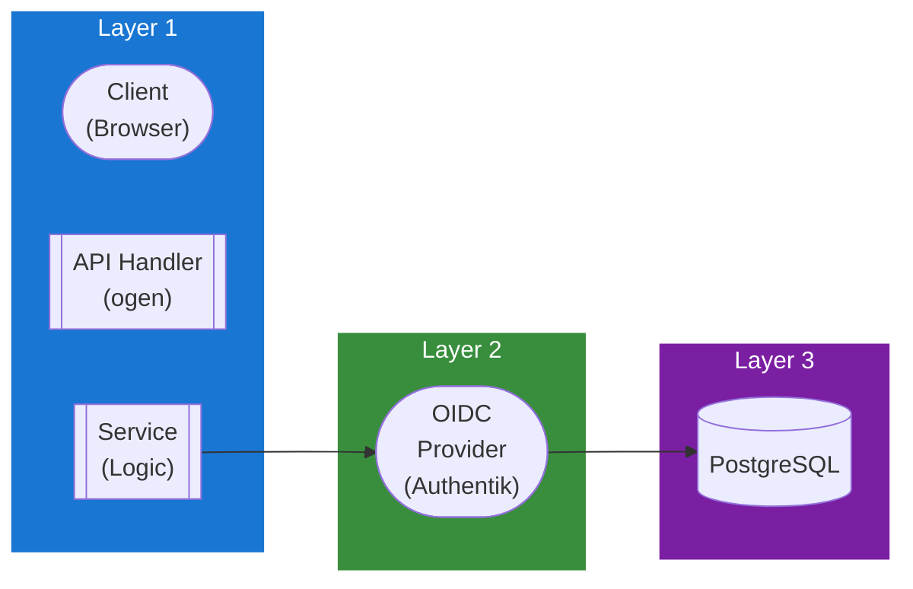

## Table of Contents

- [OIDC Service](#oidc-service)
  - [Status](#status)
  - [Architecture](#architecture)
    - [Service Structure](#service-structure)
    - [Dependencies](#dependencies)
    - [Provides](#provides)
    - [Component Diagram](#component-diagram)
  - [Implementation](#implementation)
    - [Key Interfaces](#key-interfaces)
    - [Dependencies](#dependencies)
  - [Configuration](#configuration)
    - [Environment Variables](#environment-variables)
    - [Config Keys](#config-keys)
  - [API Endpoints](#api-endpoints)
- [OAuth flow](#oauth-flow)
- [Provider management (admin)](#provider-management-admin)
  - [Related Documentation](#related-documentation)
    - [Design Documents](#design-documents)
    - [External Sources](#external-sources)

# OIDC Service

<!-- DESIGN: services, README, test_output_claude, test_output_wiki -->


**Created**: 2026-01-31
**Status**: 🟡 In Progress
**Category**: service


> > OpenID Connect / SSO provider management

**Package**: `internal/service/oidc`
**fx Module**: `oidc.Module`

---


## Status

| Dimension | Status | Notes |
|-----------|--------|-------|
| Design | ✅ | - |
| Sources | ✅ | - |
| Instructions | ✅ | - |
| Code | 🟡 Partial | - |
| Linting | 🔴 | - |
| Unit Testing | 🔴 | - |
| Integration Testing | 🔴 | - |

**Overall**: 🟡 In Progress


---


## Architecture



### Service Structure

```
internal/service/oidc/
├── module.go              # fx module (NewService, NewRepositoryPG)
├── service.go             # Service struct + business logic (17 methods) + domain types + errors
├── repository.go          # Repository interface (25 methods) + domain types (Provider, UserLink, State, etc.)
├── repository_pg.go       # PostgreSQL implementation (sqlc)
├── service_test.go        # Service tests
├── service_unit_test.go   # Unit tests
├── repository_pg_test.go  # Repository tests
└── mock_repository_test.go # Mock repository for tests
```

### Dependencies
**Go Packages**:
- `github.com/google/uuid`
- `github.com/coreos/go-oidc/v3/oidc` - OIDC discovery + verification
- `golang.org/x/oauth2` - OAuth2 flow
- `crypto/aes`, `crypto/cipher`, `crypto/rand`, `crypto/sha256` - Client secret encryption (AES-256-GCM)
- `go.uber.org/fx`, `go.uber.org/zap`

**Internal Dependencies**:
- None (self-contained, uses own repository + encryption)

### Provides

`oidc.Module` provides: `NewService`, `NewRepositoryPG`

## Implementation

### Key Interfaces (from code) ✅

```go
// Service is a concrete struct (not interface).
// Source: internal/service/oidc/service.go
type Service struct {
  repo        Repository
  logger      *zap.Logger
  callbackURL string
  encryptKey  []byte // AES-256-GCM for encrypting client secrets
}

// Provider management (11 methods)
func (s *Service) AddProvider(ctx context.Context, req CreateProviderRequest) (*Provider, error)
func (s *Service) GetProvider(ctx context.Context, id uuid.UUID) (*Provider, error)
func (s *Service) GetProviderByName(ctx context.Context, name string) (*Provider, error)
func (s *Service) GetDefaultProvider(ctx context.Context) (*Provider, error)
func (s *Service) ListProviders(ctx context.Context) ([]Provider, error)
func (s *Service) ListEnabledProviders(ctx context.Context) ([]Provider, error)
func (s *Service) UpdateProvider(ctx context.Context, id uuid.UUID, req UpdateProviderRequest) (*Provider, error)
func (s *Service) DeleteProvider(ctx context.Context, id uuid.UUID) error
func (s *Service) EnableProvider(ctx context.Context, id uuid.UUID) error
func (s *Service) DisableProvider(ctx context.Context, id uuid.UUID) error
func (s *Service) SetDefaultProvider(ctx context.Context, id uuid.UUID) error

// OAuth flow (2 methods)
func (s *Service) GetAuthURL(ctx context.Context, providerName string, redirectURL string, userID *uuid.UUID) (*AuthURLResult, error)
func (s *Service) HandleCallback(ctx context.Context, stateParam, code string) (*CallbackResult, error)

// User linking (3 methods)
func (s *Service) LinkUser(ctx context.Context, userID uuid.UUID, providerID uuid.UUID, subject string, userInfo *UserInfo, token *oauth2.Token) (*UserLink, error)
func (s *Service) UnlinkUser(ctx context.Context, userID uuid.UUID, providerID uuid.UUID) error
func (s *Service) ListUserLinks(ctx context.Context, userID uuid.UUID) ([]UserLinkWithProvider, error)

// Cleanup
func (s *Service) CleanupExpiredStates(ctx context.Context) (int64, error)

// Repository interface (25 methods): Provider CRUD (11), UserLink (10), State management (5)
```

**Key Types**:
- `Provider` - Full OIDC provider config with `ClaimMappings`, `RoleMappings`, encrypted `ClientSecret`
- `UserLink` / `UserLinkWithProvider` - User-to-provider binding with subject, tokens
- `State` - OAuth state with PKCE code verifier, redirect URL, expiry
- `AuthURLResult` - Auth URL + state token
- `CallbackResult` - User info, tokens, link, whether user was created
- `UserInfo` - Extracted user claims (subject, email, name, picture, roles)
- Provider types: `"generic"`, `"authentik"`, `"keycloak"`

## Configuration

### Current Config (from code) ✅

No dedicated `OIDCConfig` struct in `config.go`. Current values are derived from other config:
- **callbackURL**: Derived from `server.host` + `server.port` in `module.go`
- **encryptKey**: Derived from `auth.jwt_secret` (SHA-256 hashed to 32 bytes for AES-256-GCM)
- **State expiry**: 10 minutes (hardcoded in `service.go`)
- **Provider types**: `"generic"`, `"authentik"`, `"keycloak"` (constants in `service.go`)

### Planned Config (🔴 not yet in config.go)

```bash
OIDC_CALLBACK_URL=https://revenge.example.com/api/v1/oidc/callback
```

```yaml
oidc:
  callback_url: https://revenge.example.com/api/v1/oidc/callback
```

## API Endpoints
```
# OAuth flow
GET    /api/v1/oidc/auth/:provider         # Initiate OAuth flow (GetAuthURL)
GET    /api/v1/oidc/callback               # OAuth callback (HandleCallback)

# Provider management (admin)
POST   /api/v1/oidc/providers              # Add provider
GET    /api/v1/oidc/providers              # List providers
GET    /api/v1/oidc/providers/enabled      # List enabled providers only
GET    /api/v1/oidc/providers/:id          # Get provider by ID
PUT    /api/v1/oidc/providers/:id          # Update provider
DELETE /api/v1/oidc/providers/:id          # Delete provider
POST   /api/v1/oidc/providers/:id/enable   # Enable provider
POST   /api/v1/oidc/providers/:id/disable  # Disable provider
POST   /api/v1/oidc/providers/:id/default  # Set default provider

# User linking
GET    /api/v1/oidc/links                  # List user's linked providers
POST   /api/v1/oidc/links/:provider        # Link account to provider
DELETE /api/v1/oidc/links/:provider        # Unlink account from provider
```

## Related Documentation
### Design Documents
- [services](INDEX.md)
- [01_ARCHITECTURE](../architecture/ARCHITECTURE.md)
- [02_DESIGN_PRINCIPLES](../architecture/DESIGN_PRINCIPLES.md)
- [03_METADATA_SYSTEM](../architecture/METADATA_SYSTEM.md)

### External Sources
- [Authelia Documentation](../../sources/security/authelia.md) - Auto-resolved from authelia
- [Authentik Documentation](../../sources/security/authentik.md) - Auto-resolved from authentik
- [Uber fx](../../sources/tooling/fx.md) - Auto-resolved from fx
- [Keycloak Documentation](../../sources/security/keycloak.md) - Auto-resolved from keycloak
- [ogen OpenAPI Generator](../../sources/tooling/ogen.md) - Auto-resolved from ogen
- [sqlc](../../sources/database/sqlc.md) - Auto-resolved from sqlc
- [sqlc Configuration](../../sources/database/sqlc-config.md) - Auto-resolved from sqlc-config

