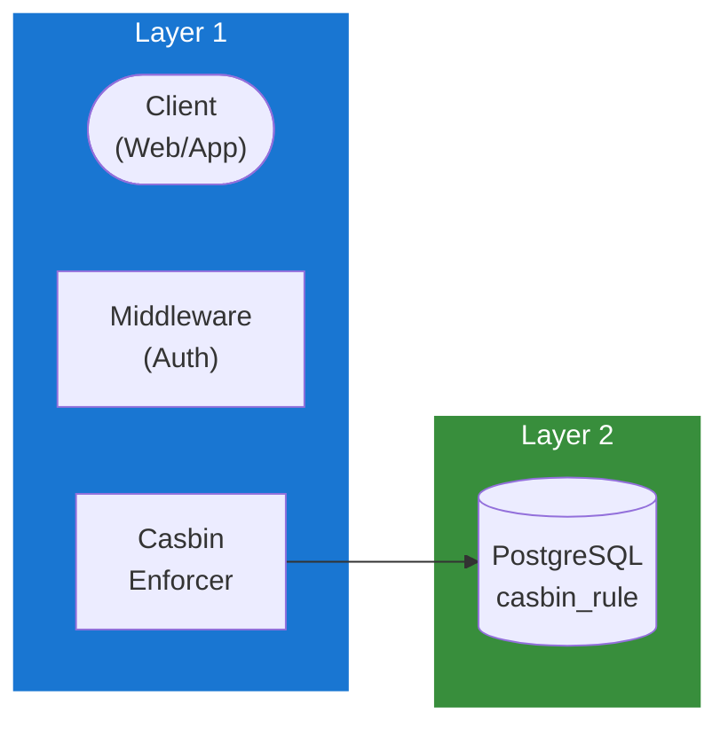

## Table of Contents

- [RBAC Service](#rbac-service)
  - [Status](#status)
  - [Architecture](#architecture)
    - [Service Structure](#service-structure)
    - [Dependencies](#dependencies)
    - [Provides](#provides)
    - [Component Diagram](#component-diagram)
  - [Implementation](#implementation)
    - [Key Interfaces](#key-interfaces)
    - [Dependencies](#dependencies)
  - [Configuration](#configuration)
    - [Environment Variables](#environment-variables)
    - [Config Keys](#config-keys)
  - [API Endpoints](#api-endpoints)
- [Policy management (admin only)](#policy-management-admin-only)
- [Role management](#role-management)
  - [Related Documentation](#related-documentation)
    - [Design Documents](#design-documents)
    - [External Sources](#external-sources)

# RBAC Service

<!-- DESIGN: services, README, test_output_claude, test_output_wiki -->


**Created**: 2026-01-31
**Status**: ✅ Complete
**Category**: service


> > Role-based access control with Casbin

**Package**: `internal/service/rbac`
**fx Module**: `rbac.Module`

---


## Status

| Dimension | Status | Notes |
|-----------|--------|-------|
| Design | ✅ | - |
| Sources | ✅ | - |
| Instructions | ✅ | - |
| Code | 🔴 | - |
| Linting | 🔴 | - |
| Unit Testing | 🔴 | - |
| Integration Testing | 🔴 | - |

**Overall**: ✅ Complete


---


## Architecture



### Service Structure

```
internal/service/rbac/
├── module.go              # fx module definition
├── service.go             # Service implementation
├── repository.go          # Data access (if needed)
├── handler.go             # HTTP handlers (if exposed)
├── middleware.go          # Middleware (if needed)
├── types.go               # Domain types
└── service_test.go        # Tests
```

### Dependencies
**Go Packages**:
- `github.com/google/uuid`
- `github.com/jackc/pgx/v5`
- `github.com/casbin/casbin/v2`
- `github.com/casbin/pgx-adapter`
- `go.uber.org/fx`


### Provides
<!-- Service provides -->

### Component Diagram

<!-- Component diagram -->
## Implementation

### Key Interfaces

```go
type RBACService interface {
  // Policy enforcement
  Enforce(ctx context.Context, sub, obj, act string) (bool, error)
  EnforceWithContext(ctx context.Context, userID uuid.UUID, resource, action string) (bool, error)

  // Policy management
  AddPolicy(ctx context.Context, sub, obj, act string) error
  RemovePolicy(ctx context.Context, sub, obj, act string) error
  GetPolicies(ctx context.Context) ([][]string, error)

  // Role management
  AssignRole(ctx context.Context, userID uuid.UUID, role string) error
  RemoveRole(ctx context.Context, userID uuid.UUID, role string) error
  GetUserRoles(ctx context.Context, userID uuid.UUID) ([]string, error)
}
```


### Dependencies
**Go Packages**:
- `github.com/google/uuid`
- `github.com/jackc/pgx/v5`
- `github.com/casbin/casbin/v2`
- `github.com/casbin/pgx-adapter`
- `go.uber.org/fx`

## Configuration

### Environment Variables

```bash
RBAC_MODEL_PATH=/config/casbin_model.conf
RBAC_POLICY_RELOAD_INTERVAL=5m
```


### Config Keys
```yaml
rbac:
  model_path: /config/casbin_model.conf
  policy_reload_interval: 5m
```

## API Endpoints
```
# Policy management (admin only)
GET    /api/v1/rbac/policies              # List policies
POST   /api/v1/rbac/policies              # Add policy
DELETE /api/v1/rbac/policies              # Remove policy

# Role management
POST   /api/v1/rbac/users/:id/roles       # Assign role
DELETE /api/v1/rbac/users/:id/roles/:role # Remove role
GET    /api/v1/rbac/users/:id/roles       # Get user roles
```

## Related Documentation
### Design Documents
- [services](INDEX.md)
- [01_ARCHITECTURE](../architecture/01_ARCHITECTURE.md)
- [02_DESIGN_PRINCIPLES](../architecture/02_DESIGN_PRINCIPLES.md)
- [03_METADATA_SYSTEM](../architecture/03_METADATA_SYSTEM.md)

### External Sources
- [Casbin](../../sources/security/casbin.md) - Auto-resolved from casbin
- [Uber fx](../../sources/tooling/fx.md) - Auto-resolved from fx
- [pgx PostgreSQL Driver](../../sources/database/pgx.md) - Auto-resolved from pgx
- [PostgreSQL Arrays](../../sources/database/postgresql-arrays.md) - Auto-resolved from postgresql-arrays
- [PostgreSQL JSON Functions](../../sources/database/postgresql-json.md) - Auto-resolved from postgresql-json
- [River Job Queue](../../sources/tooling/river.md) - Auto-resolved from river

