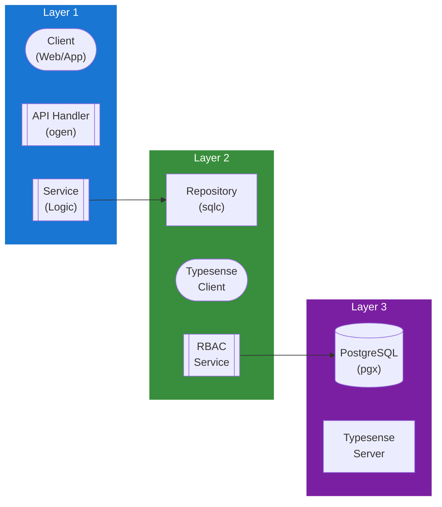

## Table of Contents

- [Search Service](#search-service)
  - [Status](#status)
  - [Architecture](#architecture)
    - [Service Structure](#service-structure)
    - [Dependencies](#dependencies)
    - [Provides](#provides)
    - [Component Diagram](#component-diagram)
  - [Implementation](#implementation)
    - [Key Interfaces](#key-interfaces)
    - [Dependencies](#dependencies)
  - [Configuration](#configuration)
    - [Environment Variables](#environment-variables)
    - [Config Keys](#config-keys)
  - [API Endpoints](#api-endpoints)
- [Search](#search)
- [Admin (indexing)](#admin-indexing)
  - [Related Documentation](#related-documentation)
    - [Design Documents](#design-documents)
    - [External Sources](#external-sources)

# Search Service

<!-- DESIGN: services, README, test_output_claude, test_output_wiki -->


**Created**: 2026-01-31
**Status**: 🟡 In Progress
**Category**: service


> > Full-text search via Typesense with per-module collections

**Package**: `internal/service/search`
**fx Module**: `search_service.Module` (fx.Module("search_service"))

---


## Status

| Dimension | Status | Notes |
|-----------|--------|-------|
| Design | ✅ | - |
| Sources | ✅ | - |
| Instructions | ✅ | - |
| Code | 🟡 Partial | - |
| Linting | 🔴 | - |
| Unit Testing | 🔴 | - |
| Integration Testing | 🔴 | - |

**Overall**: 🟡 In Progress


---


## Architecture



### Service Structure

```
internal/service/search/
├── module.go              # fx module (NewMovieSearchService)
├── movie_service.go       # MovieSearchService struct (10 methods)
├── movie_schema.go        # MovieDocument Typesense schema definition
├── cached_service.go      # CachedMovieSearchService with cache layer
└── (no tests yet)
```

**Note**: Currently movie-specific only. Generic multi-collection search is planned.

### Dependencies
**Go Packages**:
- `github.com/google/uuid`
- `log/slog` - Structured logging (not zap)
- `go.uber.org/fx`

**Internal Dependencies**:
- `internal/infra/search` - `search.Client` (Typesense wrapper)
- `internal/infra/cache` - `cache.Cache` for CachedMovieSearchService

**External Services**:
- Typesense server (https://typesense.org/)

### Provides

`search_service.Module` provides: `NewMovieSearchService`

## Implementation

### Key Interfaces (from code) ✅

```go
// MovieSearchService is a concrete struct.
// Source: internal/service/search/movie_service.go
type MovieSearchService struct {
  client *search.Client
  logger *slog.Logger
}

// Methods (10)
func (s *MovieSearchService) IsEnabled() bool
func (s *MovieSearchService) InitializeCollection(ctx context.Context) error
func (s *MovieSearchService) IndexMovie(ctx context.Context, movie MovieWithRelations) error
func (s *MovieSearchService) UpdateMovie(ctx context.Context, movie MovieWithRelations) error
func (s *MovieSearchService) RemoveMovie(ctx context.Context, movieID uuid.UUID) error
func (s *MovieSearchService) BulkIndexMovies(ctx context.Context, movies []MovieWithRelations) error
func (s *MovieSearchService) Search(ctx context.Context, params SearchParams) (*SearchResult, error)
func (s *MovieSearchService) Autocomplete(ctx context.Context, query string, limit int) (*SearchResult, error)
func (s *MovieSearchService) GetFacets(ctx context.Context, facetFields []string) ([]FacetValue, error)
func (s *MovieSearchService) ReindexAll(ctx context.Context, movies []MovieWithRelations) error
```

**Key Types**:
- `MovieDocument` - Full Typesense document schema (title, overview, genres, year, rating, etc.)
- `SearchResult` - Search results with `MovieHit` items
- `MovieHit` - Individual search hit with highlights
- `SearchParams` - Query, filters, sorting, pagination
- `FacetValue` - Facet aggregation result
- `MovieWithRelations` - Movie with all relations for indexing
- `CachedMovieSearchService` - Cache wrapper

## Configuration

### Current Config (from code) ✅

From `config.go` `SearchConfig` (koanf namespace `search.*`):
```yaml
search:
  url: http://localhost:8108         # Typesense server URL
  api_key: ""                        # Typesense API key
  enabled: false                     # Enable/disable search
```

### Planned Config (🔴 not yet in config.go)

```yaml
search:
  sync:
    interval: 5m
    batch_size: 100
  query:
    max_results: 50
    typo_tolerance: true
```

## API Endpoints
```
# Search
GET    /api/v1/search?q=query&collections=movies,tvshows  # Multi-collection search
POST   /api/v1/search/multi                               # Advanced multi-search

# Admin (indexing)
POST   /api/v1/search/sync                                # Trigger full sync
POST   /api/v1/search/sync/:collection                    # Sync specific collection
POST   /api/v1/search/reindex/:collection                 # Drop and recreate collection
```

**Example Search Request**:
```json
GET /api/v1/search?q=inception&collections=movies&filter_by=release_year:>2000&sort_by=rating:desc
```

**Example Search Response**:
```json
{
  "hits": [
    {
      "document": {
        "id": "27205",
        "title": "Inception",
        "overview": "A thief who steals corporate secrets...",
        "release_year": 2010,
        "rating": 8.4,
        "poster_url": "https://..."
      },
      "highlights": {
        "title": {
          "matched_tokens": ["Inception"],
          "snippet": "<mark>Inception</mark>"
        }
      },
      "text_match": 578934906667
    }
  ],
  "found": 1,
  "page": 1,
  "search_time_ms": 12
}
```

**Typesense Collection Schema** (Movies):
```json
{
  "name": "movies",
  "fields": [
    {"name": "id", "type": "string"},
    {"name": "title", "type": "string"},
    {"name": "overview", "type": "string"},
    {"name": "release_year", "type": "int32", "facet": true},
    {"name": "rating", "type": "float"},
    {"name": "genres", "type": "string[]", "facet": true},
    {"name": "library_id", "type": "string"},
    {"name": "poster_url", "type": "string", "optional": true}
  ],
  "default_sorting_field": "rating"
}
```

## Related Documentation
### Design Documents
- [services](INDEX.md)
- [01_ARCHITECTURE](../architecture/ARCHITECTURE.md)
- [02_DESIGN_PRINCIPLES](../architecture/DESIGN_PRINCIPLES.md)
- [03_METADATA_SYSTEM](../architecture/METADATA_SYSTEM.md)

### External Sources
- [Uber fx](../../sources/tooling/fx.md) - Auto-resolved from fx
- [River Job Queue](../../sources/tooling/river.md) - Auto-resolved from river
- [Typesense API](../../sources/infrastructure/typesense.md) - Auto-resolved from typesense
- [Typesense Go Client](../../sources/infrastructure/typesense-go.md) - Auto-resolved from typesense-go

