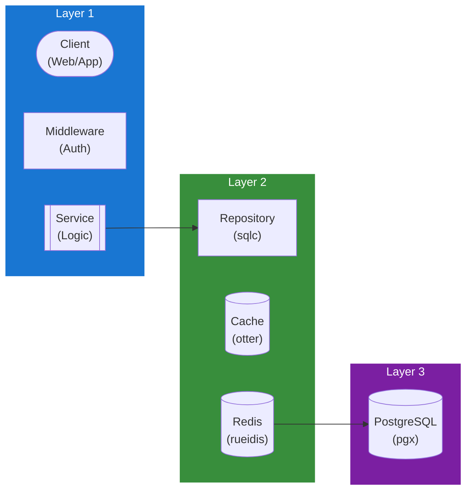

## Table of Contents

- [Session Service](#session-service)
  - [Status](#status)
  - [Architecture](#architecture)
    - [Service Structure](#service-structure)
    - [Dependencies](#dependencies)
    - [Provides](#provides)
    - [Component Diagram](#component-diagram)
  - [Implementation](#implementation)
    - [Key Interfaces](#key-interfaces)
    - [Dependencies](#dependencies)
  - [Configuration](#configuration)
    - [Environment Variables](#environment-variables)
    - [Config Keys](#config-keys)
  - [API Endpoints](#api-endpoints)
  - [Related Documentation](#related-documentation)
    - [Design Documents](#design-documents)
    - [External Sources](#external-sources)

# Session Service

<!-- DESIGN: services, README, test_output_claude, test_output_wiki -->


**Created**: 2026-01-31
**Status**: ✅ Complete
**Category**: service


> > Session token management and device tracking

**Package**: `internal/service/session`
**fx Module**: `session.Module`

---


## Status

| Dimension | Status | Notes |
|-----------|--------|-------|
| Design | ✅ | - |
| Sources | ✅ | - |
| Instructions | ✅ | - |
| Code | 🔴 | - |
| Linting | 🔴 | - |
| Unit Testing | 🔴 | - |
| Integration Testing | 🔴 | - |

**Overall**: ✅ Complete


---


## Architecture



### Service Structure

```
internal/service/session/
├── module.go              # fx module definition
├── service.go             # Service implementation
├── repository.go          # Data access (if needed)
├── handler.go             # HTTP handlers (if exposed)
├── middleware.go          # Middleware (if needed)
├── types.go               # Domain types
└── service_test.go        # Tests
```

### Dependencies
**Go Packages**:
- `github.com/google/uuid`
- `github.com/jackc/pgx/v5`
- `github.com/redis/rueidis` - Session cache (L2)
- `github.com/maypok86/otter` - Session cache (L1)
- `crypto/rand` - Token generation
- `crypto/sha256` - Token hashing
- `github.com/riverqueue/river` - Session cleanup jobs
- `net` - IP address handling
- `go.uber.org/fx`


### Provides
<!-- Service provides -->

### Component Diagram

<!-- Component diagram -->
## Implementation

### Key Interfaces

```go
type SessionService interface {
  // Session management
  CreateSession(ctx context.Context, userID uuid.UUID, deviceInfo DeviceInfo) (*Session, string, error) // Returns session and token
  GetSession(ctx context.Context, token string) (*Session, error)
  ValidateSession(ctx context.Context, token string) (*Session, error)
  RefreshSession(ctx context.Context, refreshToken string) (*Session, string, error)

  // Session operations
  RevokeSession(ctx context.Context, sessionID uuid.UUID) error
  RevokeAllSessions(ctx context.Context, userID uuid.UUID) error
  ListUserSessions(ctx context.Context, userID uuid.UUID) ([]Session, error)
  UpdateActivity(ctx context.Context, sessionID uuid.UUID) error

  // Cleanup
  CleanupExpiredSessions(ctx context.Context) (int, error)
}

type Session struct {
  ID             uuid.UUID  `db:"id" json:"id"`
  UserID         uuid.UUID  `db:"user_id" json:"user_id"`
  DeviceID       *string    `db:"device_id" json:"device_id,omitempty"`
  DeviceName     *string    `db:"device_name" json:"device_name,omitempty"`
  UserAgent      *string    `db:"user_agent" json:"user_agent,omitempty"`
  IPAddress      *net.IP    `db:"ip_address" json:"ip_address,omitempty"`
  CreatedAt      time.Time  `db:"created_at" json:"created_at"`
  LastActivityAt time.Time  `db:"last_activity_at" json:"last_activity_at"`
  ExpiresAt      time.Time  `db:"expires_at" json:"expires_at"`
  IsActive       bool       `db:"is_active" json:"is_active"`
}

type DeviceInfo struct {
  DeviceID   string
  DeviceName string
  UserAgent  string
  IPAddress  net.IP
}
```


### Dependencies
**Go Packages**:
- `github.com/google/uuid`
- `github.com/jackc/pgx/v5`
- `github.com/redis/rueidis` - Session cache (L2)
- `github.com/maypok86/otter` - Session cache (L1)
- `crypto/rand` - Token generation
- `crypto/sha256` - Token hashing
- `github.com/riverqueue/river` - Session cleanup jobs
- `net` - IP address handling
- `go.uber.org/fx`

## Configuration

### Environment Variables

```bash
SESSION_TOKEN_LENGTH=32           # bytes
SESSION_EXPIRY=720h               # 30 days
SESSION_REFRESH_TOKEN_EXPIRY=2160h  # 90 days
SESSION_INACTIVITY_TIMEOUT=168h   # 7 days
SESSION_CLEANUP_INTERVAL=1h
```


### Config Keys
```yaml
session:
  token_length: 32                    # bytes (results in 64-char hex string)
  token_hash_algorithm: sha256        # SHA-256 for token hashing
  token_format: hex                   # Hex encoding for tokens
  expiry: 720h                        # 30 days
  refresh_token_expiry: 2160h         # 90 days
  inactivity_timeout: 168h            # 7 days
  cleanup_interval: 1h
  max_sessions_per_user: 10
```

### Token Security Model

**Token Generation**:
- Generate 32 random bytes using `crypto/rand`
- Hex encode → 64-character token string
- Example: `a1b2c3d4e5f6...` (64 chars)

**Token Storage**:
- Hash token using SHA-256
- Store only hash in database (never plaintext)
- Hash format: Hex-encoded SHA-256 (64 chars)
- Database column: `token_hash TEXT NOT NULL`

**Why SHA-256 (not bcrypt/argon2id)?**:
- Tokens are random, not user-chosen passwords
- No need for slow key derivation
- Fast lookup performance (session validation)
- Sufficient security for ephemeral tokens

**Implementation**:
```go
// Generate token
token := make([]byte, 32)  // 32 bytes
rand.Read(token)
tokenStr := hex.EncodeToString(token)  // 64 hex chars

// Hash for storage
hash := sha256.Sum256([]byte(tokenStr))
tokenHash := hex.EncodeToString(hash[:])  // 64 hex chars

// Store tokenHash in database
```

## API Endpoints
```
POST   /api/v1/sessions              # Create session (internal, called by auth service)
GET    /api/v1/sessions              # List current user's sessions
GET    /api/v1/sessions/current      # Get current session info
POST   /api/v1/sessions/refresh      # Refresh session with refresh token
DELETE /api/v1/sessions/current      # Revoke current session (logout)
DELETE /api/v1/sessions/:id          # Revoke specific session
DELETE /api/v1/sessions              # Revoke all sessions (logout everywhere)
```

**Example Session Response**:
```json
{
  "id": "123e4567-e89b-12d3-a456-426614174000",
  "user_id": "987fcdeb-51a2-43d7-9876-ba98765432ab",
  "device_name": "Chrome on MacOS",
  "ip_address": "192.168.1.100",
  "created_at": "2026-02-01T10:00:00Z",
  "last_activity_at": "2026-02-01T12:30:00Z",
  "expires_at": "2026-03-03T10:00:00Z",
  "is_active": true
}
```

**Example List Sessions Response**:
```json
{
  "sessions": [
    {
      "id": "...",
      "device_name": "Chrome on MacOS",
      "ip_address": "192.168.1.100",
      "country": "US",
      "city": "New York",
      "created_at": "2026-02-01T10:00:00Z",
      "last_activity_at": "2026-02-01T12:30:00Z",
      "is_current": true
    },
    {
      "id": "...",
      "device_name": "Revenge iOS App",
      "ip_address": "10.0.0.50",
      "created_at": "2026-01-25T08:00:00Z",
      "last_activity_at": "2026-02-01T09:00:00Z",
      "is_current": false
    }
  ]
}
```

## Related Documentation
### Design Documents
- [services](INDEX.md)
- [01_ARCHITECTURE](../architecture/01_ARCHITECTURE.md)
- [02_DESIGN_PRINCIPLES](../architecture/02_DESIGN_PRINCIPLES.md)
- [03_METADATA_SYSTEM](../architecture/03_METADATA_SYSTEM.md)
- [DRAGONFLY (cache architecture)](../integrations/infrastructure/DRAGONFLY.md)

### External Sources
- [Uber fx](../../sources/tooling/fx.md) - Auto-resolved from fx
- [ogen OpenAPI Generator](../../sources/tooling/ogen.md) - Auto-resolved from ogen
- [pgx PostgreSQL Driver](../../sources/database/pgx.md) - Auto-resolved from pgx
- [PostgreSQL Arrays](../../sources/database/postgresql-arrays.md) - Auto-resolved from postgresql-arrays
- [PostgreSQL JSON Functions](../../sources/database/postgresql-json.md) - Auto-resolved from postgresql-json
- [River Job Queue](../../sources/tooling/river.md) - Auto-resolved from river
- [sqlc](../../sources/database/sqlc.md) - Auto-resolved from sqlc
- [sqlc Configuration](../../sources/database/sqlc-config.md) - Auto-resolved from sqlc-config

