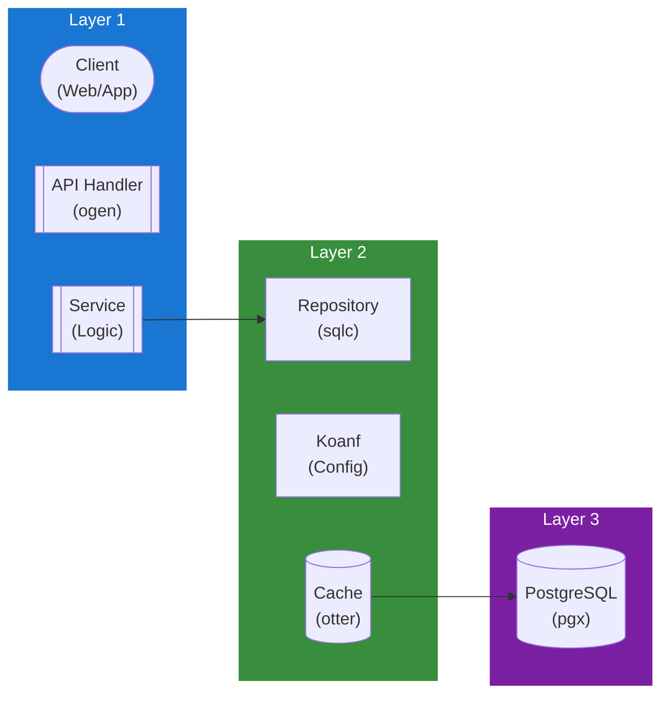

## Table of Contents

- [Settings Service](#settings-service)
  - [Status](#status)
  - [Architecture](#architecture)
    - [Service Structure](#service-structure)
    - [Dependencies](#dependencies)
    - [Provides](#provides)
    - [Component Diagram](#component-diagram)
  - [Implementation](#implementation)
    - [Key Interfaces](#key-interfaces)
    - [Dependencies](#dependencies)
  - [Configuration](#configuration)
    - [Environment Variables](#environment-variables)
    - [Config Keys](#config-keys)
  - [API Endpoints](#api-endpoints)
  - [Related Documentation](#related-documentation)
    - [Design Documents](#design-documents)
    - [External Sources](#external-sources)

# Settings Service

<!-- DESIGN: services, README, test_output_claude, test_output_wiki -->


**Created**: 2026-01-31
**Status**: 🟡 In Progress
**Category**: service


> > Server-level settings persistence and retrieval

**Package**: `internal/service/settings`
**fx Module**: `settings.Module`

**Scope**: This service manages **server-level settings** (global configuration). For **per-user settings and preferences**, see [USER_SETTINGS.md](USER_SETTINGS.md).

---


## Status

| Dimension | Status | Notes |
|-----------|--------|-------|
| Design | ✅ | - |
| Sources | ✅ | - |
| Instructions | ✅ | - |
| Code | 🟡 Partial | - |
| Linting | 🔴 | - |
| Unit Testing | 🔴 | - |
| Integration Testing | 🔴 | - |

**Overall**: 🟡 In Progress


---


## Architecture



### Service Structure

```
internal/service/settings/
├── module.go              # fx module (NewService, NewPostgresRepository)
├── service.go             # Service INTERFACE (12 methods) + implementation
├── repository.go          # Repository interface (14 methods) + domain types
├── repository_pg.go       # PostgreSQL implementation (sqlc)
├── cached_service.go      # CachedService wrapping Service with cache layer
└── (no tests yet)
```

### Dependencies
**Go Packages**:
- `github.com/google/uuid`
- `go.uber.org/fx`, `go.uber.org/zap`

**Internal Dependencies**:
- `internal/infra/database/db` - sqlc generated queries
- `internal/infra/cache` - `cache.Cache` for CachedService

### Provides

`settings.Module` provides: `NewService`, `NewPostgresRepository`

## Implementation

### Key Interfaces (from code) ✅

```go
// Service is an INTERFACE (unlike most other services).
// Source: internal/service/settings/service.go
type Service interface {
  // Server settings (6 methods)
  GetServerSetting(ctx context.Context, key string) (*ServerSetting, error)
  ListServerSettings(ctx context.Context) ([]ServerSetting, error)
  ListServerSettingsByCategory(ctx context.Context, category string) ([]ServerSetting, error)
  ListPublicServerSettings(ctx context.Context) ([]ServerSetting, error)
  SetServerSetting(ctx context.Context, setting ServerSetting) error
  DeleteServerSetting(ctx context.Context, key string) error

  // User settings (6 methods)
  GetUserSetting(ctx context.Context, userID uuid.UUID, key string) (*UserSetting, error)
  ListUserSettings(ctx context.Context, userID uuid.UUID) ([]UserSetting, error)
  ListUserSettingsByCategory(ctx context.Context, userID uuid.UUID, category string) ([]UserSetting, error)
  SetUserSetting(ctx context.Context, setting UserSetting) error
  SetUserSettingsBulk(ctx context.Context, userID uuid.UUID, settings []UserSetting) error
  DeleteUserSetting(ctx context.Context, userID uuid.UUID, key string) error
}
```

**Note**: Unlike most services, this uses an **interface** (not concrete struct). Also handles both server-level AND user-level settings. No `ResetToDefault`, `LoadDefaults`, or `GetHistory` methods yet (planned).

**Key Types**:
- `ServerSetting` - Key, Value, Description, Category, DataType, IsSecret, IsPublic, AllowedValues
- `UserSetting` - UserID + Key, Value, Category, DataType
- `CachedService` - Cache wrapper using `cache.Cache`
- Repository interface has 14 methods: Server settings (7), User settings (7)

## Configuration

### Current Config (from code) ✅

No dedicated `SettingsConfig` struct in `config.go`. Uses general database/pool configuration.

### Planned Config (🔴 not yet in config.go)

```bash
SETTINGS_CACHE_TTL=5m
```

```yaml
settings:
  cache_ttl: 5m
```

## API Endpoints
```
GET    /api/v1/settings               # List all settings
GET    /api/v1/settings/:key          # Get setting
PUT    /api/v1/settings/:key          # Update setting
POST   /api/v1/settings/bulk          # Bulk update
POST   /api/v1/settings/:key/reset    # Reset to default
GET    /api/v1/settings/:key/history  # Get change history
```

## Related Documentation
### Design Documents
- [services](INDEX.md)
- [01_ARCHITECTURE](../architecture/ARCHITECTURE.md)
- [02_DESIGN_PRINCIPLES](../architecture/DESIGN_PRINCIPLES.md)
- [03_METADATA_SYSTEM](../architecture/METADATA_SYSTEM.md)

### External Sources
- [Uber fx](../../sources/tooling/fx.md) - Auto-resolved from fx
- [koanf](../../sources/tooling/koanf.md) - Auto-resolved from koanf
- [ogen OpenAPI Generator](../../sources/tooling/ogen.md) - Auto-resolved from ogen
- [pgx PostgreSQL Driver](../../sources/database/pgx.md) - Auto-resolved from pgx
- [PostgreSQL Arrays](../../sources/database/postgresql-arrays.md) - Auto-resolved from postgresql-arrays
- [PostgreSQL JSON Functions](../../sources/database/postgresql-json.md) - Auto-resolved from postgresql-json
- [River Job Queue](../../sources/tooling/river.md) - Auto-resolved from river
- [sqlc](../../sources/database/sqlc.md) - Auto-resolved from sqlc
- [sqlc Configuration](../../sources/database/sqlc-config.md) - Auto-resolved from sqlc-config

