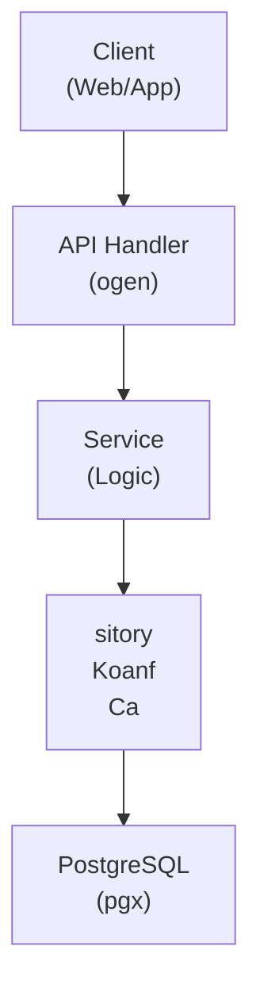

## Table of Contents

- [Settings Service](#settings-service)
  - [Status](#status)
  - [Architecture](#architecture)
    - [Service Structure](#service-structure)
    - [Dependencies](#dependencies)
    - [Provides](#provides)
    - [Component Diagram](#component-diagram)
  - [Implementation](#implementation)
    - [Key Interfaces](#key-interfaces)
    - [Dependencies](#dependencies)
  - [Configuration](#configuration)
    - [Environment Variables](#environment-variables)
    - [Config Keys](#config-keys)
  - [API Endpoints](#api-endpoints)
  - [Related Documentation](#related-documentation)
    - [Design Documents](#design-documents)
    - [External Sources](#external-sources)

# Settings Service


**Created**: 2026-01-31
**Status**: ✅ Complete
**Category**: service


> > Server settings persistence and retrieval

**Package**: `internal/service/settings`
**fx Module**: `settings.Module`

---


## Status

| Dimension | Status | Notes |
|-----------|--------|-------|
| Design | ✅ | - |
| Sources | ✅ | - |
| Instructions | ✅ | - |
| Code | 🔴 | - |
| Linting | 🔴 | - |
| Unit Testing | 🔴 | - |
| Integration Testing | 🔴 | - |

**Overall**: ✅ Complete


---


## Architecture



### Service Structure

```
internal/service/settings/
├── module.go              # fx module definition
├── service.go             # Service implementation
├── repository.go          # Data access (if needed)
├── handler.go             # HTTP handlers (if exposed)
├── middleware.go          # Middleware (if needed)
├── types.go               # Domain types
└── service_test.go        # Tests
```

### Dependencies
**Go Packages**:
- `github.com/google/uuid`
- `github.com/jackc/pgx/v5`
- `github.com/knadh/koanf/v2` - Configuration management
- `github.com/maypok86/otter` - Settings cache
- `go.uber.org/fx`


### Provides
<!-- Service provides -->

### Component Diagram

<!-- Component diagram -->
## Implementation

### Key Interfaces

```go
type SettingsService interface {
  // Get/Set
  GetSetting(ctx context.Context, key string) (*Setting, error)
  GetSettings(ctx context.Context, category string) ([]Setting, error)
  SetSetting(ctx context.Context, key, value string, userID uuid.UUID) error
  SetBulk(ctx context.Context, settings map[string]string, userID uuid.UUID) error

  // Defaults
  ResetToDefault(ctx context.Context, key string) error
  LoadDefaults(ctx context.Context) error

  // History
  GetHistory(ctx context.Context, key string) ([]SettingChange, error)
}

type Setting struct {
  Key          string     `db:"key" json:"key"`
  Value        string     `db:"value" json:"value"`
  ValueType    string     `db:"value_type" json:"value_type"`
  Category     *string    `db:"category" json:"category,omitempty"`
  Description  *string    `db:"description" json:"description,omitempty"`
}
```


### Dependencies
**Go Packages**:
- `github.com/google/uuid`
- `github.com/jackc/pgx/v5`
- `github.com/knadh/koanf/v2` - Configuration management
- `github.com/maypok86/otter` - Settings cache
- `go.uber.org/fx`

## Configuration

### Environment Variables

```bash
SETTINGS_CACHE_TTL=5m
```


### Config Keys
```yaml
settings:
  cache_ttl: 5m
```

## API Endpoints
```
GET    /api/v1/settings               # List all settings
GET    /api/v1/settings/:key          # Get setting
PUT    /api/v1/settings/:key          # Update setting
POST   /api/v1/settings/bulk          # Bulk update
POST   /api/v1/settings/:key/reset    # Reset to default
GET    /api/v1/settings/:key/history  # Get change history
```

## Related Documentation
### Design Documents
- [services](INDEX.md)
- [01_ARCHITECTURE](../architecture/01_ARCHITECTURE.md)
- [02_DESIGN_PRINCIPLES](../architecture/02_DESIGN_PRINCIPLES.md)
- [03_METADATA_SYSTEM](../architecture/03_METADATA_SYSTEM.md)

### External Sources
- [Uber fx](../../sources/tooling/fx.md) - Auto-resolved from fx
- [koanf](../../sources/tooling/koanf.md) - Auto-resolved from koanf
- [ogen OpenAPI Generator](../../sources/tooling/ogen.md) - Auto-resolved from ogen
- [pgx PostgreSQL Driver](../../sources/database/pgx.md) - Auto-resolved from pgx
- [PostgreSQL Arrays](../../sources/database/postgresql-arrays.md) - Auto-resolved from postgresql-arrays
- [PostgreSQL JSON Functions](../../sources/database/postgresql-json.md) - Auto-resolved from postgresql-json
- [River Job Queue](../../sources/tooling/river.md) - Auto-resolved from river
- [sqlc](../../sources/database/sqlc.md) - Auto-resolved from sqlc
- [sqlc Configuration](../../sources/database/sqlc-config.md) - Auto-resolved from sqlc-config

