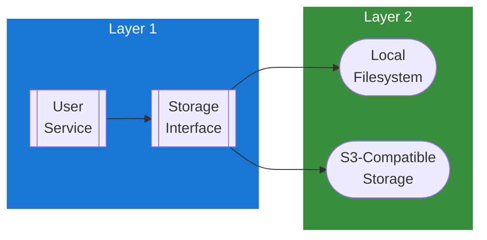

## Table of Contents

- [Storage Service](#storage-service)
  - [Status](#status)
  - [Architecture](#architecture)
    - [Service Structure](#service-structure)
    - [Dependencies](#dependencies)
  - [Implementation](#implementation)
    - [Key Interfaces](#key-interfaces)
  - [Configuration](#configuration)
  - [Related Documentation](#related-documentation)

# Storage Service

<!-- DESIGN: services, README, test_output_claude, test_output_wiki -->


**Created**: 2026-02-06
**Status**: 🟡 In Progress
**Category**: service


> > File storage abstraction (local filesystem, S3-compatible)

**Package**: `internal/service/storage`
**fx Module**: `storage.Module` (fx.Options)

---


## Status

| Dimension | Status | Notes |
|-----------|--------|-------|
| Design | ✅ | This document |
| Sources | ✅ | - |
| Instructions | ✅ | - |
| Code | 🟡 Partial | LocalStorage + S3Storage + MockStorage implemented |
| Linting | 🔴 | - |
| Unit Testing | 🟡 Partial | storage_test.go exists |
| Integration Testing | 🔴 | - |

**Overall**: 🟡 In Progress


---


## Architecture



### Service Structure

```
internal/service/storage/
├── module.go              # fx module (provideStorage - selects backend from config)
├── storage.go             # Storage interface + LocalStorage implementation + utility functions
├── s3.go                  # S3Storage implementation (AWS SDK v2)
├── mock_storage.go        # MockStorage for testing (in-memory)
└── storage_test.go        # Tests
```

### Dependencies
**Go Packages**:
- `github.com/google/uuid`
- `github.com/aws/aws-sdk-go-v2` - S3 client (s3, config, credentials)
- `go.uber.org/zap`

**Internal Dependencies**:
- `internal/config` - `config.StorageConfig`, `config.S3Config`, `config.AvatarConfig`

## Implementation

### Key Interfaces (from code) ✅

```go
// Storage is an interface with two implementations.
// Source: internal/service/storage/storage.go
type Storage interface {
  Store(ctx context.Context, key string, reader io.Reader, contentType string) (string, error)
  Get(ctx context.Context, key string) (io.ReadCloser, error)
  Delete(ctx context.Context, key string) error
  Exists(ctx context.Context, key string) (bool, error)
  GetURL(key string) string
}

// LocalStorage - filesystem-based
type LocalStorage struct {
  basePath string
  baseURL  string
  logger   *zap.Logger
  mu       sync.RWMutex
}

func NewLocalStorage(cfg config.AvatarConfig, logger *zap.Logger) (*LocalStorage, error)

// S3Storage - S3-compatible (AWS, MinIO, etc.)
type S3Storage struct {
  client   *s3.Client
  bucket   string
  endpoint string
  logger   *zap.Logger
}

func NewS3Storage(cfg config.S3Config, logger *zap.Logger) (*S3Storage, error)

// MockStorage - in-memory for testing
type MockStorage struct {
  files map[string][]byte
}

func NewMockStorage() *MockStorage
```

**Utility Functions**:
- `GenerateAvatarKey(userID uuid.UUID, filename string) string` - Generates storage key for avatars
- `sanitizeKey(key string) string` - Sanitizes storage keys

**Backend Selection**: `provideStorage()` in `module.go` reads `cfg.Storage.Backend` and returns either `LocalStorage` or `S3Storage`.

## Configuration

### Current Config (from code) ✅

From `config.go` `StorageConfig` (koanf namespace `storage.*`):
```yaml
storage:
  backend: local                    # "local" or "s3"
  local:
    path: ./data/storage            # Local storage directory
  s3:
    endpoint: ""                    # S3-compatible endpoint (for MinIO, etc.)
    region: us-east-1
    bucket: revenge-storage
    access_key_id: ""
    secret_access_key: ""
    use_path_style: false           # Set true for MinIO
```

## Related Documentation
### Design Documents
- [services](INDEX.md)
- [USER.md](USER.md) - User service uses storage for avatar uploads
