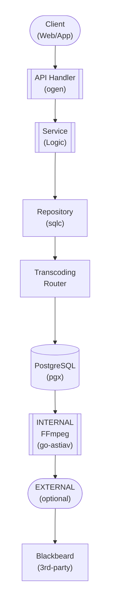

## Table of Contents

- [Transcoding Service](#transcoding-service)
  - [Status](#status)
  - [Architecture](#architecture)
    - [Service Structure](#service-structure)
    - [Dependencies](#dependencies)
    - [Provides](#provides)
    - [Component Diagram](#component-diagram)
  - [Implementation](#implementation)
    - [Key Interfaces](#key-interfaces)
    - [Dependencies](#dependencies)
  - [Configuration](#configuration)
    - [Environment Variables](#environment-variables)
    - [Config Keys](#config-keys)
  - [API Endpoints](#api-endpoints)
    - [POST /api/v1/transcode/video/:id](#post-apiv1transcodevideoid)
    - [GET /api/v1/transcode/job/:job_id](#get-apiv1transcodejobjob_id)
    - [DELETE /api/v1/transcode/job/:job_id](#delete-apiv1transcodejobjob_id)
    - [GET /api/v1/transcode/cache/stats](#get-apiv1transcodecachestats)
  - [Related Documentation](#related-documentation)
    - [Design Documents](#design-documents)
    - [External Sources](#external-sources)

# Transcoding Service


**Created**: 2026-01-31
**Status**: ✅ Complete
**Category**: service


> > On-demand video/audio transcoding service with hardware acceleration

Transcoding capabilities:
- **INTERNAL**: go-astiav FFmpeg bindings (default, always available)
- **EXTERNAL**: Blackbeard service for optional offloading (third-party, not developed by us)
- **Hardware Acceleration**: NVENC (NVIDIA), QSV (Intel), VAAPI (AMD)
- **Adaptive Streaming**: HLS with multiple quality tiers
- **Queue Management**: River background jobs for async processing

**Package**: `internal/service/transcoding`
**fx Module**: `transcoding.Module`

---


## Status

| Dimension | Status | Notes |
|-----------|--------|-------|
| Design | ✅ | Complete transcoding service design |
| Sources | ✅ | All transcoding tools documented |
| Instructions | ✅ | Generated from design |
| Code | 🔴 | - |
| Linting | 🔴 | - |
| Unit Testing | 🔴 | - |
| Integration Testing | 🔴 | - |

**Overall**: ✅ Complete


---


## Architecture



### Service Structure

```
internal/service/transcoding/
├── module.go              # fx module definition
├── service.go             # Service implementation
├── repository.go          # Data access (if needed)
├── handler.go             # HTTP handlers (if exposed)
├── middleware.go          # Middleware (if needed)
├── types.go               # Domain types
└── service_test.go        # Tests
```

### Dependencies
**Go Packages**:
- `github.com/google/uuid`
- `github.com/jackc/pgx/v5`
- `github.com/asticode/go-astiav` - FFmpeg Go bindings
- `github.com/bluenviron/gohlslib/v2` - HLS streaming
- `github.com/riverqueue/river` - Background jobs
- `go.uber.org/fx`

**External Services**:
- Blackbeard service (optional, for offloading)
- FFmpeg (system dependency)


### Provides
<!-- Service provides -->

### Component Diagram

<!-- Component diagram -->
## Implementation

### Key Interfaces

```go
type TranscodingService interface {
  // Transcode operations
  QueueTranscode(ctx context.Context, videoID uuid.UUID, profile string) (*TranscodeJob, error)
  GetJob(ctx context.Context, jobID uuid.UUID) (*TranscodeJob, error)
  CancelJob(ctx context.Context, jobID uuid.UUID) error

  // Cache
  GetCachedVideo(ctx context.Context, videoID uuid.UUID, profile string) (string, error)
  ClearCache(ctx context.Context) error
  GetCacheStats(ctx context.Context) (*CacheStats, error)

  // HLS
  GenerateHLSManifest(ctx context.Context, videoID uuid.UUID) (string, error)
}

type Transcoder interface {
  Transcode(ctx context.Context, input, output string, profile Profile) error
  SupportsHardwareAccel() bool
  GetHardwareType() string
}

type TranscodeJob struct {
  ID              uuid.UUID  `db:"id" json:"id"`
  VideoID         uuid.UUID  `db:"video_id" json:"video_id"`
  Profile         string     `db:"profile" json:"profile"`
  Status          string     `db:"status" json:"status"`
  ProgressPercent float64    `db:"progress_percent" json:"progress_percent"`
  CreatedAt       time.Time  `db:"created_at" json:"created_at"`
}
```


### Dependencies
**Go Packages**:
- `github.com/google/uuid`
- `github.com/jackc/pgx/v5`
- `github.com/asticode/go-astiav` - FFmpeg Go bindings
- `github.com/bluenviron/gohlslib/v2` - HLS streaming
- `github.com/riverqueue/river` - Background jobs
- `go.uber.org/fx`

**External Services**:
- Blackbeard service (optional, for offloading)
- FFmpeg (system dependency)

## Configuration

### Environment Variables

```bash
TRANSCODING_BLACKBEARD_URL=http://blackbeard:8080
TRANSCODING_CACHE_DIR=/var/cache/revenge/transcoded
TRANSCODING_CACHE_MAX_SIZE_GB=100
TRANSCODING_HARDWARE_ACCEL=auto  # auto, nvenc, qsv, vaapi, none
TRANSCODING_WORKERS=2
```


### Config Keys
```yaml
transcoding:
  blackbeard:
    url: http://blackbeard:8080
    enabled: true
    timeout: 30s
  cache:
    dir: /var/cache/revenge/transcoded
    max_size_gb: 100
    ttl: 168h  # 7 days
  hardware:
    accel: auto
    prefer_nvenc: true
  workers: 2
  hls:
    segment_duration: 6s
```

## API Endpoints
### POST /api/v1/transcode/video/:id

Start video transcoding

**Request**:
```json
{
  "profile": "1080p",
  "priority": "normal"
}

```

**Response**:
```json
{
  "job_id": "uuid-here",
  "status": "queued"
}

```
### GET /api/v1/transcode/job/:job_id

Get transcode job status

**Request**:
```json
{}
```

**Response**:
```json
{
  "job_id": "uuid-here",
  "status": "processing",
  "progress": 45.5,
  "eta_seconds": 180
}

```
### DELETE /api/v1/transcode/job/:job_id

Cancel transcode job

**Request**:
```json
{}
```

**Response**:
```json
{}
```
### GET /api/v1/transcode/cache/stats

Get cache statistics

**Request**:
```json
{}
```

**Response**:
```json
{
  "size_bytes": 85000000000,
  "max_size_bytes": 100000000000,
  "item_count": 523,
  "hit_rate": 0.78
}

```
## Related Documentation
### Design Documents
- [services](INDEX.md)
- [01_ARCHITECTURE](../architecture/01_ARCHITECTURE.md)
- [OFFLOADING](../technical/OFFLOADING.md)
- [AUDIO_STREAMING](../technical/AUDIO_STREAMING.md)

### External Sources
- [go-astiav (FFmpeg)](../../sources/media/go-astiav.md) - FFmpeg Go bindings
- [gohlslib](../../sources/media/gohlslib.md) - HLS streaming library
- [River Job Queue](../../sources/tooling/river.md) - Background job processing
- [Uber fx](../../sources/tooling/fx.md) - Dependency injection

