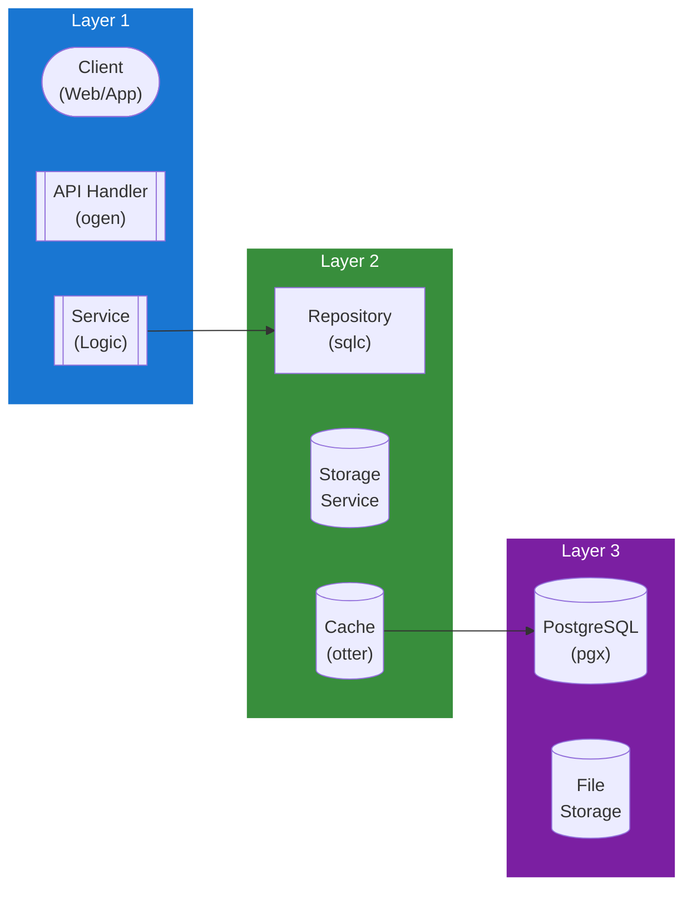

## Table of Contents

- [User Service](#user-service)
  - [Status](#status)
  - [Architecture](#architecture)
    - [Service Structure](#service-structure)
    - [Dependencies](#dependencies)
    - [Provides](#provides)
    - [Component Diagram](#component-diagram)
  - [Implementation](#implementation)
    - [Key Interfaces](#key-interfaces)
    - [Dependencies](#dependencies)
  - [Configuration](#configuration)
    - [Environment Variables](#environment-variables)
    - [Config Keys](#config-keys)
  - [API Endpoints](#api-endpoints)
- [User management (admin)](#user-management-admin)
- [Current user (self)](#current-user-self)
- [Profile](#profile)
- [Notifications](#notifications)
- [GDPR](#gdpr)
  - [Related Documentation](#related-documentation)
    - [Design Documents](#design-documents)
    - [External Sources](#external-sources)

# User Service

<!-- DESIGN: services, README, test_output_claude, test_output_wiki -->


**Created**: 2026-01-31
**Status**: 🟡 In Progress
**Category**: service


> > User account management and authentication

**Package**: `internal/service/user`
**fx Module**: `user.Module`

---


## Status

| Dimension | Status | Notes |
|-----------|--------|-------|
| Design | ✅ | - |
| Sources | ✅ | - |
| Instructions | ✅ | - |
| Code | 🟡 Partial | - |
| Linting | 🔴 | - |
| Unit Testing | 🔴 | - |
| Integration Testing | 🔴 | - |

**Overall**: 🟡 In Progress


---


## Architecture



### Service Structure

```
internal/service/user/
├── module.go              # fx module (NewService, NewPostgresRepository)
├── service.go             # Service struct + business logic (21 methods) + types
├── repository.go          # Repository interface (24 methods) + domain types
├── repository_pg.go       # PostgreSQL implementation (sqlc)
├── cached_service.go      # CachedService wrapping Service with cache layer
├── service_test.go        # Service tests
├── service_unit_test.go   # Unit tests
├── repository_pg_test.go  # Repository tests
├── cached_service_test.go # Cache tests
└── mock_repository_test.go # Mock repository for tests
```

### Dependencies
**Go Packages**:
- `github.com/google/uuid`
- `github.com/jackc/pgx/v5` - Database via pgxpool
- `go.uber.org/fx`
- `io` - Avatar file handling

**Internal Dependencies**:
- `internal/crypto` - `PasswordHasher` (Argon2id)
- `internal/service/activity` - `activity.Logger` for audit logging
- `internal/service/storage` - `storage.Storage` for avatar file storage
- `internal/config` - `config.AvatarConfig` (storage_path, max_size_bytes, allowed_types)
- `internal/infra/database/db` - sqlc generated queries (`db.SharedUser`, `db.SharedUserPreference`, `db.SharedUserAvatar`)

### Provides

`user.Module` provides: `NewService`, `NewPostgresRepository`

## Implementation

### Key Interfaces (from code) ✅

```go
// Service is a concrete struct (not interface).
// Source: internal/service/user/service.go
type Service struct {
  pool           *pgxpool.Pool
  repo           Repository
  hasher         *crypto.PasswordHasher
  activityLogger activity.Logger
  storage        storage.Storage
  avatarConfig   config.AvatarConfig
}

// User CRUD (10 methods)
func (s *Service) GetUser(ctx context.Context, userID uuid.UUID) (*db.SharedUser, error)
func (s *Service) GetUserByUsername(ctx context.Context, username string) (*db.SharedUser, error)
func (s *Service) GetUserByEmail(ctx context.Context, email string) (*db.SharedUser, error)
func (s *Service) ListUsers(ctx context.Context, filters UserFilters) ([]db.SharedUser, int64, error)
func (s *Service) CreateUser(ctx context.Context, params CreateUserParams) (*db.SharedUser, error)
func (s *Service) UpdateUser(ctx context.Context, userID uuid.UUID, params UpdateUserParams) (*db.SharedUser, error)
func (s *Service) DeleteUser(ctx context.Context, userID uuid.UUID) error
func (s *Service) HardDeleteUser(ctx context.Context, userID uuid.UUID) error
func (s *Service) VerifyEmail(ctx context.Context, userID uuid.UUID) error
func (s *Service) RecordLogin(ctx context.Context, userID uuid.UUID) error

// Password (3 methods)
func (s *Service) HashPassword(password string) (string, error)
func (s *Service) VerifyPassword(hashedPassword, password string) error
func (s *Service) UpdatePassword(ctx context.Context, userID uuid.UUID, oldPassword, newPassword string) error

// Preferences (3 methods)
func (s *Service) GetUserPreferences(ctx context.Context, userID uuid.UUID) (*db.SharedUserPreference, error)
func (s *Service) UpdateUserPreferences(ctx context.Context, params UpsertPreferencesParams) (*db.SharedUserPreference, error)
func (s *Service) UpdateNotificationPreferences(ctx context.Context, userID uuid.UUID, email, push, digest *NotificationSettings) error

// Avatars (5 methods)
func (s *Service) GetCurrentAvatar(ctx context.Context, userID uuid.UUID) (*db.SharedUserAvatar, error)
func (s *Service) ListUserAvatars(ctx context.Context, userID uuid.UUID, limit, offset int32) ([]db.SharedUserAvatar, error)
func (s *Service) UploadAvatar(ctx context.Context, userID uuid.UUID, file io.Reader, metadata AvatarMetadata) (*db.SharedUserAvatar, error)
func (s *Service) SetCurrentAvatar(ctx context.Context, userID, avatarID uuid.UUID) error
func (s *Service) DeleteAvatar(ctx context.Context, userID, avatarID uuid.UUID) error

// Repository interface (24 methods): User (11), Preferences (3), Avatars (10)
```

**Note**: Returns `*db.SharedUser` (sqlc generated from `shared.users` table), not a local `User` type. No `UserProfile` type — profile fields are in `db.SharedUserPreference`. No GDPR methods yet (planned).

**Key Types**:
- `UserFilters` - Filtering for list queries
- `CreateUserParams` / `UpdateUserParams` - User creation/update params
- `UpsertPreferencesParams` - Preferences upsert
- `AvatarMetadata` - Avatar upload metadata
- `NotificationSettings` - Notification preferences per channel
- `CachedService` - Cache wrapper using `cache.Cache`

## Configuration

### Current Config (from code) ✅

No dedicated `UserConfig` struct. Avatar config uses `AvatarConfig` (koanf namespace `avatar.*`):
```yaml
avatar:
  storage_path: ./data/avatars     # Local file storage path
  max_size_bytes: 5242880          # 5 MB
  allowed_types:                   # Accepted MIME types
    - image/jpeg
    - image/png
    - image/webp
```

### Planned Config (🔴 not yet in config.go)

```bash
USER_DEFAULT_STORAGE_QUOTA_MB=100
USER_DATA_EXPORT_EXPIRY=168h  # 7 days
USER_DELETION_GRACE_PERIOD=720h  # 30 days
```

```yaml
user:
  storage:
    default_quota_mb: 100
  gdpr:
    data_export_expiry: 168h
    deletion_grace_period: 720h
  profile:
    default_visibility: private
```

## API Endpoints
```
# User management (admin)
GET    /api/v1/users               # List users
GET    /api/v1/users/:id           # Get user
PUT    /api/v1/users/:id           # Update user
DELETE /api/v1/users/:id           # Delete user

# Current user (self)
GET    /api/v1/users/me            # Get current user
PUT    /api/v1/users/me            # Update current user

# Profile
GET    /api/v1/users/:id/profile   # Get profile
PUT    /api/v1/users/me/profile    # Update profile
POST   /api/v1/users/me/avatar     # Upload avatar

# Notifications
GET    /api/v1/users/me/notifications/preferences
PUT    /api/v1/users/me/notifications/preferences

# GDPR
POST   /api/v1/users/me/data-export           # Request export
GET    /api/v1/users/me/data-export/:id       # Get export status
GET    /api/v1/users/me/data-export/:id/download  # Download export
POST   /api/v1/users/me/delete                # Request deletion
DELETE /api/v1/users/me/delete/:id            # Cancel deletion
```

**Example Profile Update Request**:
```json
{
  "bio": "Movie enthusiast and avid reader",
  "timezone": "America/New_York",
  "language": "en",
  "profile_visibility": "friends"
}
```

## Related Documentation
### Design Documents
- [services](INDEX.md)
- [01_ARCHITECTURE](../architecture/ARCHITECTURE.md)
- [02_DESIGN_PRINCIPLES](../architecture/DESIGN_PRINCIPLES.md)
- [03_METADATA_SYSTEM](../architecture/METADATA_SYSTEM.md)

### External Sources
- [Uber fx](../../sources/tooling/fx.md) - Auto-resolved from fx
- [golang.org/x/crypto](../../sources/go/x/crypto.md) - Auto-resolved from golang-x-crypto
- [ogen OpenAPI Generator](../../sources/tooling/ogen.md) - Auto-resolved from ogen
- [pgx PostgreSQL Driver](../../sources/database/pgx.md) - Auto-resolved from pgx
- [PostgreSQL Arrays](../../sources/database/postgresql-arrays.md) - Auto-resolved from postgresql-arrays
- [PostgreSQL JSON Functions](../../sources/database/postgresql-json.md) - Auto-resolved from postgresql-json
- [River Job Queue](../../sources/tooling/river.md) - Auto-resolved from river
- [sqlc](../../sources/database/sqlc.md) - Auto-resolved from sqlc
- [sqlc Configuration](../../sources/database/sqlc-config.md) - Auto-resolved from sqlc-config

